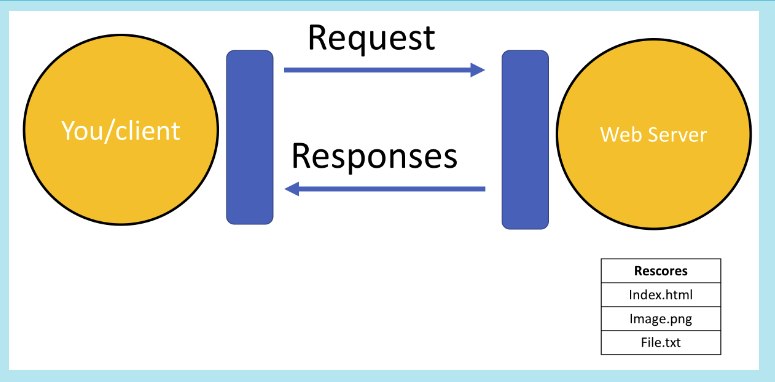
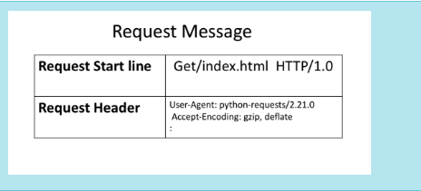
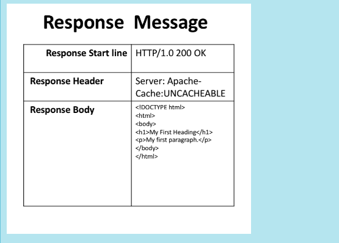
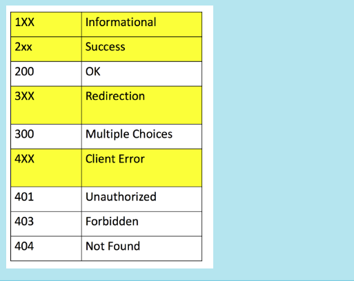
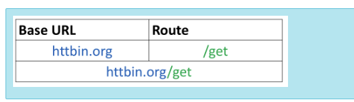
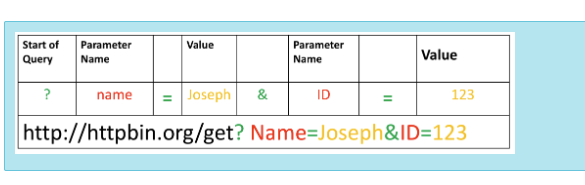

# API / HTTP Refreshers

## Overview of HTTP
When you, **the client**, use a web page your browser sends an HTTP request to the server where the page is hosted. The server tries to find the desired resource by default "index.html". If your request is successful, the server will send the object to the client in an HTTP response. This includes information like 
* the type of the resource 
* the length of the resource 
* and other information.

The figure below represents the process. The circle on the left represents the client, the circle on the right represents the Web server. The table under the Web server represents a list of resources stored in the web server. In this case an HTML file, png image, and txt file .

The HTTP protocol allows you to send and receive information through the web including webpages, images, and other web resources. In this lab, we will provide an overview of the Requests library for interacting with the HTTP protocol.

___

 

## Uniform Resource Locator : URL
You may also hear the term **Uniform Resource Identifier (URI)**, 
* URL are actually a subset of URIs. 

Another popular term is **endpoint**
+ this is the URL of an operation provided by a Web server.

Uniform resource locator (URL) is the most popular way to find resources on the web. We can break the URL into **three** parts.

1. Scheme this is this **protocol**, for this lab it will always be http://
2. Internet address or Base URL this will be used to find the location here are some examples: www.ibm.com and www.gitlab.com
3. Route location on the web server for example: /images/IDSNlogo.png

___

 

## Request
The process can be broken into the <b>request</b> and <b>response </b> process.  The request using the get method is partially illustrated below. 
* In the start line we have the <code>GET</code> method, this is an <code>HTTP</code> method. 
* Also the location of the resource  <code>/index.html</code> and the <code>HTTP</code> version. 
* The Request header passes additional information with an <code>HTTP</code> request:

When an <code>HTTP</code> request is made, an <code>HTTP</code> method is sent, this tells the server what action to perform.  A list of several <code>HTTP</code> methods is shown below.

 

### Common Request Types
|HTTP Methods|Description|
|-----|------|
|GET|Retrieves Data From The Server|
|POST|Submits Data to the Server|
|PUT|Updates Data Already on the Server|
|DELETE|Deletes Data From The Server|

___

 

## Response 
The figure below represents the response; the response start line contains the version number <code>HTTP/1.0</code>, a status code (200) meaning success, followed by a descriptive phrase (OK). The response header contains useful information. Finally, we have the response body containing the requested file, an <code> HTML </code> document.  It should be noted that some requests have headers.

### Message Quick Overview

 

Some status code examples are shown in the table below, the prefix indicates the class. These are shown in yellow, with actual status codes shown in white. Check out the following link for more descriptions.

### Status Responses (Sample)

___

 

### Get Request w/URL Params
You can use the <b>GET</b> method to modify the results of your query, for example retrieving data from an API. We send a <b>GET</b> request to the  server. Like before we have the <b>Base URL</b>, in the <b>Route</b> we append <code>/get</code>, this indicates we would like to preform a <code>GET</code> request. This is demonstrated in the following table:

* A <a href="https://en.wikipedia.org/wiki/Query_string?utm_medium=Exinfluencer&utm_source=Exinfluencer&utm_content=000026UJ&utm_term=10006555&utm_id=NA-SkillsNetwork-Channel-SkillsNetworkCoursesIBMDeveloperSkillsNetworkPY0101ENSkillsNetwork19487395-2022-01-01">query string</a> is a part of a uniform resource locator (URL), this sends other information to the web server. The start of the query is a <code>?</code>, followed by a series of parameter and value pairs, as shown in the table below. The first parameter name is <code>name</code> and the value is <code>Joseph</code>. The second parameter name is <code>ID</code> and the Value is <code>123</code>. Each pair, parameter, and value is separated by an equals sign, <code>=</code>.
The series of pairs is separated by the ampersand <code>&</code>.

