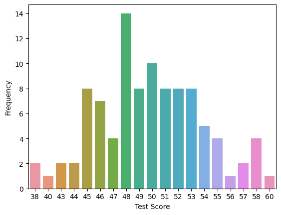

<p style="text-align:center">
    <a href="https://skills.network/?utm_medium=Exinfluencer&utm_source=Exinfluencer&utm_content=000026UJ&utm_term=10006555&utm_id=NA-SkillsNetwork-Channel-SkillsNetworkCoursesIBMDeveloperSkillsNetworkDB0201ENSkillsNetwork20127838-2022-01-01" target="_blank">
    
    </a>
</p>

# Accessing Databases with SQL Magic

Estimated time needed: **15** minutes

## Objectives

After completing this lab you will be able to:

*   Perform simplified database access using SQL "magic"


##### To communicate with SQL Databases from within a JupyterLab notebook, we can use the SQL "magic" provided by the [ipython-sql](https://github.com/catherinedevlin/ipython-sql) extension. "Magic" is JupyterLab's term for special commands that start with "%". Below, we'll use the *load*\_*ext* magic to load the ipython-sql extension. In the lab environemnt provided in the course the ipython-sql extension is already installed and so is the ibm_db_sa driver.

The following required modules are pre-installed in the Skills Network Labs environment. However if you run this notebook commands in a different Jupyter environment (e.g. Watson Studio or Ananconda) you may need to install these libraries by removing the `#` sign before `!pip` in the code cell below.


```python
# These libraries are pre-installed in SN Labs. If running in another environment please uncomment lines below to install them:
# !pip install --force-reinstall ibm_db==3.1.0 ibm_db_sa==0.3.3
# Ensure we don't load_ext with sqlalchemy>=1.4 (incompadible)
# !pip uninstall sqlalchemy==1.4 -y && pip install sqlalchemy==1.3.24
# !pip install ipython-sql
```


```python
%load_ext sql
```

##### Now we have access to SQL magic. With our first SQL magic command, we'll connect to a Db2 database. However, in order to do that, you'll first need to retrieve or create your credentials to access your Db2 database.


<a ></a>

  <h5 align=center>  This image shows the location of your connection string if you're using Db2 on IBM Cloud. If you're using another host the format is: username:password@hostname:port/database-name?security=SSL
  </h5>


```python
# Enter your Db2 credentials in the connection string below
# Recall you created Service Credentials in Part III of the first lab of the course in Week 1
# i.e. from the uri field in the Service Credentials copy everything after db2:// (but remove the double quote at the end)
# for example, if your credentials are as in the screenshot above, you would write:
# %sql ibm_db_sa://my-username:my-password@hostname:port/BLUDB?security=SSL
# Note the ibm_db_sa:// prefix instead of db2://
# This is because JupyterLab's ipython-sql extension uses sqlalchemy (a python SQL toolkit)
# which in turn uses IBM's sqlalchemy dialect: ibm_db_sa

%sql ibm_db_sa://cgv02624:***********@1bbf73c5-d84a-4bb0-85b9-ab1a4348f4a4.c3n41cmd0nqnrk39u98g.databases.appdomain.cloud:32286/bludb?security=SSL
```


    'Connected: cgv02624@bludb'


##### For convenience, we can use %%sql (two %'s instead of one) at the top of a cell to indicate we want the entire cell to be treated as SQL. Let's use this to create a table and fill it with some test data for experimenting.


```sql
%%sql

CREATE TABLE INTERNATIONAL_STUDENT_TEST_SCORES (
	country VARCHAR(50),
	first_name VARCHAR(50),
	last_name VARCHAR(50),
	test_score INT
);
INSERT INTO INTERNATIONAL_STUDENT_TEST_SCORES (country, first_name, last_name, test_score)
VALUES
('United States', 'Marshall', 'Bernadot', 54),
('Ghana', 'Celinda', 'Malkin', 51),
('Ukraine', 'Guillermo', 'Furze', 53),
('Greece', 'Aharon', 'Tunnow', 48),
('Russia', 'Bail', 'Goodwin', 46),
('Poland', 'Cole', 'Winteringham', 49),
('Sweden', 'Emlyn', 'Erricker', 55),
('Russia', 'Cathee', 'Sivewright', 49),
('China', 'Barny', 'Ingerson', 57),
('Uganda', 'Sharla', 'Papaccio', 55),
('China', 'Stella', 'Youens', 51),
('Poland', 'Julio', 'Buesden', 48),
('United States', 'Tiffie', 'Cosely', 58),
('Poland', 'Auroora', 'Stiffell', 45),
('China', 'Clarita', 'Huet', 52),
('Poland', 'Shannon', 'Goulden', 45),
('Philippines', 'Emylee', 'Privost', 50),
('France', 'Madelina', 'Burk', 49),
('China', 'Saunderson', 'Root', 58),
('Indonesia', 'Bo', 'Waring', 55),
('China', 'Hollis', 'Domotor', 45),
('Russia', 'Robbie', 'Collip', 46),
('Philippines', 'Davon', 'Donisi', 46),
('China', 'Cristabel', 'Radeliffe', 48),
('China', 'Wallis', 'Bartleet', 58),
('Moldova', 'Arleen', 'Stailey', 38),
('Ireland', 'Mendel', 'Grumble', 58),
('China', 'Sallyann', 'Exley', 51),
('Mexico', 'Kain', 'Swaite', 46),
('Indonesia', 'Alonso', 'Bulteel', 45),
('Armenia', 'Anatol', 'Tankus', 51),
('Indonesia', 'Coralyn', 'Dawkins', 48),
('China', 'Deanne', 'Edwinson', 45),
('China', 'Georgiana', 'Epple', 51),
('Portugal', 'Bartlet', 'Breese', 56),
('Azerbaijan', 'Idalina', 'Lukash', 50),
('France', 'Livvie', 'Flory', 54),
('Malaysia', 'Nonie', 'Borit', 48),
('Indonesia', 'Clio', 'Mugg', 47),
('Brazil', 'Westley', 'Measor', 48),
('Philippines', 'Katrinka', 'Sibbert', 51),
('Poland', 'Valentia', 'Mounch', 50),
('Norway', 'Sheilah', 'Hedditch', 53),
('Papua New Guinea', 'Itch', 'Jubb', 50),
('Latvia', 'Stesha', 'Garnson', 53),
('Canada', 'Cristionna', 'Wadmore', 46),
('China', 'Lianna', 'Gatward', 43),
('Guatemala', 'Tanney', 'Vials', 48),
('France', 'Alma', 'Zavittieri', 44),
('China', 'Alvira', 'Tamas', 50),
('United States', 'Shanon', 'Peres', 45),
('Sweden', 'Maisey', 'Lynas', 53),
('Indonesia', 'Kip', 'Hothersall', 46),
('China', 'Cash', 'Landis', 48),
('Panama', 'Kennith', 'Digance', 45),
('China', 'Ulberto', 'Riggeard', 48),
('Switzerland', 'Judy', 'Gilligan', 49),
('Philippines', 'Tod', 'Trevaskus', 52),
('Brazil', 'Herold', 'Heggs', 44),
('Latvia', 'Verney', 'Note', 50),
('Poland', 'Temp', 'Ribey', 50),
('China', 'Conroy', 'Egdal', 48),
('Japan', 'Gabie', 'Alessandone', 47),
('Ukraine', 'Devlen', 'Chaperlin', 54),
('France', 'Babbette', 'Turner', 51),
('Czech Republic', 'Virgil', 'Scotney', 52),
('Tajikistan', 'Zorina', 'Bedow', 49),
('China', 'Aidan', 'Rudeyeard', 50),
('Ireland', 'Saunder', 'MacLice', 48),
('France', 'Waly', 'Brunstan', 53),
('China', 'Gisele', 'Enns', 52),
('Peru', 'Mina', 'Winchester', 48),
('Japan', 'Torie', 'MacShirrie', 50),
('Russia', 'Benjamen', 'Kenford', 51),
('China', 'Etan', 'Burn', 53),
('Russia', 'Merralee', 'Chaperlin', 38),
('Indonesia', 'Lanny', 'Malam', 49),
('Canada', 'Wilhelm', 'Deeprose', 54),
('Czech Republic', 'Lari', 'Hillhouse', 48),
('China', 'Ossie', 'Woodley', 52),
('Macedonia', 'April', 'Tyer', 50),
('Vietnam', 'Madelon', 'Dansey', 53),
('Ukraine', 'Korella', 'McNamee', 52),
('Jamaica', 'Linnea', 'Cannam', 43),
('China', 'Mart', 'Coling', 52),
('Indonesia', 'Marna', 'Causbey', 47),
('China', 'Berni', 'Daintier', 55),
('Poland', 'Cynthia', 'Hassell', 49),
('Canada', 'Carma', 'Schule', 49),
('Indonesia', 'Malia', 'Blight', 48),
('China', 'Paulo', 'Seivertsen', 47),
('Niger', 'Kaylee', 'Hearley', 54),
('Japan', 'Maure', 'Jandak', 46),
('Argentina', 'Foss', 'Feavers', 45),
('Venezuela', 'Ron', 'Leggitt', 60),
('Russia', 'Flint', 'Gokes', 40),
('China', 'Linet', 'Conelly', 52),
('Philippines', 'Nikolas', 'Birtwell', 57),
('Australia', 'Eduard', 'Leipelt', 53)

```

     * ibm_db_sa://cgv02624:***@1bbf73c5-d84a-4bb0-85b9-ab1a4348f4a4.c3n41cmd0nqnrk39u98g.databases.appdomain.cloud:32286/bludb
    Done.
    99 rows affected.


    []


#### Using Python Variables in your SQL Statements

##### You can use python variables in your SQL statements by adding a ":" prefix to your python variable names.

##### For example, if I have a python variable `country` with a value of `"Canada"`, I can use this variable in a SQL query to find all the rows of students from Canada.


```python
country = "Canada"
%sql select * from INTERNATIONAL_STUDENT_TEST_SCORES where country = :country
```

     * ibm_db_sa://cgv02624:***@1bbf73c5-d84a-4bb0-85b9-ab1a4348f4a4.c3n41cmd0nqnrk39u98g.databases.appdomain.cloud:32286/bludb
    Done.


<table>
    <thead>
        <tr>
            <th>country</th>
            <th>first_name</th>
            <th>last_name</th>
            <th>test_score</th>
        </tr>
    </thead>
    <tbody>
        <tr>
            <td>Canada</td>
            <td>Cristionna</td>
            <td>Wadmore</td>
            <td>46</td>
        </tr>
        <tr>
            <td>Canada</td>
            <td>Wilhelm</td>
            <td>Deeprose</td>
            <td>54</td>
        </tr>
        <tr>
            <td>Canada</td>
            <td>Carma</td>
            <td>Schule</td>
            <td>49</td>
        </tr>
    </tbody>
</table>


#### Assigning the Results of Queries to Python Variables


##### You can use the normal python assignment syntax to assign the results of your queries to python variables.

##### For example, I have a SQL query to retrieve the distribution of test scores (i.e. how many students got each score). I can assign the result of this query to the variable `test_score_distribution` using the `=` operator.


```python
test_score_distribution = %sql SELECT test_score as "Test Score", count(*) as "Frequency" from INTERNATIONAL_STUDENT_TEST_SCORES GROUP BY test_score;
test_score_distribution
```

     * ibm_db_sa://cgv02624:***@1bbf73c5-d84a-4bb0-85b9-ab1a4348f4a4.c3n41cmd0nqnrk39u98g.databases.appdomain.cloud:32286/bludb
    Done.


<table>
    <thead>
        <tr>
            <th>Test Score</th>
            <th>Frequency</th>
        </tr>
    </thead>
    <tbody>
        <tr>
            <td>38</td>
            <td>2</td>
        </tr>
        <tr>
            <td>40</td>
            <td>1</td>
        </tr>
        <tr>
            <td>43</td>
            <td>2</td>
        </tr>
        <tr>
            <td>44</td>
            <td>2</td>
        </tr>
        <tr>
            <td>45</td>
            <td>8</td>
        </tr>
        <tr>
            <td>46</td>
            <td>7</td>
        </tr>
        <tr>
            <td>47</td>
            <td>4</td>
        </tr>
        <tr>
            <td>48</td>
            <td>14</td>
        </tr>
        <tr>
            <td>49</td>
            <td>8</td>
        </tr>
        <tr>
            <td>50</td>
            <td>10</td>
        </tr>
        <tr>
            <td>51</td>
            <td>8</td>
        </tr>
        <tr>
            <td>52</td>
            <td>8</td>
        </tr>
        <tr>
            <td>53</td>
            <td>8</td>
        </tr>
        <tr>
            <td>54</td>
            <td>5</td>
        </tr>
        <tr>
            <td>55</td>
            <td>4</td>
        </tr>
        <tr>
            <td>56</td>
            <td>1</td>
        </tr>
        <tr>
            <td>57</td>
            <td>2</td>
        </tr>
        <tr>
            <td>58</td>
            <td>4</td>
        </tr>
        <tr>
            <td>60</td>
            <td>1</td>
        </tr>
    </tbody>
</table>


#### Converting Query Results to DataFrames


##### You can easily convert a SQL query result to a pandas dataframe using the `DataFrame()` method. Dataframe objects are much more versatile than SQL query result objects. For example, we can easily graph our test score distribution after converting to a dataframe.


```python
dataframe = test_score_distribution.DataFrame()
print(dataframe.head(2))

%matplotlib inline
# uncomment the following line if you get an module error saying seaborn not found
# !pip install seaborn==0.9.0
import seaborn

plot = seaborn.barplot(x='Test Score',y='Frequency', data=dataframe)
```

       Test Score  Frequency
    0          38          2
    1          40          1


    

    


Now you know how to work with Db2 from within JupyterLab notebooks using SQL "magic"!


```sql
%%sql 

-- Feel free to experiment with the data set provided in this notebook for practice:
SELECT country, first_name, last_name, test_score FROM INTERNATIONAL_STUDENT_TEST_SCORES;    
```

     * ibm_db_sa://cgv02624:***@1bbf73c5-d84a-4bb0-85b9-ab1a4348f4a4.c3n41cmd0nqnrk39u98g.databases.appdomain.cloud:32286/bludb
    Done.


<table>
    <thead>
        <tr>
            <th>country</th>
            <th>first_name</th>
            <th>last_name</th>
            <th>test_score</th>
        </tr>
    </thead>
    <tbody>
        <tr>
            <td>United States</td>
            <td>Marshall</td>
            <td>Bernadot</td>
            <td>54</td>
        </tr>
        <tr>
            <td>Ghana</td>
            <td>Celinda</td>
            <td>Malkin</td>
            <td>51</td>
        </tr>
        <tr>
            <td>Ukraine</td>
            <td>Guillermo</td>
            <td>Furze</td>
            <td>53</td>
        </tr>
        <tr>
            <td>Greece</td>
            <td>Aharon</td>
            <td>Tunnow</td>
            <td>48</td>
        </tr>
        <tr>
            <td>Russia</td>
            <td>Bail</td>
            <td>Goodwin</td>
            <td>46</td>
        </tr>
        <tr>
            <td>Poland</td>
            <td>Cole</td>
            <td>Winteringham</td>
            <td>49</td>
        </tr>
        <tr>
            <td>Sweden</td>
            <td>Emlyn</td>
            <td>Erricker</td>
            <td>55</td>
        </tr>
        <tr>
            <td>Russia</td>
            <td>Cathee</td>
            <td>Sivewright</td>
            <td>49</td>
        </tr>
        <tr>
            <td>China</td>
            <td>Barny</td>
            <td>Ingerson</td>
            <td>57</td>
        </tr>
        <tr>
            <td>Uganda</td>
            <td>Sharla</td>
            <td>Papaccio</td>
            <td>55</td>
        </tr>
        <tr>
            <td>China</td>
            <td>Stella</td>
            <td>Youens</td>
            <td>51</td>
        </tr>
        <tr>
            <td>Poland</td>
            <td>Julio</td>
            <td>Buesden</td>
            <td>48</td>
        </tr>
        <tr>
            <td>United States</td>
            <td>Tiffie</td>
            <td>Cosely</td>
            <td>58</td>
        </tr>
        <tr>
            <td>Poland</td>
            <td>Auroora</td>
            <td>Stiffell</td>
            <td>45</td>
        </tr>
        <tr>
            <td>China</td>
            <td>Clarita</td>
            <td>Huet</td>
            <td>52</td>
        </tr>
        <tr>
            <td>Poland</td>
            <td>Shannon</td>
            <td>Goulden</td>
            <td>45</td>
        </tr>
        <tr>
            <td>Philippines</td>
            <td>Emylee</td>
            <td>Privost</td>
            <td>50</td>
        </tr>
        <tr>
            <td>France</td>
            <td>Madelina</td>
            <td>Burk</td>
            <td>49</td>
        </tr>
        <tr>
            <td>China</td>
            <td>Saunderson</td>
            <td>Root</td>
            <td>58</td>
        </tr>
        <tr>
            <td>Indonesia</td>
            <td>Bo</td>
            <td>Waring</td>
            <td>55</td>
        </tr>
        <tr>
            <td>China</td>
            <td>Hollis</td>
            <td>Domotor</td>
            <td>45</td>
        </tr>
        <tr>
            <td>Russia</td>
            <td>Robbie</td>
            <td>Collip</td>
            <td>46</td>
        </tr>
        <tr>
            <td>Philippines</td>
            <td>Davon</td>
            <td>Donisi</td>
            <td>46</td>
        </tr>
        <tr>
            <td>China</td>
            <td>Cristabel</td>
            <td>Radeliffe</td>
            <td>48</td>
        </tr>
        <tr>
            <td>China</td>
            <td>Wallis</td>
            <td>Bartleet</td>
            <td>58</td>
        </tr>
        <tr>
            <td>Moldova</td>
            <td>Arleen</td>
            <td>Stailey</td>
            <td>38</td>
        </tr>
        <tr>
            <td>Ireland</td>
            <td>Mendel</td>
            <td>Grumble</td>
            <td>58</td>
        </tr>
        <tr>
            <td>China</td>
            <td>Sallyann</td>
            <td>Exley</td>
            <td>51</td>
        </tr>
        <tr>
            <td>Mexico</td>
            <td>Kain</td>
            <td>Swaite</td>
            <td>46</td>
        </tr>
        <tr>
            <td>Indonesia</td>
            <td>Alonso</td>
            <td>Bulteel</td>
            <td>45</td>
        </tr>
        <tr>
            <td>Armenia</td>
            <td>Anatol</td>
            <td>Tankus</td>
            <td>51</td>
        </tr>
        <tr>
            <td>Indonesia</td>
            <td>Coralyn</td>
            <td>Dawkins</td>
            <td>48</td>
        </tr>
        <tr>
            <td>China</td>
            <td>Deanne</td>
            <td>Edwinson</td>
            <td>45</td>
        </tr>
        <tr>
            <td>China</td>
            <td>Georgiana</td>
            <td>Epple</td>
            <td>51</td>
        </tr>
        <tr>
            <td>Portugal</td>
            <td>Bartlet</td>
            <td>Breese</td>
            <td>56</td>
        </tr>
        <tr>
            <td>Azerbaijan</td>
            <td>Idalina</td>
            <td>Lukash</td>
            <td>50</td>
        </tr>
        <tr>
            <td>France</td>
            <td>Livvie</td>
            <td>Flory</td>
            <td>54</td>
        </tr>
        <tr>
            <td>Malaysia</td>
            <td>Nonie</td>
            <td>Borit</td>
            <td>48</td>
        </tr>
        <tr>
            <td>Indonesia</td>
            <td>Clio</td>
            <td>Mugg</td>
            <td>47</td>
        </tr>
        <tr>
            <td>Brazil</td>
            <td>Westley</td>
            <td>Measor</td>
            <td>48</td>
        </tr>
        <tr>
            <td>Philippines</td>
            <td>Katrinka</td>
            <td>Sibbert</td>
            <td>51</td>
        </tr>
        <tr>
            <td>Poland</td>
            <td>Valentia</td>
            <td>Mounch</td>
            <td>50</td>
        </tr>
        <tr>
            <td>Norway</td>
            <td>Sheilah</td>
            <td>Hedditch</td>
            <td>53</td>
        </tr>
        <tr>
            <td>Papua New Guinea</td>
            <td>Itch</td>
            <td>Jubb</td>
            <td>50</td>
        </tr>
        <tr>
            <td>Latvia</td>
            <td>Stesha</td>
            <td>Garnson</td>
            <td>53</td>
        </tr>
        <tr>
            <td>Canada</td>
            <td>Cristionna</td>
            <td>Wadmore</td>
            <td>46</td>
        </tr>
        <tr>
            <td>China</td>
            <td>Lianna</td>
            <td>Gatward</td>
            <td>43</td>
        </tr>
        <tr>
            <td>Guatemala</td>
            <td>Tanney</td>
            <td>Vials</td>
            <td>48</td>
        </tr>
        <tr>
            <td>France</td>
            <td>Alma</td>
            <td>Zavittieri</td>
            <td>44</td>
        </tr>
        <tr>
            <td>China</td>
            <td>Alvira</td>
            <td>Tamas</td>
            <td>50</td>
        </tr>
        <tr>
            <td>United States</td>
            <td>Shanon</td>
            <td>Peres</td>
            <td>45</td>
        </tr>
        <tr>
            <td>Sweden</td>
            <td>Maisey</td>
            <td>Lynas</td>
            <td>53</td>
        </tr>
        <tr>
            <td>Indonesia</td>
            <td>Kip</td>
            <td>Hothersall</td>
            <td>46</td>
        </tr>
        <tr>
            <td>China</td>
            <td>Cash</td>
            <td>Landis</td>
            <td>48</td>
        </tr>
        <tr>
            <td>Panama</td>
            <td>Kennith</td>
            <td>Digance</td>
            <td>45</td>
        </tr>
        <tr>
            <td>China</td>
            <td>Ulberto</td>
            <td>Riggeard</td>
            <td>48</td>
        </tr>
        <tr>
            <td>Switzerland</td>
            <td>Judy</td>
            <td>Gilligan</td>
            <td>49</td>
        </tr>
        <tr>
            <td>Philippines</td>
            <td>Tod</td>
            <td>Trevaskus</td>
            <td>52</td>
        </tr>
        <tr>
            <td>Brazil</td>
            <td>Herold</td>
            <td>Heggs</td>
            <td>44</td>
        </tr>
        <tr>
            <td>Latvia</td>
            <td>Verney</td>
            <td>Note</td>
            <td>50</td>
        </tr>
        <tr>
            <td>Poland</td>
            <td>Temp</td>
            <td>Ribey</td>
            <td>50</td>
        </tr>
        <tr>
            <td>China</td>
            <td>Conroy</td>
            <td>Egdal</td>
            <td>48</td>
        </tr>
        <tr>
            <td>Japan</td>
            <td>Gabie</td>
            <td>Alessandone</td>
            <td>47</td>
        </tr>
        <tr>
            <td>Ukraine</td>
            <td>Devlen</td>
            <td>Chaperlin</td>
            <td>54</td>
        </tr>
        <tr>
            <td>France</td>
            <td>Babbette</td>
            <td>Turner</td>
            <td>51</td>
        </tr>
        <tr>
            <td>Czech Republic</td>
            <td>Virgil</td>
            <td>Scotney</td>
            <td>52</td>
        </tr>
        <tr>
            <td>Tajikistan</td>
            <td>Zorina</td>
            <td>Bedow</td>
            <td>49</td>
        </tr>
        <tr>
            <td>China</td>
            <td>Aidan</td>
            <td>Rudeyeard</td>
            <td>50</td>
        </tr>
        <tr>
            <td>Ireland</td>
            <td>Saunder</td>
            <td>MacLice</td>
            <td>48</td>
        </tr>
        <tr>
            <td>France</td>
            <td>Waly</td>
            <td>Brunstan</td>
            <td>53</td>
        </tr>
        <tr>
            <td>China</td>
            <td>Gisele</td>
            <td>Enns</td>
            <td>52</td>
        </tr>
        <tr>
            <td>Peru</td>
            <td>Mina</td>
            <td>Winchester</td>
            <td>48</td>
        </tr>
        <tr>
            <td>Japan</td>
            <td>Torie</td>
            <td>MacShirrie</td>
            <td>50</td>
        </tr>
        <tr>
            <td>Russia</td>
            <td>Benjamen</td>
            <td>Kenford</td>
            <td>51</td>
        </tr>
        <tr>
            <td>China</td>
            <td>Etan</td>
            <td>Burn</td>
            <td>53</td>
        </tr>
        <tr>
            <td>Russia</td>
            <td>Merralee</td>
            <td>Chaperlin</td>
            <td>38</td>
        </tr>
        <tr>
            <td>Indonesia</td>
            <td>Lanny</td>
            <td>Malam</td>
            <td>49</td>
        </tr>
        <tr>
            <td>Canada</td>
            <td>Wilhelm</td>
            <td>Deeprose</td>
            <td>54</td>
        </tr>
        <tr>
            <td>Czech Republic</td>
            <td>Lari</td>
            <td>Hillhouse</td>
            <td>48</td>
        </tr>
        <tr>
            <td>China</td>
            <td>Ossie</td>
            <td>Woodley</td>
            <td>52</td>
        </tr>
        <tr>
            <td>Macedonia</td>
            <td>April</td>
            <td>Tyer</td>
            <td>50</td>
        </tr>
        <tr>
            <td>Vietnam</td>
            <td>Madelon</td>
            <td>Dansey</td>
            <td>53</td>
        </tr>
        <tr>
            <td>Ukraine</td>
            <td>Korella</td>
            <td>McNamee</td>
            <td>52</td>
        </tr>
        <tr>
            <td>Jamaica</td>
            <td>Linnea</td>
            <td>Cannam</td>
            <td>43</td>
        </tr>
        <tr>
            <td>China</td>
            <td>Mart</td>
            <td>Coling</td>
            <td>52</td>
        </tr>
        <tr>
            <td>Indonesia</td>
            <td>Marna</td>
            <td>Causbey</td>
            <td>47</td>
        </tr>
        <tr>
            <td>China</td>
            <td>Berni</td>
            <td>Daintier</td>
            <td>55</td>
        </tr>
        <tr>
            <td>Poland</td>
            <td>Cynthia</td>
            <td>Hassell</td>
            <td>49</td>
        </tr>
        <tr>
            <td>Canada</td>
            <td>Carma</td>
            <td>Schule</td>
            <td>49</td>
        </tr>
        <tr>
            <td>Indonesia</td>
            <td>Malia</td>
            <td>Blight</td>
            <td>48</td>
        </tr>
        <tr>
            <td>China</td>
            <td>Paulo</td>
            <td>Seivertsen</td>
            <td>47</td>
        </tr>
        <tr>
            <td>Niger</td>
            <td>Kaylee</td>
            <td>Hearley</td>
            <td>54</td>
        </tr>
        <tr>
            <td>Japan</td>
            <td>Maure</td>
            <td>Jandak</td>
            <td>46</td>
        </tr>
        <tr>
            <td>Argentina</td>
            <td>Foss</td>
            <td>Feavers</td>
            <td>45</td>
        </tr>
        <tr>
            <td>Venezuela</td>
            <td>Ron</td>
            <td>Leggitt</td>
            <td>60</td>
        </tr>
        <tr>
            <td>Russia</td>
            <td>Flint</td>
            <td>Gokes</td>
            <td>40</td>
        </tr>
        <tr>
            <td>China</td>
            <td>Linet</td>
            <td>Conelly</td>
            <td>52</td>
        </tr>
        <tr>
            <td>Philippines</td>
            <td>Nikolas</td>
            <td>Birtwell</td>
            <td>57</td>
        </tr>
        <tr>
            <td>Australia</td>
            <td>Eduard</td>
            <td>Leipelt</td>
            <td>53</td>
        </tr>
    </tbody>
</table>


```sql
%%sql
-- a few sample sql statements

-- Top five country test scores
SELECT country, AVG(test_score) AS CountryAvgTestScore
FROM INTERNATIONAL_STUDENT_TEST_SCORES
GROUP BY country
ORDER BY CountryAvgTestScore DESC
LIMIT 5;

-- Top five countries for total tests scores recorded
SELECT country, COUNT(test_score) AS TotalTestsPerCountry
FROM INTERNATIONAL_STUDENT_TEST_SCORES
GROUP BY country
ORDER BY TotalTestsPerCountry DESC
LIMIT 5;
```

     * ibm_db_sa://cgv02624:***@1bbf73c5-d84a-4bb0-85b9-ab1a4348f4a4.c3n41cmd0nqnrk39u98g.databases.appdomain.cloud:32286/bludb
    Done.
    Done.


<table>
    <thead>
        <tr>
            <th>country</th>
            <th>totaltestspercountry</th>
        </tr>
    </thead>
    <tbody>
        <tr>
            <td>China</td>
            <td>23</td>
        </tr>
        <tr>
            <td>Indonesia</td>
            <td>8</td>
        </tr>
        <tr>
            <td>Poland</td>
            <td>7</td>
        </tr>
        <tr>
            <td>Russia</td>
            <td>6</td>
        </tr>
        <tr>
            <td>France</td>
            <td>5</td>
        </tr>
    </tbody>
</table>


```python
# pandas retrieval of type agg statistics

# pull in sql table
int_test_scores = %sql SELECT * FROM INTERNATIONAL_STUDENT_TEST_SCORES;
# set to dataframe
country_score_details = int_test_scores.DataFrame()
print(country_score_details.head(), '\n')
print(type(country_score_details), '\n')

agg_stat_frame = country_score_details.groupby('country')['test_score'].agg(['min', 'max', 'mean', 'count'])
# Get Top Counts of multiple country test scores
print(agg_stat_frame.sort_values('count', ascending=False))
```

     * ibm_db_sa://cgv02624:***@1bbf73c5-d84a-4bb0-85b9-ab1a4348f4a4.c3n41cmd0nqnrk39u98g.databases.appdomain.cloud:32286/bludb
    Done.
             country first_name last_name  test_score
    0  United States   Marshall  Bernadot          54
    1          Ghana    Celinda    Malkin          51
    2        Ukraine  Guillermo     Furze          53
    3         Greece     Aharon    Tunnow          48
    4         Russia       Bail   Goodwin          46 
    
    <class 'pandas.core.frame.DataFrame'> 
    
                      min  max       mean  count
    country                                     
    China              43   58  50.695652     23
    Indonesia          45   55  48.125000      8
    Poland             45   50  48.000000      7
    Russia             38   51  45.000000      6
    France             44   54  50.200000      5
    Philippines        46   57  51.200000      5
    United States      45   58  52.333333      3
    Japan              46   50  47.666667      3
    Canada             46   54  49.666667      3
    Ukraine            52   54  53.000000      3
    Ireland            48   58  53.000000      2
    Latvia             50   53  51.500000      2
    Sweden             53   55  54.000000      2
    Czech Republic     48   52  50.000000      2
    Brazil             44   48  46.000000      2
    Portugal           56   56  56.000000      1
    Argentina          45   45  45.000000      1
    Tajikistan         49   49  49.000000      1
    Switzerland        49   49  49.000000      1
    Papua New Guinea   50   50  50.000000      1
    Uganda             55   55  55.000000      1
    Venezuela          60   60  60.000000      1
    Peru               48   48  48.000000      1
    Mexico             46   46  46.000000      1
    Panama             45   45  45.000000      1
    Norway             53   53  53.000000      1
    Niger              54   54  54.000000      1
    Moldova            38   38  38.000000      1
    Armenia            51   51  51.000000      1
    Malaysia           48   48  48.000000      1
    Macedonia          50   50  50.000000      1
    Jamaica            43   43  43.000000      1
    Guatemala          48   48  48.000000      1
    Greece             48   48  48.000000      1
    Ghana              51   51  51.000000      1
    Azerbaijan         50   50  50.000000      1
    Australia          53   53  53.000000      1
    Vietnam            53   53  53.000000      1


## Author

<a href="https://www.linkedin.com/in/ravahuja/?utm_medium=Exinfluencer&utm_source=Exinfluencer&utm_content=000026UJ&utm_term=10006555&utm_id=NA-SkillsNetwork-Channel-SkillsNetworkCoursesIBMDeveloperSkillsNetworkDB0201ENSkillsNetwork20127838-2022-01-01" target="_blank">Rav Ahuja</a>

## Change Log

| Date (YYYY-MM-DD) | Version | Changed By    | Change Description                                 |
| ----------------- | ------- | ------------- | -------------------------------------------------- |
| 2021-11-17        | 2.3     | Lakshmi       | Updated library                                    |
| 2021-07-09        | 2.2     | Malika        | Updated sql magic connection string and screenshot |
| 2021-05-06        | 2.1     | Malika Singla | Added libraries                                    |
| 2020-07-17        | 2.0     | Lavanya       | Moved lab to course repo in GitLab                 |

<hr>

## <h3 align="center"> © IBM Corporation 2020. All rights reserved. <h3/>

