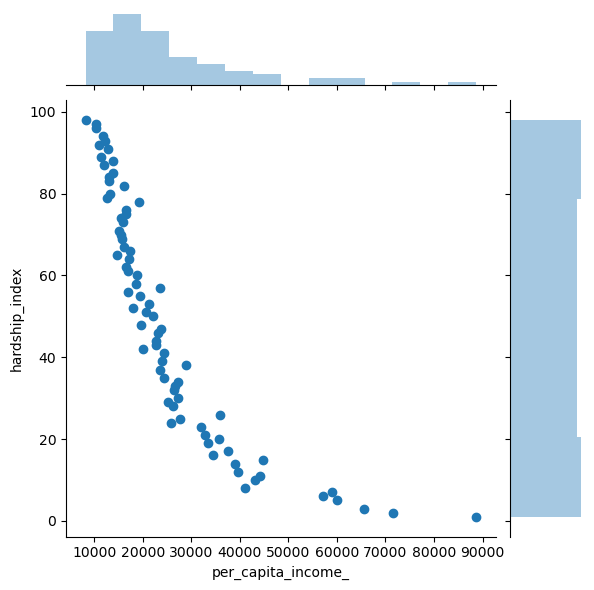

<p style="text-align:center">
    <a href="https://skills.network/?utm_medium=Exinfluencer&utm_source=Exinfluencer&utm_content=000026UJ&utm_term=10006555&utm_id=NA-SkillsNetwork-Channel-SkillsNetworkCoursesIBMDeveloperSkillsNetworkDB0201ENSkillsNetwork20127838-2022-01-01" target="_blank">
    
    </a>
</p>

# Analyzing a real world data-set with SQL and Python

Estimated time needed: **15** minutes

## Objectives

After completing this lab you will be able to:

*   Understand a dataset of selected socioeconomic indicators in Chicago
*   Learn how to store data in an Db2 database on IBM Cloud instance
*   Solve example problems to practice your SQL skills


## Selected Socioeconomic Indicators in Chicago

The city of Chicago released a dataset of socioeconomic data to the Chicago City Portal.
This dataset contains a selection of six socioeconomic indicators of public health significance and a “hardship index,” for each Chicago community area, for the years 2008 – 2012.

Scores on the hardship index can range from 1 to 100, with a higher index number representing a greater level of hardship.

A detailed description of the dataset can be found on [the city of Chicago's website](https://data.cityofchicago.org/Health-Human-Services/Census-Data-Selected-socioeconomic-indicators-in-C/kn9c-c2s2?utm_medium=Exinfluencer&utm_source=Exinfluencer&utm_content=000026UJ&utm_term=10006555&utm_id=NA-SkillsNetwork-Channel-SkillsNetworkCoursesIBMDeveloperSkillsNetworkDB0201ENSkillsNetwork20127838-2022-01-01), but to summarize, the dataset has the following variables:

*   **Community Area Number** (`ca`): Used to uniquely identify each row of the dataset

*   **Community Area Name** (`community_area_name`): The name of the region in the city of Chicago

*   **Percent of Housing Crowded** (`percent_of_housing_crowded`): Percent of occupied housing units with more than one person per room

*   **Percent Households Below Poverty** (`percent_households_below_poverty`): Percent of households living below the federal poverty line

*   **Percent Aged 16+ Unemployed** (`percent_aged_16_unemployed`): Percent of persons over the age of 16 years that are unemployed

*   **Percent Aged 25+ without High School Diploma** (`percent_aged_25_without_high_school_diploma`): Percent of persons over the age of 25 years without a high school education

*   **Percent Aged Under** 18 or Over 64:Percent of population under 18 or over 64 years of age (`percent_aged_under_18_or_over_64`): (ie. dependents)

*   **Per Capita Income** (`per_capita_income_`): Community Area per capita income is estimated as the sum of tract-level aggragate incomes divided by the total population

*   **Hardship Index** (`hardship_index`): Score that incorporates each of the six selected socioeconomic indicators

In this Lab, we'll take a look at the variables in the socioeconomic indicators dataset and do some basic analysis with Python.


### Connect to the database

Let us first load the SQL extension and establish a connection with the database

The following required modules are pre-installed in the Skills Network Labs environment. However if you run this notebook commands in a different Jupyter environment (e.g. Watson Studio or Ananconda) you may need to install these libraries by removing the `#` sign before `!pip` in the code cell below.


```python
# These libraries are pre-installed in SN Labs. If running in another environment please uncomment lines below to install them:
# !pip install --force-reinstall ibm_db==3.1.0 ibm_db_sa==0.3.3
# Ensure we don't load_ext with sqlalchemy>=1.4 (incompadible)
# !pip uninstall sqlalchemy==1.4 -y && pip install sqlalchemy==1.3.24
# !pip install ipython-sql
```


```python
%load_ext sql
```


```python
# Remember the connection string is of the format:
# %sql ibm_db_sa://my-username:my-password@hostname:port/BLUDB?security=SSL
# Enter the connection string for your Db2 on Cloud database instance below
# i.e. copy after db2:// from the URI string in Service Credentials of your Db2 instance. Remove the double quotes at the end.
%sql ibm_db_sa://cgv02624:********@1bbf73c5-d84a-4bb0-85b9-ab1a4348f4a4.c3n41cmd0nqnrk39u98g.databases.appdomain.cloud:32286/bludb?security=SSL
```


    'Connected: cgv02624@bludb'


### Store the dataset in a Table

##### In many cases the dataset to be analyzed is available as a .CSV (comma separated values) file, perhaps on the internet. To analyze the data using SQL, it first needs to be stored in the database.

##### We will first read the dataset source .CSV from the internet into pandas dataframe

##### Then we need to create a table in our Db2 database to store the dataset. The PERSIST command in SQL "magic" simplifies the process of table creation and writing the data from a `pandas` dataframe into the table


```python
import pandas
# import pandas library, read in CSV file
chicago_socioeconomic_data = pandas.read_csv('https://data.cityofchicago.org/resource/jcxq-k9xf.csv')
# Table creation in Db2 Datatabase
%sql PERSIST chicago_socioeconomic_data
```

     * ibm_db_sa://cgv02624:***@1bbf73c5-d84a-4bb0-85b9-ab1a4348f4a4.c3n41cmd0nqnrk39u98g.databases.appdomain.cloud:32286/bludb


    'Persisted chicago_socioeconomic_data'


##### You can verify that the table creation was successful by making a basic query like:


## Problems

### Problem 1

##### How many rows are in the dataset?


```sql
%%sql
-- Initial Row(s) pull
SELECT * FROM chicago_socioeconomic_data LIMIT 3;
```

     * ibm_db_sa://cgv02624:***@1bbf73c5-d84a-4bb0-85b9-ab1a4348f4a4.c3n41cmd0nqnrk39u98g.databases.appdomain.cloud:32286/bludb
    Done.


<table>
    <thead>
        <tr>
            <th>index</th>
            <th>ca</th>
            <th>community_area_name</th>
            <th>percent_of_housing_crowded</th>
            <th>percent_households_below_poverty</th>
            <th>percent_aged_16_unemployed</th>
            <th>percent_aged_25_without_high_school_diploma</th>
            <th>percent_aged_under_18_or_over_64</th>
            <th>per_capita_income_</th>
            <th>hardship_index</th>
        </tr>
    </thead>
    <tbody>
        <tr>
            <td>0</td>
            <td>1.0</td>
            <td>Rogers Park</td>
            <td>7.7</td>
            <td>23.6</td>
            <td>8.7</td>
            <td>18.2</td>
            <td>27.5</td>
            <td>23939</td>
            <td>39.0</td>
        </tr>
        <tr>
            <td>1</td>
            <td>2.0</td>
            <td>West Ridge</td>
            <td>7.8</td>
            <td>17.2</td>
            <td>8.8</td>
            <td>20.8</td>
            <td>38.5</td>
            <td>23040</td>
            <td>46.0</td>
        </tr>
        <tr>
            <td>2</td>
            <td>3.0</td>
            <td>Uptown</td>
            <td>3.8</td>
            <td>24.0</td>
            <td>8.9</td>
            <td>11.8</td>
            <td>22.2</td>
            <td>35787</td>
            <td>20.0</td>
        </tr>
    </tbody>
</table>


```python
%sql SELECT COUNT(*) AS total_rows FROM chicago_socioeconomic_data;
```

     * ibm_db_sa://cgv02624:***@1bbf73c5-d84a-4bb0-85b9-ab1a4348f4a4.c3n41cmd0nqnrk39u98g.databases.appdomain.cloud:32286/bludb
    Done.


<table>
    <thead>
        <tr>
            <th>total_rows</th>
        </tr>
    </thead>
    <tbody>
        <tr>
            <td>78</td>
        </tr>
    </tbody>
</table>


<details><summary>Click here for the solution</summary>

```python
%sql SELECT COUNT(*) FROM chicago_socioeconomic_data;

Correct answer: 78
```

</details>


### Problem 2

##### How many community areas in Chicago have a hardship index greater than 50.0?


```python
%sql SELECT COUNT(*) AS hardship_greater_50_count FROM chicago_socioeconomic_data WHERE hardship_index > 50;
```

     * ibm_db_sa://cgv02624:***@1bbf73c5-d84a-4bb0-85b9-ab1a4348f4a4.c3n41cmd0nqnrk39u98g.databases.appdomain.cloud:32286/bludb
    Done.


<table>
    <thead>
        <tr>
            <th>hardship_greater_50_count</th>
        </tr>
    </thead>
    <tbody>
        <tr>
            <td>38</td>
        </tr>
    </tbody>
</table>


<details><summary>Click here for the solution</summary>

```python
%sql SELECT COUNT(*) FROM chicago_socioeconomic_data WHERE hardship_index > 50.0;

Correct answer: 38
```

</details>


### Problem 3

##### What is the maximum value of hardship index in this dataset?


```python
%sql SELECT MAX(hardship_index) AS max_hardship_index FROM chicago_socioeconomic_data;
```

     * ibm_db_sa://cgv02624:***@1bbf73c5-d84a-4bb0-85b9-ab1a4348f4a4.c3n41cmd0nqnrk39u98g.databases.appdomain.cloud:32286/bludb
    Done.


<table>
    <thead>
        <tr>
            <th>max_hardship_index</th>
        </tr>
    </thead>
    <tbody>
        <tr>
            <td>98.0</td>
        </tr>
    </tbody>
</table>


<details><summary>Click here for the solution</summary>

```python
%sql SELECT MAX(hardship_index) FROM chicago_socioeconomic_data;

Correct answer: 98.0
```

</details>


### Problem 4

##### Which community area which has the highest hardship index?


```python
%sql SELECT COUNT(DISTINCT community_area_name) FROM chicago_socioeconomic_data;
# https://www.ibm.com/docs/en/db2/11.5?topic=messages-sql0000-sql0249#sql0134n - GROUP BY CLAUSE 
```

     * ibm_db_sa://cgv02624:***@1bbf73c5-d84a-4bb0-85b9-ab1a4348f4a4.c3n41cmd0nqnrk39u98g.databases.appdomain.cloud:32286/bludb
    (ibm_db_dbi.ProgrammingError) ibm_db_dbi::ProgrammingError: SQLNumResultCols failed: [IBM][CLI Driver][DB2/LINUXX8664] SQL0134N  Improper use of a string column, host variable, constant, or function "COUNT".  SQLSTATE=42907 SQLCODE=-134
    [SQL: SELECT COUNT(DISTINCT community_area_name) FROM chicago_socioeconomic_data;]
    (Background on this error at: http://sqlalche.me/e/13/f405)


```sql
%%sql
SELECT hardship_index, COUNT(*)
FROM chicago_socioeconomic_data
GROUP BY hardship_index
HAVING hardship_index >= 95
ORDER BY hardship_index DESC;

-- Note here that our highest hardship index only has 1 count or area return so can just grab the one area instead of working about multiles (for subquery below)
```

     * ibm_db_sa://cgv02624:***@1bbf73c5-d84a-4bb0-85b9-ab1a4348f4a4.c3n41cmd0nqnrk39u98g.databases.appdomain.cloud:32286/bludb
    Done.


<table>
    <thead>
        <tr>
            <th>hardship_index</th>
            <th>2</th>
        </tr>
    </thead>
    <tbody>
        <tr>
            <td>98.0</td>
            <td>1</td>
        </tr>
        <tr>
            <td>97.0</td>
            <td>1</td>
        </tr>
        <tr>
            <td>96.0</td>
            <td>1</td>
        </tr>
    </tbody>
</table>


```sql
%%sql
SELECT community_area_name
FROM chicago_socioeconomic_data
WHERE hardship_index = (SELECT MAX(hardship_index)
                        FROM chicago_socioeconomic_data);
```

     * ibm_db_sa://cgv02624:***@1bbf73c5-d84a-4bb0-85b9-ab1a4348f4a4.c3n41cmd0nqnrk39u98g.databases.appdomain.cloud:32286/bludb
    Done.


<table>
    <thead>
        <tr>
            <th>community_area_name</th>
        </tr>
    </thead>
    <tbody>
        <tr>
            <td>Riverdale</td>
        </tr>
    </tbody>
</table>


```python
%sql SELECT community_area_name FROM chicago_socioeconomic_data ORDER BY hardship_index DESC NULLS LAST FETCH FIRST ROW ONLY;
```

     * ibm_db_sa://cgv02624:***@1bbf73c5-d84a-4bb0-85b9-ab1a4348f4a4.c3n41cmd0nqnrk39u98g.databases.appdomain.cloud:32286/bludb
    Done.


<table>
    <thead>
        <tr>
            <th>community_area_name</th>
        </tr>
    </thead>
    <tbody>
        <tr>
            <td>Riverdale</td>
        </tr>
    </tbody>
</table>


<details><summary>Click here for the solution</summary>

```python
#We can use the result of the last query to as an input to this query:
%sql SELECT community_area_name FROM chicago_socioeconomic_data where hardship_index=98.0

#or another option:
%sql SELECT community_area_name FROM chicago_socioeconomic_data ORDER BY hardship_index DESC NULLS LAST FETCH FIRST ROW ONLY;

#or you can use a sub-query to determine the max hardship index:
%sql select community_area_name from chicago_socioeconomic_data where hardship_index = ( select max(hardship_index) from chicago_socioeconomic_data ) 

Correct answer: 'Riverdale'
    
```

</details>


### Problem 5

##### Which Chicago community areas have per-capita incomes greater than $60,000?


```python
%sql SELECT community_area_name, per_capita_income_ FROM chicago_socioeconomic_data WHERE per_capita_income_ > 60000 ORDER BY per_capita_income_ DESC;
```

     * ibm_db_sa://cgv02624:***@1bbf73c5-d84a-4bb0-85b9-ab1a4348f4a4.c3n41cmd0nqnrk39u98g.databases.appdomain.cloud:32286/bludb
    Done.


<table>
    <thead>
        <tr>
            <th>community_area_name</th>
            <th>per_capita_income_</th>
        </tr>
    </thead>
    <tbody>
        <tr>
            <td>Near North Side</td>
            <td>88669</td>
        </tr>
        <tr>
            <td>Lincoln Park</td>
            <td>71551</td>
        </tr>
        <tr>
            <td>Loop</td>
            <td>65526</td>
        </tr>
        <tr>
            <td>Lake View</td>
            <td>60058</td>
        </tr>
    </tbody>
</table>


<details><summary>Click here for the solution</summary>

```python
%sql SELECT community_area_name FROM chicago_socioeconomic_data WHERE per_capita_income_ > 60000;

Correct answer:Lake View,Lincoln Park, Near North Side, Loop
    
```

</details>


### Problem 6

##### Create a scatter plot using the variables `per_capita_income_` and `hardship_index`. Explain the correlation between the two variables.


```python
import matplotlib.pyplot as plt
%matplotlib inline
import seaborn as sns

sql_cols = %sql SELECT per_capita_income_, hardship_index FROM chicago_socioeconomic_data;
jnt_plot = sns.jointplot(x='per_capita_income_', y='hardship_index', data=sql_cols.DataFrame())

# Negative Correlation
```

     * ibm_db_sa://cgv02624:***@1bbf73c5-d84a-4bb0-85b9-ab1a4348f4a4.c3n41cmd0nqnrk39u98g.databases.appdomain.cloud:32286/bludb
    Done.


    

    


<details><summary>Click here for the solution</summary>

```python
# if the import command gives ModuleNotFoundError: No module named 'seaborn'
# then uncomment the following line i.e. delete the # to install the seaborn package 
# !pip install seaborn==0.9.0

import matplotlib.pyplot as plt
%matplotlib inline
import seaborn as sns

income_vs_hardship = %sql SELECT per_capita_income_, hardship_index FROM chicago_socioeconomic_data;
plot = sns.jointplot(x='per_capita_income_',y='hardship_index', data=income_vs_hardship.DataFrame())

Correct answer:You can see that as Per Capita Income rises as the Hardship Index decreases. We see that the points on the scatter plot are somewhat closer to a straight line in the negative direction, so we have a negative correlation between the two variables. 
    
```

</details>


### Conclusion

##### Now that you know how to do basic exploratory data analysis using SQL and python visualization tools, you can further explore this dataset to see how the variable `per_capita_income_` is related to `percent_households_below_poverty` and `percent_aged_16_unemployed`. Try to create interesting visualizations!


## Summary

##### In this lab you learned how to store a real world data set from the internet in a database (Db2 on IBM Cloud), gain insights into data using SQL queries. You also visualized a portion of the data in the database to see what story it tells.


## Author

<a href="https://www.linkedin.com/in/ravahuja/?utm_medium=Exinfluencer&utm_source=Exinfluencer&utm_content=000026UJ&utm_term=10006555&utm_id=NA-SkillsNetwork-Channel-SkillsNetworkCoursesIBMDeveloperSkillsNetworkDB0201ENSkillsNetwork20127838-2022-01-01" target="_blank">Rav Ahuja</a>

## Change Log

| Date (YYYY-MM-DD) | Version | Changed By    | Change Description                 |
| ----------------- | ------- | ------------- | ---------------------------------- |
| 2021-11-17        | 2.3     | Lakshmi       | Updated library                    |
| 2021-07-09        | 2.2     | Malika        | Updated connection string          |
| 2021-05-06        | 2.1     | Malika Singla | Added libraries                    |
| 2020-08-28        | 2.0     | Lavanya       | Moved lab to course repo in GitLab |

<hr>

## <h3 align="center"> © IBM Corporation 2020. All rights reserved. <h3/>

