# Practice notebook for univariate analysis using NHANES data

This notebook will give you the opportunity to perform some univariate analyses on your own using the NHANES.  These analyses are similar to what was done in the week 2 NHANES case study notebook.

You can enter your code into the cells that say "enter your code here", and you can type responses to the questions into the cells that say "Type Markdown and Latex".

Note that most of the code that you will need to write below is very similar to code that appears in the case study notebook.  You will need to edit code from that notebook in small ways to adapt it to the prompts below.

To get started, we will use the same module imports and read the data in the same way as we did in the case study:


```python
%matplotlib inline
import matplotlib.pyplot as plt
import seaborn as sns
import pandas as pd
import statsmodels.api as sm
import numpy as np

da = pd.read_csv("nhanes_2015_2016.csv")
```

## Question 1

Relabel the marital status variable [DMDMARTL](https://wwwn.cdc.gov/Nchs/Nhanes/2015-2016/DEMO_I.htm#DMDMARTL) to have brief but informative character labels.  Then construct a frequency table of these values for all people, then for women only, and for men only.  Then construct these three frequency tables using only people whose age is between 30 and 40.

__Q1a.__ Briefly comment on some of the differences that you observe between the distribution of marital status between women and men, for people of all ages.


```python
# insert your code here
print(da.columns.tolist()) # DMDMARTL within ## DMDEDUC2x (type of rename structure)
print('\n')
display(da['DMDMARTL'].value_counts())

# Set new column and replace with values from encoded variables # https://wwwn.cdc.gov/Nchs/Nhanes/2015-2016/DEMO_I.htm#DMDEDUC2
da['DMDMARTLx'] = da['DMDMARTL'].replace({1:'Married', 2:'Widowed', 3:'Divorced', 4:'Separated', 
                                          5:'Never Married', 6:'Living With Partner', 77:'Refused'})

print('\n')
## See value counts to make sure they match .. will use .notation for columns and go top to bottom for counts
display(da.DMDMARTLx.value_counts(ascending=False))


```

    ['SEQN', 'ALQ101', 'ALQ110', 'ALQ130', 'SMQ020', 'RIAGENDR', 'RIDAGEYR', 'RIDRETH1', 'DMDCITZN', 'DMDEDUC2', 'DMDMARTL', 'DMDHHSIZ', 'WTINT2YR', 'SDMVPSU', 'SDMVSTRA', 'INDFMPIR', 'BPXSY1', 'BPXDI1', 'BPXSY2', 'BPXDI2', 'BMXWT', 'BMXHT', 'BMXBMI', 'BMXLEG', 'BMXARML', 'BMXARMC', 'BMXWAIST', 'HIQ210']
    
    


    1.0     2780
    5.0     1004
    3.0      579
    6.0      527
    2.0      396
    4.0      186
    77.0       2
    Name: DMDMARTL, dtype: int64


    
    


    Married                2780
    Never Married          1004
    Divorced                579
    Living With Partner     527
    Widowed                 396
    Separated               186
    Refused                   2
    Name: DMDMARTLx, dtype: int64


```python
## Then construct a frequency table of these values for all people (above), then for women only, and for men only. 
## Then construct these three frequency tables using only people whose age is between 30 and 40.
print("Here is our Gender Counts")
display(da.RIAGENDR.value_counts())
da['RIAGENDRx'] = da['RIAGENDR'].replace({1:'Male', 2:'Female'})
display(da.RIAGENDRx.value_counts())

print("Women's Frequency Table for Marriage Values")
## Women Freq - Let's get the DMDMARTLx status for all females
female_mrg_freq = da[da['RIAGENDRx'] == 'Female'] # We'll set a new dataframe for just females 
display(female_mrg_freq['DMDMARTLx'].value_counts()) # Here is their respective frequency tables for marital status

print("Men's Frequency Table for Marraige Values")
## Men Frequency
male_mrg_freq = da[da['RIAGENDRx'] == 'Male'] # We'll set a new dataframe for just males 
display(male_mrg_freq['DMDMARTLx'].value_counts()) # Here is their respective frequency tables for marital status
```

    Here is our Gender Counts


    2    2976
    1    2759
    Name: RIAGENDR, dtype: int64


    Female    2976
    Male      2759
    Name: RIAGENDRx, dtype: int64


    Women's Frequency Table for Marriage Values


    Married                1303
    Never Married           520
    Divorced                350
    Widowed                 296
    Living With Partner     262
    Separated               118
    Refused                   1
    Name: DMDMARTLx, dtype: int64


    Men's Frequency Table for Marraige Values


    Married                1477
    Never Married           484
    Living With Partner     265
    Divorced                229
    Widowed                 100
    Separated                68
    Refused                   1
    Name: DMDMARTLx, dtype: int64


```python
## Then construct these three frequency tables using only people whose age is between 30 and 40.
print(da.RIDAGEYR.value_counts()[:5]) # Age value counts subsset (Lots of 80 years olds I guess haha)
print("Now let's subset for 30-40 for Both")


print("Subsetting For Women 30-40 : Get Top 3 Ages")
female_mrg_freq_30_40 = female_mrg_freq.loc[(female_mrg_freq['RIDAGEYR'] >= 30) & (female_mrg_freq['RIDAGEYR'] <= 40)]
print(female_mrg_freq_30_40['RIDAGEYR'].value_counts(ascending=False)[:3])

print("Subsetting For Men 30-40 : Get Top 3 Ages")
male_mrg_freq_30_40 = male_mrg_freq.loc[(male_mrg_freq['RIDAGEYR'] >= 30) & (male_mrg_freq['RIDAGEYR'] <= 40)]
print(male_mrg_freq_30_40['RIDAGEYR'].value_counts(ascending=False)[:3])
```

    80    343
    18    133
    19    128
    60    119
    61    112
    Name: RIDAGEYR, dtype: int64
    Now let's subset for 30-40 for Both
    Subsetting For Women 30-40 : Get Top 3 Ages
    36    60
    30    58
    31    57
    Name: RIDAGEYR, dtype: int64
    Subsetting For Men 30-40 : Get Top 3 Ages
    33    58
    35    52
    38    48
    Name: RIDAGEYR, dtype: int64


```python
## We Have the Frequency Tables partioned - let's see the marital status for the 30-40 sets
print('Female Marriage Freq Counts : 30-39')
display(female_mrg_freq_30_40['DMDMARTLx'].value_counts())
print('\n')
print('Male Marriage Freq Counts : 30-39')
display(male_mrg_freq_30_40['DMDMARTLx'].value_counts())

## Just a peek here at the pie charts for each 30 age distribution how it shakes up better looks in subsequent cells
explode = [0, 0, 0, 0.05, 0.1, 0.1]
fig, ax = plt.subplots(2, figsize=(10,5))
ax[0].pie(female_mrg_freq_30_40['DMDMARTLx'].value_counts(), 
        labels=female_mrg_freq_30_40['DMDMARTLx'].value_counts().index.tolist(),
        autopct='%.1f', explode=[0, 0, 0, .05, .1, .1])
ax[0].set_title('Female Marriage Distribution : Ages(30-39)')

ax[1].pie(male_mrg_freq_30_40['DMDMARTLx'].value_counts(), 
        labels=male_mrg_freq_30_40['DMDMARTLx'].value_counts().index.tolist(),
        autopct='%.1f')
ax[1].set_title('Male Marriage Distribution : Ages(30-39)')
plt.show()
```

    Female Marriage Freq Counts : 30-39


    Married                285
    Never Married          116
    Living With Partner     65
    Divorced                46
    Separated               18
    Widowed                  2
    Name: DMDMARTLx, dtype: int64


    
    
    Male Marriage Freq Counts : 30-39


    Married                275
    Never Married          101
    Living With Partner     78
    Divorced                24
    Separated               12
    Widowed                  3
    Refused                  1
    Name: DMDMARTLx, dtype: int64


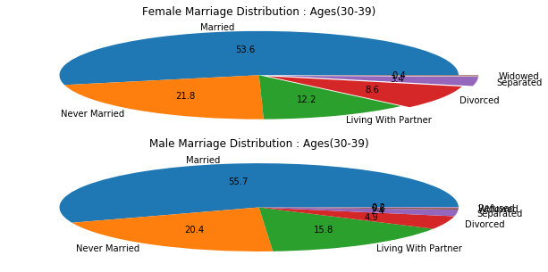


```python
## the pie uses the value_counts as percentages, the index of value_counts (so series count return per category)

fig, ax = plt.subplots(figsize=(14,9))
_, _, pcts = ax.pie(female_mrg_freq_30_40['DMDMARTLx'].value_counts(), 
        labels=female_mrg_freq_30_40['DMDMARTLx'].value_counts().index.tolist(),
        autopct='%.1f', explode=[0, 0, 0, .05, .1, .15], startangle = 15,
        wedgeprops={'linewidth': 2.0, 'edgecolor': 'white'})

plt.setp(pcts, color='white', fontweight='bold', size='x-large')
ax.set_title('Female Marriage Distribution : Ages(30-39)')
ax.legend(loc='upper left')
plt.show()
```


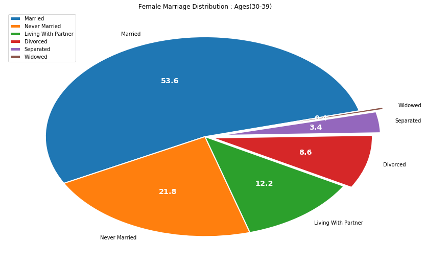


```python
## Let's Do Males 
## the pie uses the value_counts as percentages/proportions, the index of value_counts (so series count return per category) are labels

fig, ax = plt.subplots(figsize=(14,9))
_, _, pcts_2 = ax.pie(male_mrg_freq_30_40['DMDMARTLx'].value_counts(), 
        labels=male_mrg_freq_30_40['DMDMARTLx'].value_counts().index.tolist(),
        autopct='%.1f', explode=[0, 0, 0, 0, .05, .15, .25], startangle = 15,
        wedgeprops={'linewidth': 2.0, 'edgecolor': 'white'})

plt.setp(pcts_2, color='white', fontweight='bold', size='x-large')
ax.set_title('Male Marriage Distribution : Ages(30-39)')
ax.legend(loc='upper left')
plt.show()
```


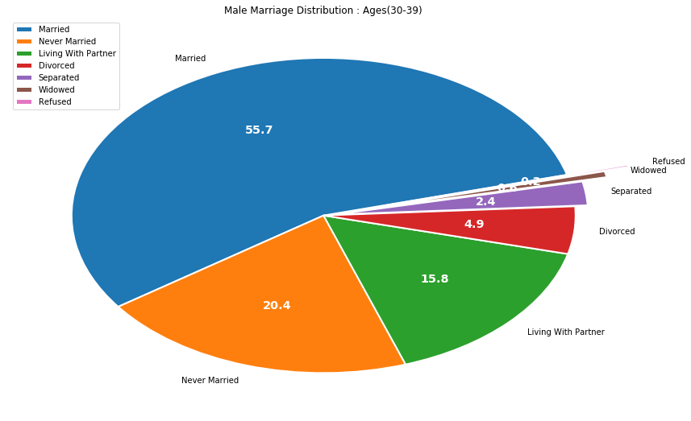


```python
## Let's Do the Total Breakdown
fig, ax = plt.subplots(figsize=(14,9))
_, _, pcts_2 = ax.pie(da['DMDMARTLx'].value_counts(), 
        labels=da['DMDMARTLx'].value_counts().index.tolist(),
        autopct='%.1f', explode=[0, 0, 0, 0, .05, .1, .15], startangle = 15,
        wedgeprops={'linewidth': 2.0, 'edgecolor': 'white'})

plt.setp(pcts_2, color='white', fontweight='bold', size='x-large')
ax.set_title('Total Distribution for Marraige Status Across Dataset')
ax.legend(loc='upper left')
plt.show()
```


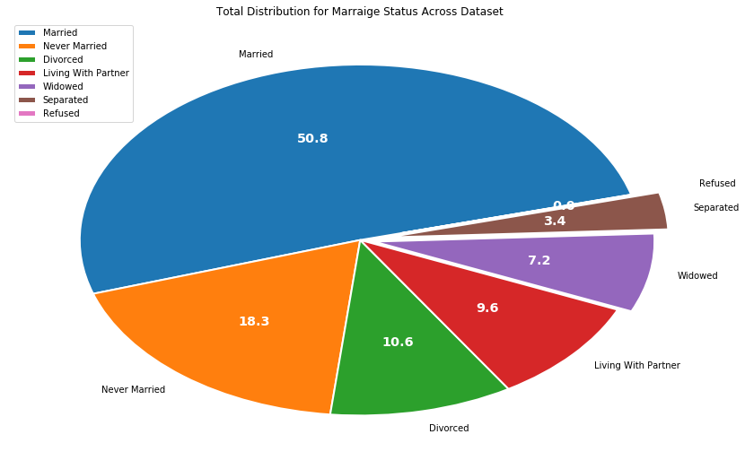


__Q1b.__ Briefly comment on the differences that you observe between the distribution of marital status states for women between the overall population, and for women between the ages of 30 and 40.
Women within 30-39 show comprably to the overall distribution with a slightly higher percentage in Both 'Married' and 'Never Married' categories. Each category differs about 3% from our overall dataset. The divorce rate is nearly doubled that of male counterparts for the same age and is close to our overall average shown in the last dataset. Unsuprisingly we do see lower percentages for widowed and divorced for this subset and higher percentages for either 'living with partner' or 'never married' but there is a very common amount of separation at this age group then what we see over the whole distribution.
__Q1c.__ Repeat part b for the men.
Males in the same age bucket have larger portions of currnetly married or never married then generally. Compared to Women 30-39 we see that that categories of 'Divorced' and 'Living with Partner' are far more different than their female counterparts. 
## Question 2

Restricting to the female population, stratify the subjects into age bands no wider than ten years, and construct the distribution of marital status within each age band.  Within each age band, present the distribution in terms of proportions that must sum to 1.


```python
# insert your code here
female_mrg_freq.columns.tolist()
print('Here is What our Distribution of the age in years looks')
display(female_mrg_freq['RIDAGEYR'].describe()) # We can base our bands off the below
female_mrg_freq['age_bins'] = pd.cut(female_mrg_freq.RIDAGEYR, [17, 25, 32, 40, 48, 56, 64, 72, 80])
print("Let's look at the Value Counts for Our New Binned Column")
display(female_mrg_freq['age_bins'].value_counts())
print("Now We'll groupby our age bins and get the counts of our new marital column value")
female_grp_mrg_ages = female_mrg_freq.groupby('age_bins')['DMDMARTLx']
female_grp_mrg_ages = female_grp_mrg_ages.value_counts() ## The groupby dataframe can be conveniently transformed like this
display(female_grp_mrg_ages[:10])
```

    Here is What our Distribution of the age in years looks


    count    2976.000000
    mean       47.793011
    std        18.299419
    min        18.000000
    25%        32.000000
    50%        47.000000
    75%        62.000000
    max        80.000000
    Name: RIDAGEYR, dtype: float64


    Let's look at the Value Counts for Our New Binned Column


    (40, 48]    423
    (17, 25]    399
    (25, 32]    381
    (48, 56]    378
    (32, 40]    373
    (56, 64]    361
    (72, 80]    355
    (64, 72]    306
    Name: age_bins, dtype: int64


    Now We'll groupby our age bins and get the counts of our new marital column value


    age_bins  DMDMARTLx          
    (17, 25]  Never Married          164
              Living With Partner     54
              Married                 44
              Separated                8
              Divorced                 3
    (25, 32]  Married                160
              Never Married          122
              Living With Partner     76
              Divorced                17
              Separated                6
    Name: DMDMARTLx, dtype: int64


```python
## Continuing On with our Groupby Dataframe
female_grp_mrg_ages_wide = female_grp_mrg_ages.unstack()
display(female_grp_mrg_ages_wide[:5])
## Well well, we have some null values to take care of. We can assume there was no count for this binned subset in this category and will simply set to zero
female_grp_mrg_ages_wide = female_grp_mrg_ages_wide.fillna(0)
print("Let's take another look")
display(female_grp_mrg_ages_wide[:5]) # Much Better!

print("Let's create one last new dataframe for proportions now for the age bucket for our marriage categories")
## We'll want to perform a lambda on the dataframe and for each value divide it by the row sum to get a percentage
## Row sum is axis=1 (applied as such with .apply) we want the proportion for the age_bins (index) not the columns
female_grp_mrg_ages_wide_props = female_grp_mrg_ages_wide.apply(lambda x: x/x.sum(), axis=1)
display(female_grp_mrg_ages_wide_props[:10])
print('Help a bit here with viewing the proportions')
print('\n')
print(female_grp_mrg_ages_wide_props.to_string(float_format="%.4f"))

```


<div>
<style scoped>
    .dataframe tbody tr th:only-of-type {
        vertical-align: middle;
    }

    .dataframe tbody tr th {
        vertical-align: top;
    }

    .dataframe thead th {
        text-align: right;
    }
</style>
<table border="1" class="dataframe">
  <thead>
    <tr style="text-align: right;">
      <th>DMDMARTLx</th>
      <th>Divorced</th>
      <th>Living With Partner</th>
      <th>Married</th>
      <th>Never Married</th>
      <th>Refused</th>
      <th>Separated</th>
      <th>Widowed</th>
    </tr>
    <tr>
      <th>age_bins</th>
      <th></th>
      <th></th>
      <th></th>
      <th></th>
      <th></th>
      <th></th>
      <th></th>
    </tr>
  </thead>
  <tbody>
    <tr>
      <th>(17, 25]</th>
      <td>3.0</td>
      <td>54.0</td>
      <td>44.0</td>
      <td>164.0</td>
      <td>NaN</td>
      <td>8.0</td>
      <td>NaN</td>
    </tr>
    <tr>
      <th>(25, 32]</th>
      <td>17.0</td>
      <td>76.0</td>
      <td>160.0</td>
      <td>122.0</td>
      <td>NaN</td>
      <td>6.0</td>
      <td>NaN</td>
    </tr>
    <tr>
      <th>(32, 40]</th>
      <td>34.0</td>
      <td>41.0</td>
      <td>212.0</td>
      <td>70.0</td>
      <td>NaN</td>
      <td>14.0</td>
      <td>2.0</td>
    </tr>
    <tr>
      <th>(40, 48]</th>
      <td>58.0</td>
      <td>34.0</td>
      <td>240.0</td>
      <td>57.0</td>
      <td>NaN</td>
      <td>27.0</td>
      <td>7.0</td>
    </tr>
    <tr>
      <th>(48, 56]</th>
      <td>69.0</td>
      <td>28.0</td>
      <td>202.0</td>
      <td>33.0</td>
      <td>NaN</td>
      <td>21.0</td>
      <td>25.0</td>
    </tr>
  </tbody>
</table>
</div>


    Let's take another look


<div>
<style scoped>
    .dataframe tbody tr th:only-of-type {
        vertical-align: middle;
    }

    .dataframe tbody tr th {
        vertical-align: top;
    }

    .dataframe thead th {
        text-align: right;
    }
</style>
<table border="1" class="dataframe">
  <thead>
    <tr style="text-align: right;">
      <th>DMDMARTLx</th>
      <th>Divorced</th>
      <th>Living With Partner</th>
      <th>Married</th>
      <th>Never Married</th>
      <th>Refused</th>
      <th>Separated</th>
      <th>Widowed</th>
    </tr>
    <tr>
      <th>age_bins</th>
      <th></th>
      <th></th>
      <th></th>
      <th></th>
      <th></th>
      <th></th>
      <th></th>
    </tr>
  </thead>
  <tbody>
    <tr>
      <th>(17, 25]</th>
      <td>3.0</td>
      <td>54.0</td>
      <td>44.0</td>
      <td>164.0</td>
      <td>0.0</td>
      <td>8.0</td>
      <td>0.0</td>
    </tr>
    <tr>
      <th>(25, 32]</th>
      <td>17.0</td>
      <td>76.0</td>
      <td>160.0</td>
      <td>122.0</td>
      <td>0.0</td>
      <td>6.0</td>
      <td>0.0</td>
    </tr>
    <tr>
      <th>(32, 40]</th>
      <td>34.0</td>
      <td>41.0</td>
      <td>212.0</td>
      <td>70.0</td>
      <td>0.0</td>
      <td>14.0</td>
      <td>2.0</td>
    </tr>
    <tr>
      <th>(40, 48]</th>
      <td>58.0</td>
      <td>34.0</td>
      <td>240.0</td>
      <td>57.0</td>
      <td>0.0</td>
      <td>27.0</td>
      <td>7.0</td>
    </tr>
    <tr>
      <th>(48, 56]</th>
      <td>69.0</td>
      <td>28.0</td>
      <td>202.0</td>
      <td>33.0</td>
      <td>0.0</td>
      <td>21.0</td>
      <td>25.0</td>
    </tr>
  </tbody>
</table>
</div>


    Let's create one last new dataframe for proportions now for the age bucket for our marriage categories


<div>
<style scoped>
    .dataframe tbody tr th:only-of-type {
        vertical-align: middle;
    }

    .dataframe tbody tr th {
        vertical-align: top;
    }

    .dataframe thead th {
        text-align: right;
    }
</style>
<table border="1" class="dataframe">
  <thead>
    <tr style="text-align: right;">
      <th>DMDMARTLx</th>
      <th>Divorced</th>
      <th>Living With Partner</th>
      <th>Married</th>
      <th>Never Married</th>
      <th>Refused</th>
      <th>Separated</th>
      <th>Widowed</th>
    </tr>
    <tr>
      <th>age_bins</th>
      <th></th>
      <th></th>
      <th></th>
      <th></th>
      <th></th>
      <th></th>
      <th></th>
    </tr>
  </thead>
  <tbody>
    <tr>
      <th>(17, 25]</th>
      <td>0.010989</td>
      <td>0.197802</td>
      <td>0.161172</td>
      <td>0.600733</td>
      <td>0.00000</td>
      <td>0.029304</td>
      <td>0.000000</td>
    </tr>
    <tr>
      <th>(25, 32]</th>
      <td>0.044619</td>
      <td>0.199475</td>
      <td>0.419948</td>
      <td>0.320210</td>
      <td>0.00000</td>
      <td>0.015748</td>
      <td>0.000000</td>
    </tr>
    <tr>
      <th>(32, 40]</th>
      <td>0.091153</td>
      <td>0.109920</td>
      <td>0.568365</td>
      <td>0.187668</td>
      <td>0.00000</td>
      <td>0.037534</td>
      <td>0.005362</td>
    </tr>
    <tr>
      <th>(40, 48]</th>
      <td>0.137116</td>
      <td>0.080378</td>
      <td>0.567376</td>
      <td>0.134752</td>
      <td>0.00000</td>
      <td>0.063830</td>
      <td>0.016548</td>
    </tr>
    <tr>
      <th>(48, 56]</th>
      <td>0.182540</td>
      <td>0.074074</td>
      <td>0.534392</td>
      <td>0.087302</td>
      <td>0.00000</td>
      <td>0.055556</td>
      <td>0.066138</td>
    </tr>
    <tr>
      <th>(56, 64]</th>
      <td>0.182825</td>
      <td>0.038781</td>
      <td>0.551247</td>
      <td>0.094183</td>
      <td>0.00277</td>
      <td>0.055402</td>
      <td>0.074792</td>
    </tr>
    <tr>
      <th>(64, 72]</th>
      <td>0.179739</td>
      <td>0.042484</td>
      <td>0.454248</td>
      <td>0.065359</td>
      <td>0.00000</td>
      <td>0.052288</td>
      <td>0.205882</td>
    </tr>
    <tr>
      <th>(72, 80]</th>
      <td>0.135211</td>
      <td>0.005634</td>
      <td>0.301408</td>
      <td>0.056338</td>
      <td>0.00000</td>
      <td>0.016901</td>
      <td>0.484507</td>
    </tr>
  </tbody>
</table>
</div>


    Help a bit here with viewing the proportions
    
    
    DMDMARTLx  Divorced  Living With Partner  Married  Never Married  Refused  Separated  Widowed
    age_bins                                                                                     
    (17, 25]     0.0110               0.1978   0.1612         0.6007   0.0000     0.0293   0.0000
    (25, 32]     0.0446               0.1995   0.4199         0.3202   0.0000     0.0157   0.0000
    (32, 40]     0.0912               0.1099   0.5684         0.1877   0.0000     0.0375   0.0054
    (40, 48]     0.1371               0.0804   0.5674         0.1348   0.0000     0.0638   0.0165
    (48, 56]     0.1825               0.0741   0.5344         0.0873   0.0000     0.0556   0.0661
    (56, 64]     0.1828               0.0388   0.5512         0.0942   0.0028     0.0554   0.0748
    (64, 72]     0.1797               0.0425   0.4542         0.0654   0.0000     0.0523   0.2059
    (72, 80]     0.1352               0.0056   0.3014         0.0563   0.0000     0.0169   0.4845


__Q2b.__ Repeat the construction for males.


```python
# insert your code here
print('Here is What our Distribution of the age in years looks')
display(male_mrg_freq['RIDAGEYR'].describe()) # We can base our bands off the below
male_mrg_freq['age_bins'] = pd.cut(male_mrg_freq.RIDAGEYR, [17, 25, 32, 40, 48, 56, 64, 72, 80])
print("Let's look at the Value Counts for Our New Binned Column")
display(male_mrg_freq['age_bins'].value_counts())
print("Now We'll groupby our age bins and get the counts of our new marital column value")
male_grp_mrg_ages = male_mrg_freq.groupby('age_bins')['DMDMARTLx']
male_grp_mrg_ages = male_grp_mrg_ages.value_counts() ## The groupby dataframe can be conveniently transformed like this
display(male_grp_mrg_ages[:10])

print("Awesome! We have replicated for above and have binned our ages and got the counts of each Marital Value (Categorical Column : DMDMARTLx) which was created for the unique frequency counts of marriage statuses")
```

    Here is What our Distribution of the age in years looks


    count    2759.000000
    mean       48.332004
    std        18.571168
    min        18.000000
    25%        32.000000
    50%        48.000000
    75%        63.000000
    max        80.000000
    Name: RIDAGEYR, dtype: float64


    Let's look at the Value Counts for Our New Binned Column


    (56, 64]    397
    (17, 25]    387
    (32, 40]    369
    (48, 56]    335
    (72, 80]    329
    (40, 48]    321
    (64, 72]    312
    (25, 32]    309
    Name: age_bins, dtype: int64


    Now We'll groupby our age bins and get the counts of our new marital column value


    age_bins  DMDMARTLx          
    (17, 25]  Never Married          185
              Living With Partner     34
              Married                 30
              Separated                2
              Divorced                 1
    (25, 32]  Married                116
              Never Married          107
              Living With Partner     74
              Separated                7
              Divorced                 3
    Name: DMDMARTLx, dtype: int64


    Awesome! We have replicated for above and have binned our ages and got the counts of each Marital Value (Categorical Column : DMDMARTLx) which was created for the unique frequency counts of marriage statuses


```python
## Continuing On with our Groupby Dataframe for Males
male_grp_mrg_ages_wide = male_grp_mrg_ages.unstack()
display(male_grp_mrg_ages_wide[:5])
## Well well, we have some null values to take care of. We can assume there was no count for this binned subset in this category and will simply set to zero
male_grp_mrg_ages_wide = male_grp_mrg_ages_wide.fillna(0)
print("Let's take another look")
display(male_grp_mrg_ages_wide[:5]) # Much Better!

print("Let's create one last new dataframe for proportions now for the age bucket for our marriage categories")
# ## We'll want to perform a lambda on the dataframe and for each value divide it by the row sum to get a percentage
# ## Row sum is axis=1 (applied as such with .apply) we want the proportion for the age_bins (index) not the columns
male_grp_mrg_ages_wide_props = male_grp_mrg_ages_wide.apply(lambda x: x/x.sum(), axis=1)
display(male_grp_mrg_ages_wide_props[:10])
print('Help a bit here with viewing the proportions')
print('\n')
print(male_grp_mrg_ages_wide_props.to_string(float_format="%.4f"))

```


<div>
<style scoped>
    .dataframe tbody tr th:only-of-type {
        vertical-align: middle;
    }

    .dataframe tbody tr th {
        vertical-align: top;
    }

    .dataframe thead th {
        text-align: right;
    }
</style>
<table border="1" class="dataframe">
  <thead>
    <tr style="text-align: right;">
      <th>DMDMARTLx</th>
      <th>Divorced</th>
      <th>Living With Partner</th>
      <th>Married</th>
      <th>Never Married</th>
      <th>Refused</th>
      <th>Separated</th>
      <th>Widowed</th>
    </tr>
    <tr>
      <th>age_bins</th>
      <th></th>
      <th></th>
      <th></th>
      <th></th>
      <th></th>
      <th></th>
      <th></th>
    </tr>
  </thead>
  <tbody>
    <tr>
      <th>(17, 25]</th>
      <td>1.0</td>
      <td>34.0</td>
      <td>30.0</td>
      <td>185.0</td>
      <td>NaN</td>
      <td>2.0</td>
      <td>NaN</td>
    </tr>
    <tr>
      <th>(25, 32]</th>
      <td>3.0</td>
      <td>74.0</td>
      <td>116.0</td>
      <td>107.0</td>
      <td>NaN</td>
      <td>7.0</td>
      <td>2.0</td>
    </tr>
    <tr>
      <th>(32, 40]</th>
      <td>22.0</td>
      <td>59.0</td>
      <td>216.0</td>
      <td>59.0</td>
      <td>1.0</td>
      <td>10.0</td>
      <td>2.0</td>
    </tr>
    <tr>
      <th>(40, 48]</th>
      <td>23.0</td>
      <td>30.0</td>
      <td>228.0</td>
      <td>33.0</td>
      <td>NaN</td>
      <td>6.0</td>
      <td>1.0</td>
    </tr>
    <tr>
      <th>(48, 56]</th>
      <td>41.0</td>
      <td>23.0</td>
      <td>226.0</td>
      <td>30.0</td>
      <td>NaN</td>
      <td>11.0</td>
      <td>4.0</td>
    </tr>
  </tbody>
</table>
</div>


    Let's take another look


<div>
<style scoped>
    .dataframe tbody tr th:only-of-type {
        vertical-align: middle;
    }

    .dataframe tbody tr th {
        vertical-align: top;
    }

    .dataframe thead th {
        text-align: right;
    }
</style>
<table border="1" class="dataframe">
  <thead>
    <tr style="text-align: right;">
      <th>DMDMARTLx</th>
      <th>Divorced</th>
      <th>Living With Partner</th>
      <th>Married</th>
      <th>Never Married</th>
      <th>Refused</th>
      <th>Separated</th>
      <th>Widowed</th>
    </tr>
    <tr>
      <th>age_bins</th>
      <th></th>
      <th></th>
      <th></th>
      <th></th>
      <th></th>
      <th></th>
      <th></th>
    </tr>
  </thead>
  <tbody>
    <tr>
      <th>(17, 25]</th>
      <td>1.0</td>
      <td>34.0</td>
      <td>30.0</td>
      <td>185.0</td>
      <td>0.0</td>
      <td>2.0</td>
      <td>0.0</td>
    </tr>
    <tr>
      <th>(25, 32]</th>
      <td>3.0</td>
      <td>74.0</td>
      <td>116.0</td>
      <td>107.0</td>
      <td>0.0</td>
      <td>7.0</td>
      <td>2.0</td>
    </tr>
    <tr>
      <th>(32, 40]</th>
      <td>22.0</td>
      <td>59.0</td>
      <td>216.0</td>
      <td>59.0</td>
      <td>1.0</td>
      <td>10.0</td>
      <td>2.0</td>
    </tr>
    <tr>
      <th>(40, 48]</th>
      <td>23.0</td>
      <td>30.0</td>
      <td>228.0</td>
      <td>33.0</td>
      <td>0.0</td>
      <td>6.0</td>
      <td>1.0</td>
    </tr>
    <tr>
      <th>(48, 56]</th>
      <td>41.0</td>
      <td>23.0</td>
      <td>226.0</td>
      <td>30.0</td>
      <td>0.0</td>
      <td>11.0</td>
      <td>4.0</td>
    </tr>
  </tbody>
</table>
</div>


    Let's create one last new dataframe for proportions now for the age bucket for our marriage categories


<div>
<style scoped>
    .dataframe tbody tr th:only-of-type {
        vertical-align: middle;
    }

    .dataframe tbody tr th {
        vertical-align: top;
    }

    .dataframe thead th {
        text-align: right;
    }
</style>
<table border="1" class="dataframe">
  <thead>
    <tr style="text-align: right;">
      <th>DMDMARTLx</th>
      <th>Divorced</th>
      <th>Living With Partner</th>
      <th>Married</th>
      <th>Never Married</th>
      <th>Refused</th>
      <th>Separated</th>
      <th>Widowed</th>
    </tr>
    <tr>
      <th>age_bins</th>
      <th></th>
      <th></th>
      <th></th>
      <th></th>
      <th></th>
      <th></th>
      <th></th>
    </tr>
  </thead>
  <tbody>
    <tr>
      <th>(17, 25]</th>
      <td>0.003968</td>
      <td>0.134921</td>
      <td>0.119048</td>
      <td>0.734127</td>
      <td>0.00000</td>
      <td>0.007937</td>
      <td>0.000000</td>
    </tr>
    <tr>
      <th>(25, 32]</th>
      <td>0.009709</td>
      <td>0.239482</td>
      <td>0.375405</td>
      <td>0.346278</td>
      <td>0.00000</td>
      <td>0.022654</td>
      <td>0.006472</td>
    </tr>
    <tr>
      <th>(32, 40]</th>
      <td>0.059621</td>
      <td>0.159892</td>
      <td>0.585366</td>
      <td>0.159892</td>
      <td>0.00271</td>
      <td>0.027100</td>
      <td>0.005420</td>
    </tr>
    <tr>
      <th>(40, 48]</th>
      <td>0.071651</td>
      <td>0.093458</td>
      <td>0.710280</td>
      <td>0.102804</td>
      <td>0.00000</td>
      <td>0.018692</td>
      <td>0.003115</td>
    </tr>
    <tr>
      <th>(48, 56]</th>
      <td>0.122388</td>
      <td>0.068657</td>
      <td>0.674627</td>
      <td>0.089552</td>
      <td>0.00000</td>
      <td>0.032836</td>
      <td>0.011940</td>
    </tr>
    <tr>
      <th>(56, 64]</th>
      <td>0.148615</td>
      <td>0.062972</td>
      <td>0.612091</td>
      <td>0.110831</td>
      <td>0.00000</td>
      <td>0.027708</td>
      <td>0.037783</td>
    </tr>
    <tr>
      <th>(64, 72]</th>
      <td>0.121795</td>
      <td>0.041667</td>
      <td>0.695513</td>
      <td>0.057692</td>
      <td>0.00000</td>
      <td>0.041667</td>
      <td>0.041667</td>
    </tr>
    <tr>
      <th>(72, 80]</th>
      <td>0.127660</td>
      <td>0.021277</td>
      <td>0.610942</td>
      <td>0.024316</td>
      <td>0.00000</td>
      <td>0.024316</td>
      <td>0.191489</td>
    </tr>
  </tbody>
</table>
</div>


    Help a bit here with viewing the proportions
    
    
    DMDMARTLx  Divorced  Living With Partner  Married  Never Married  Refused  Separated  Widowed
    age_bins                                                                                     
    (17, 25]     0.0040               0.1349   0.1190         0.7341   0.0000     0.0079   0.0000
    (25, 32]     0.0097               0.2395   0.3754         0.3463   0.0000     0.0227   0.0065
    (32, 40]     0.0596               0.1599   0.5854         0.1599   0.0027     0.0271   0.0054
    (40, 48]     0.0717               0.0935   0.7103         0.1028   0.0000     0.0187   0.0031
    (48, 56]     0.1224               0.0687   0.6746         0.0896   0.0000     0.0328   0.0119
    (56, 64]     0.1486               0.0630   0.6121         0.1108   0.0000     0.0277   0.0378
    (64, 72]     0.1218               0.0417   0.6955         0.0577   0.0000     0.0417   0.0417
    (72, 80]     0.1277               0.0213   0.6109         0.0243   0.0000     0.0243   0.1915


__Q2c.__ Comment on any notable differences that you see when comparing these results for females and for males.


```python
print("Female Set Proportions")
print(female_grp_mrg_ages_wide_props.to_string(float_format="%.4f"))
print("\n")
print("Male Set Proportions")
print(male_grp_mrg_ages_wide_props.to_string(float_format="%.4f"))
print('\n')
print("Percentages")
print('\n')
print("Female Percentages")
## Not looking for proportions so can just do a standard type apply across all values in the dataframe
female_grp_mrg_ages_wide_props_str = female_grp_mrg_ages_wide_props.copy()
## Use copied dataframe with float type column types to a string rounded string represntation
female_grp_mrg_ages_wide_props_str = female_grp_mrg_ages_wide_props_str.apply(lambda x: round((x * 100), 1)).astype(str).apply(lambda x: x + '%')
display(female_grp_mrg_ages_wide_props_str)
print('\n')
print("Male Percentages")
## Not looking for proportions so can just do a standard type apply across all values in the dataframe
male_grp_mrg_ages_wide_props_str = male_grp_mrg_ages_wide_props.copy()
## Use copied dataframe with float type column types to a string rounded string represntation
male_grp_mrg_ages_wide_props_str = male_grp_mrg_ages_wide_props_str.apply(lambda x: round((x * 100), 1)).astype(str).apply(lambda x: x + '%')
display(male_grp_mrg_ages_wide_props_str)
print("""
      We see females appear to be far likely more widowed than males from 60+  
      One striking difference is the marriage rate for males 60+. 
      There is a notable spike in what appears like potential re-marriages for males at 65 and a 
      lower divorce rate than females. Having tighter bins in the range from 30-65 would be the next item to
      investigate based on a majority of our distribution living in that range.
      """
     )
```

    Female Set Proportions
    DMDMARTLx  Divorced  Living With Partner  Married  Never Married  Refused  Separated  Widowed
    age_bins                                                                                     
    (17, 25]     0.0110               0.1978   0.1612         0.6007   0.0000     0.0293   0.0000
    (25, 32]     0.0446               0.1995   0.4199         0.3202   0.0000     0.0157   0.0000
    (32, 40]     0.0912               0.1099   0.5684         0.1877   0.0000     0.0375   0.0054
    (40, 48]     0.1371               0.0804   0.5674         0.1348   0.0000     0.0638   0.0165
    (48, 56]     0.1825               0.0741   0.5344         0.0873   0.0000     0.0556   0.0661
    (56, 64]     0.1828               0.0388   0.5512         0.0942   0.0028     0.0554   0.0748
    (64, 72]     0.1797               0.0425   0.4542         0.0654   0.0000     0.0523   0.2059
    (72, 80]     0.1352               0.0056   0.3014         0.0563   0.0000     0.0169   0.4845
    
    
    Male Set Proportions
    DMDMARTLx  Divorced  Living With Partner  Married  Never Married  Refused  Separated  Widowed
    age_bins                                                                                     
    (17, 25]     0.0040               0.1349   0.1190         0.7341   0.0000     0.0079   0.0000
    (25, 32]     0.0097               0.2395   0.3754         0.3463   0.0000     0.0227   0.0065
    (32, 40]     0.0596               0.1599   0.5854         0.1599   0.0027     0.0271   0.0054
    (40, 48]     0.0717               0.0935   0.7103         0.1028   0.0000     0.0187   0.0031
    (48, 56]     0.1224               0.0687   0.6746         0.0896   0.0000     0.0328   0.0119
    (56, 64]     0.1486               0.0630   0.6121         0.1108   0.0000     0.0277   0.0378
    (64, 72]     0.1218               0.0417   0.6955         0.0577   0.0000     0.0417   0.0417
    (72, 80]     0.1277               0.0213   0.6109         0.0243   0.0000     0.0243   0.1915
    
    
    Percentages
    
    
    Female Percentages


<div>
<style scoped>
    .dataframe tbody tr th:only-of-type {
        vertical-align: middle;
    }

    .dataframe tbody tr th {
        vertical-align: top;
    }

    .dataframe thead th {
        text-align: right;
    }
</style>
<table border="1" class="dataframe">
  <thead>
    <tr style="text-align: right;">
      <th>DMDMARTLx</th>
      <th>Divorced</th>
      <th>Living With Partner</th>
      <th>Married</th>
      <th>Never Married</th>
      <th>Refused</th>
      <th>Separated</th>
      <th>Widowed</th>
    </tr>
    <tr>
      <th>age_bins</th>
      <th></th>
      <th></th>
      <th></th>
      <th></th>
      <th></th>
      <th></th>
      <th></th>
    </tr>
  </thead>
  <tbody>
    <tr>
      <th>(17, 25]</th>
      <td>1.1%</td>
      <td>19.8%</td>
      <td>16.1%</td>
      <td>60.1%</td>
      <td>0.0%</td>
      <td>2.9%</td>
      <td>0.0%</td>
    </tr>
    <tr>
      <th>(25, 32]</th>
      <td>4.5%</td>
      <td>19.9%</td>
      <td>42.0%</td>
      <td>32.0%</td>
      <td>0.0%</td>
      <td>1.6%</td>
      <td>0.0%</td>
    </tr>
    <tr>
      <th>(32, 40]</th>
      <td>9.1%</td>
      <td>11.0%</td>
      <td>56.8%</td>
      <td>18.8%</td>
      <td>0.0%</td>
      <td>3.8%</td>
      <td>0.5%</td>
    </tr>
    <tr>
      <th>(40, 48]</th>
      <td>13.7%</td>
      <td>8.0%</td>
      <td>56.7%</td>
      <td>13.5%</td>
      <td>0.0%</td>
      <td>6.4%</td>
      <td>1.7%</td>
    </tr>
    <tr>
      <th>(48, 56]</th>
      <td>18.3%</td>
      <td>7.4%</td>
      <td>53.4%</td>
      <td>8.7%</td>
      <td>0.0%</td>
      <td>5.6%</td>
      <td>6.6%</td>
    </tr>
    <tr>
      <th>(56, 64]</th>
      <td>18.3%</td>
      <td>3.9%</td>
      <td>55.1%</td>
      <td>9.4%</td>
      <td>0.3%</td>
      <td>5.5%</td>
      <td>7.5%</td>
    </tr>
    <tr>
      <th>(64, 72]</th>
      <td>18.0%</td>
      <td>4.2%</td>
      <td>45.4%</td>
      <td>6.5%</td>
      <td>0.0%</td>
      <td>5.2%</td>
      <td>20.6%</td>
    </tr>
    <tr>
      <th>(72, 80]</th>
      <td>13.5%</td>
      <td>0.6%</td>
      <td>30.1%</td>
      <td>5.6%</td>
      <td>0.0%</td>
      <td>1.7%</td>
      <td>48.5%</td>
    </tr>
  </tbody>
</table>
</div>


    
    
    Male Percentages


<div>
<style scoped>
    .dataframe tbody tr th:only-of-type {
        vertical-align: middle;
    }

    .dataframe tbody tr th {
        vertical-align: top;
    }

    .dataframe thead th {
        text-align: right;
    }
</style>
<table border="1" class="dataframe">
  <thead>
    <tr style="text-align: right;">
      <th>DMDMARTLx</th>
      <th>Divorced</th>
      <th>Living With Partner</th>
      <th>Married</th>
      <th>Never Married</th>
      <th>Refused</th>
      <th>Separated</th>
      <th>Widowed</th>
    </tr>
    <tr>
      <th>age_bins</th>
      <th></th>
      <th></th>
      <th></th>
      <th></th>
      <th></th>
      <th></th>
      <th></th>
    </tr>
  </thead>
  <tbody>
    <tr>
      <th>(17, 25]</th>
      <td>0.4%</td>
      <td>13.5%</td>
      <td>11.9%</td>
      <td>73.4%</td>
      <td>0.0%</td>
      <td>0.8%</td>
      <td>0.0%</td>
    </tr>
    <tr>
      <th>(25, 32]</th>
      <td>1.0%</td>
      <td>23.9%</td>
      <td>37.5%</td>
      <td>34.6%</td>
      <td>0.0%</td>
      <td>2.3%</td>
      <td>0.6%</td>
    </tr>
    <tr>
      <th>(32, 40]</th>
      <td>6.0%</td>
      <td>16.0%</td>
      <td>58.5%</td>
      <td>16.0%</td>
      <td>0.3%</td>
      <td>2.7%</td>
      <td>0.5%</td>
    </tr>
    <tr>
      <th>(40, 48]</th>
      <td>7.2%</td>
      <td>9.3%</td>
      <td>71.0%</td>
      <td>10.3%</td>
      <td>0.0%</td>
      <td>1.9%</td>
      <td>0.3%</td>
    </tr>
    <tr>
      <th>(48, 56]</th>
      <td>12.2%</td>
      <td>6.9%</td>
      <td>67.5%</td>
      <td>9.0%</td>
      <td>0.0%</td>
      <td>3.3%</td>
      <td>1.2%</td>
    </tr>
    <tr>
      <th>(56, 64]</th>
      <td>14.9%</td>
      <td>6.3%</td>
      <td>61.2%</td>
      <td>11.1%</td>
      <td>0.0%</td>
      <td>2.8%</td>
      <td>3.8%</td>
    </tr>
    <tr>
      <th>(64, 72]</th>
      <td>12.2%</td>
      <td>4.2%</td>
      <td>69.6%</td>
      <td>5.8%</td>
      <td>0.0%</td>
      <td>4.2%</td>
      <td>4.2%</td>
    </tr>
    <tr>
      <th>(72, 80]</th>
      <td>12.8%</td>
      <td>2.1%</td>
      <td>61.1%</td>
      <td>2.4%</td>
      <td>0.0%</td>
      <td>2.4%</td>
      <td>19.1%</td>
    </tr>
  </tbody>
</table>
</div>


    
          We see females appear to be far likely more widowed than males from 60+  
          One striking difference is the marriage rate for males 60+. 
          There is a notable spike in what appears like potential re-marriages for males at 65 and a 
          lower divorce rate than females. Having tighter bins in the range from 30-65 would be the next item to
          investigate based on a majority of our distribution living in that range.
          


## Question 3

Construct a histogram of the distribution of heights using the BMXHT variable in the NHANES sample.


```python
# insert your code here 
## Distribution without cleaning Nulls returns : ValueError: cannot convert float NaN to integer
print(da.BMXHT.describe())
da['BMXHT'].dropna(inplace=True)
sns.distplot(da.BMXHT, kde=False)
plt.ylabel('Count')
plt.show()
```

    count    5673.000000
    mean      166.142834
    std        10.079264
    min       129.700000
    25%       158.700000
    50%       166.000000
    75%       173.500000
    max       202.700000
    Name: BMXHT, dtype: float64


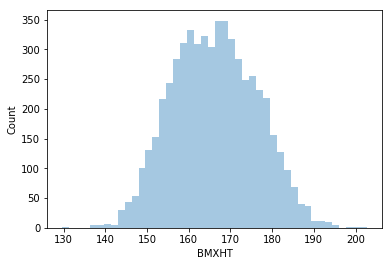


__Q3a.__ Use the `bins` argument to [distplot](https://seaborn.pydata.org/generated/seaborn.distplot.html) to produce histograms with different numbers of bins.  Assess whether the default value for this argument gives a meaningful result, and comment on what happens as the number of bins grows excessively large or excessively small. 


```python
## Can overlap and use color to see a few different bin settings
sns.distplot(da.BMXHT, kde=False, bins=8, color='lightblue')
sns.distplot(da.BMXHT, kde=False, bins=15, color='darkred')
sns.distplot(da.BMXHT, kde=False, bins=25, color='lightgreen')
sns.distplot(da.BMXHT, kde=False, bins=35, color='blue')
plt.ylabel('Count')
plt.show()
```


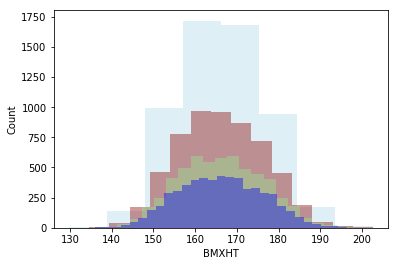


__Q3b.__ Make separate histograms for the heights of women and men, then make a side-by-side boxplot showing the heights of women and men.


```python
# insert your code here
display(female_mrg_freq.head(5))
sns.distplot(female_mrg_freq['BMXHT'].dropna(), color='pink', label='Female', kde=False)
sns.distplot(male_mrg_freq['BMXHT'].dropna(), color='blue', label='Male', kde=False)
plt.ylabel('Count')
plt.title('Distribution of Men & Women Height')
plt.legend()
plt.show()
```


<div>
<style scoped>
    .dataframe tbody tr th:only-of-type {
        vertical-align: middle;
    }

    .dataframe tbody tr th {
        vertical-align: top;
    }

    .dataframe thead th {
        text-align: right;
    }
</style>
<table border="1" class="dataframe">
  <thead>
    <tr style="text-align: right;">
      <th></th>
      <th>SEQN</th>
      <th>ALQ101</th>
      <th>ALQ110</th>
      <th>ALQ130</th>
      <th>SMQ020</th>
      <th>RIAGENDR</th>
      <th>RIDAGEYR</th>
      <th>RIDRETH1</th>
      <th>DMDCITZN</th>
      <th>DMDEDUC2</th>
      <th>...</th>
      <th>BMXHT</th>
      <th>BMXBMI</th>
      <th>BMXLEG</th>
      <th>BMXARML</th>
      <th>BMXARMC</th>
      <th>BMXWAIST</th>
      <th>HIQ210</th>
      <th>DMDMARTLx</th>
      <th>RIAGENDRx</th>
      <th>age_bins</th>
    </tr>
  </thead>
  <tbody>
    <tr>
      <th>3</th>
      <td>83735</td>
      <td>2.0</td>
      <td>1.0</td>
      <td>1.0</td>
      <td>2</td>
      <td>2</td>
      <td>56</td>
      <td>3</td>
      <td>1.0</td>
      <td>5.0</td>
      <td>...</td>
      <td>160.9</td>
      <td>42.4</td>
      <td>38.5</td>
      <td>37.7</td>
      <td>38.3</td>
      <td>110.1</td>
      <td>2.0</td>
      <td>Living With Partner</td>
      <td>Female</td>
      <td>(48, 56]</td>
    </tr>
    <tr>
      <th>4</th>
      <td>83736</td>
      <td>2.0</td>
      <td>1.0</td>
      <td>1.0</td>
      <td>2</td>
      <td>2</td>
      <td>42</td>
      <td>4</td>
      <td>1.0</td>
      <td>4.0</td>
      <td>...</td>
      <td>164.9</td>
      <td>20.3</td>
      <td>37.4</td>
      <td>36.0</td>
      <td>27.2</td>
      <td>80.4</td>
      <td>2.0</td>
      <td>Divorced</td>
      <td>Female</td>
      <td>(40, 48]</td>
    </tr>
    <tr>
      <th>5</th>
      <td>83737</td>
      <td>2.0</td>
      <td>2.0</td>
      <td>NaN</td>
      <td>2</td>
      <td>2</td>
      <td>72</td>
      <td>1</td>
      <td>2.0</td>
      <td>2.0</td>
      <td>...</td>
      <td>150.0</td>
      <td>28.6</td>
      <td>34.4</td>
      <td>33.5</td>
      <td>31.4</td>
      <td>92.9</td>
      <td>NaN</td>
      <td>Separated</td>
      <td>Female</td>
      <td>(64, 72]</td>
    </tr>
    <tr>
      <th>7</th>
      <td>83742</td>
      <td>1.0</td>
      <td>NaN</td>
      <td>1.0</td>
      <td>2</td>
      <td>2</td>
      <td>32</td>
      <td>1</td>
      <td>2.0</td>
      <td>4.0</td>
      <td>...</td>
      <td>151.3</td>
      <td>28.2</td>
      <td>34.1</td>
      <td>33.1</td>
      <td>31.5</td>
      <td>93.3</td>
      <td>2.0</td>
      <td>Married</td>
      <td>Female</td>
      <td>(25, 32]</td>
    </tr>
    <tr>
      <th>12</th>
      <td>83752</td>
      <td>1.0</td>
      <td>NaN</td>
      <td>2.0</td>
      <td>1</td>
      <td>2</td>
      <td>30</td>
      <td>2</td>
      <td>1.0</td>
      <td>4.0</td>
      <td>...</td>
      <td>163.6</td>
      <td>26.6</td>
      <td>37.3</td>
      <td>35.7</td>
      <td>31.0</td>
      <td>90.7</td>
      <td>2.0</td>
      <td>Living With Partner</td>
      <td>Female</td>
      <td>(25, 32]</td>
    </tr>
  </tbody>
</table>
<p>5 rows × 31 columns</p>
</div>


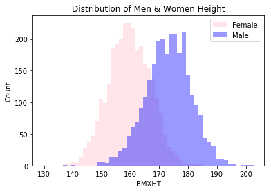


```python
sns.boxplot(x='RIAGENDRx', y='BMXHT', data=da)
plt.ylabel('Height')
plt.xlabel('Sex')
plt.title('Height Distribution Between Males and Females')
plt.show()
```


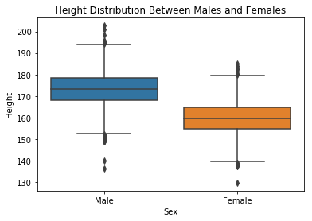


## Question 4

Make a boxplot showing the distribution of within-subject differences between the first and second systolic blood pressure measurents ([BPXSY1](https://wwwn.cdc.gov/Nchs/Nhanes/2015-2016/BPX_I.htm#BPXSY1) and [BPXSY2](https://wwwn.cdc.gov/Nchs/Nhanes/2015-2016/BPX_I.htm#BPXSY2)).


```python
# insert your code here
## Let's get a view of what a difference may be
print(da[['BPXSY1', 'BPXSY2']][:5].to_string())

print("\nNew Dataframe with Subject Difference Created Below", '\n')
## Potential for later use so can make a subset dataframe with the measurements and their difference
first_second_bp_measures = da[['BPXSY1', 'BPXSY2']]
## Total Column Nulls
print("\nFirst Let's look at Nulls and their Totals Per Column")
print(first_second_bp_measures.isna().sum())
## Where each column was null? Can we check in our boolean series
null_bool_frame = first_second_bp_measures.isna()
print('\n')
print("This is our totals for each column having a null value based on their total above : {}".format(len(null_bool_frame.loc[(null_bool_frame['BPXSY1'] == True) & (null_bool_frame['BPXSY2'] == True)])))

## Since we're looking for proportion, what happens when null attempted differences are made?
first_second_bp_measures['Wth_Sbj_Dff'] = da['BPXSY1'] - da['BPXSY2']
print("\n")
print("Our count of total null values for our difference check is : {}".format(first_second_bp_measures['Wth_Sbj_Dff'].isna().sum()))
print("""
We'll we see that makes sense, regardless of which column holds the null value (or if both do), 
the subsequent value for our difference column will be null. How would our conition check a null value to get \na proportion we're after.
""")

first_ten = first_second_bp_measures[:10]
print(first_ten, '\n')
## An individual with a lower second reading would have a positive  difference indicating an initial higher score
## For our subset of the first 10 we see 5 subj_diff values with a negative value (second reading was higher)
## We see 4 subj_diff value with a positive value ("white coat syndrome" our higher reading)

## So How does our subsetting ultimately shake out?
higher_second = first_ten.loc[first_ten['Wth_Sbj_Dff'] < 0]
print('Here is our measureements with a higher second reading (Not White Coat Syndrome)\n', higher_second)

higher_first = first_ten.loc[first_ten['Wth_Sbj_Dff'] > 0]
print('\nHere is our measureements with a higher first reading (White Coat Syndrome)\n', higher_first)

print("""\nSo our null values have been ignored with our conditional setting as expected. 
Do get an accurate proprotion however we can't use our length of a column on a positive/negative proportion check
as the conditional % (count / total) would include nulls in the total and wouldn't give us an accurate read. 
The sum would include our 366 null values in the denominator which accounts for {}% of our total distribution
""".format(round(366/len(first_second_bp_measures), 2)))

```

       BPXSY1  BPXSY2
    0   128.0   124.0
    1   146.0   140.0
    2   138.0   132.0
    3   132.0   134.0
    4   100.0   114.0
    
    New Dataframe with Subject Difference Created Below 
    
    
    First Let's look at Nulls and their Totals Per Column
    BPXSY1    334
    BPXSY2    200
    dtype: int64
    
    
    This is our totals for each column having a null value based on their total above : 168
    
    
    Our count of total null values for our difference check is : 366
    
    We'll we see that makes sense, regardless of which column holds the null value (or if both do), 
    the subsequent value for our difference column will be null. How would our conition check a null value to get 
    a proportion we're after.
    
       BPXSY1  BPXSY2  Wth_Sbj_Dff
    0   128.0   124.0          4.0
    1   146.0   140.0          6.0
    2   138.0   132.0          6.0
    3   132.0   134.0         -2.0
    4   100.0   114.0        -14.0
    5   116.0   122.0         -6.0
    6   110.0   112.0         -2.0
    7   120.0   114.0          6.0
    8     NaN     NaN          NaN
    9   178.0   180.0         -2.0 
    
    Here is our measureements with a higher second reading (Not White Coat Syndrome)
        BPXSY1  BPXSY2  Wth_Sbj_Dff
    3   132.0   134.0         -2.0
    4   100.0   114.0        -14.0
    5   116.0   122.0         -6.0
    6   110.0   112.0         -2.0
    9   178.0   180.0         -2.0
    
    Here is our measureements with a higher first reading (White Coat Syndrome)
        BPXSY1  BPXSY2  Wth_Sbj_Dff
    0   128.0   124.0          4.0
    1   146.0   140.0          6.0
    2   138.0   132.0          6.0
    7   120.0   114.0          6.0
    
    So our null values have been ignored with our conditional setting as expected. 
    Do get an accurate proprotion however we can't use our length of a column on a positive/negative proportion check
    as the conditional % (count / total) would include nulls in the total and wouldn't give us an accurate read. 
    The sum would include our 366 null values in the denominator which accounts for 0.06% of our total distribution
    


```python
## Here is our difference column distribution
display(first_second_bp_measures['Wth_Sbj_Dff'].describe())

## Well We took a bit of a Detour But Let's Plot Now and take a look
sns.boxplot(first_second_bp_measures['Wth_Sbj_Dff'], orient='v')

plt.ylabel('Within Subject Difference')
plt.title('Difference Summary Distribution')
plt.show()
```


    count    5369.000000
    mean        0.674986
    std         5.046465
    min       -26.000000
    25%        -2.000000
    50%         0.000000
    75%         4.000000
    max        32.000000
    Name: Wth_Sbj_Dff, dtype: float64


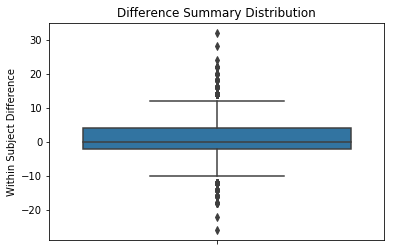


```python
## This is kinda hard to view however, can we zoom in?

## Define Figure Size 
sns.set(rc={"figure.figsize":(9, 9)}) #width=8, height=4


diff_zoom = sns.boxplot(
            first_second_bp_measures['Wth_Sbj_Dff'], 
            orient='v'
            )

diff_zoom.set_ylim(-15, 15)
plt.ylabel('Within Subject Difference')
plt.title('Difference Summary Distribution')
plt.show()
```


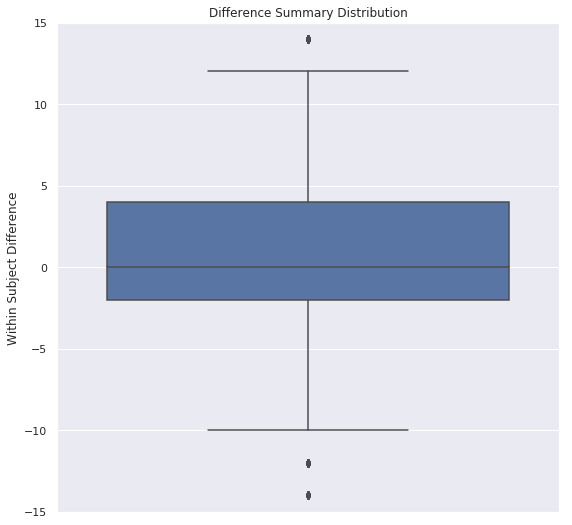


* We see that our interquartile range would certainly be positive lending to the theory of a "White Coat" Initial measurement 

__Q4a.__ What proportion of the subjects have a lower SBP on the second reading compared to the first?


```python
## Well what's our mean difference (absolute value)
## da[['BPXSY1', 'BPXSY2']]
mean_difference = first_second_bp_measures['BPXSY1'].mean() - first_second_bp_measures['BPXSY2'].mean()
abs_mean_difference = abs(mean_difference)
print("Mean difference before absolute value : {} and after : {}".format(mean_difference, abs_mean_difference))
print("We can see a positive mean difference from our first measurement and gives us an idea of the difference between our averages in each group")

## Now .. to proportions! (We know nulls could factor in so we'll just get both conditions total)
## Hey! They could also ... just be the same measurments too haha (Our conditional count)

print('\n')

## Subsetting the expected values for our measurment column (differences) 
lower_second_reading = first_second_bp_measures.loc[first_second_bp_measures['Wth_Sbj_Dff'] > 0] # Difference would be positive (first_reading - second_reading)
higher_second_reading = first_second_bp_measures.loc[first_second_bp_measures['Wth_Sbj_Dff'] < 0]
same_reading = first_second_bp_measures.loc[first_second_bp_measures['Wth_Sbj_Dff'] == 0]

## This is our count (all observations measured) of all the possibilities that aren't null for the Sbj_Diff Column : combined_values_sbjdff_len
## We can see that the three expected value types subset (reading variables above) have the same length combined as our column of interest minus the nulls!
combined_values_sbjdff_len = lower_second_reading.shape[0] + len(higher_second_reading) + same_reading.shape[0]
column_len_nonnulls = len(first_second_bp_measures['Wth_Sbj_Dff']) - first_second_bp_measures['Wth_Sbj_Dff'].isna().sum()
print("Do these counts equal the same (Combined_values_count : {}) and (Column_Total_SansNulls_count : {})".format(combined_values_sbjdff_len, column_len_nonnulls))
print(combined_values_sbjdff_len == column_len_nonnulls)

# subj_diff = first_second_bp_measures['Wth_Sbj_Dff']


## Let's check that the sum equals the counts with nulls removed
true_lower_secnd_count =  len(lower_second_reading)
false_lower_secnd_count = len(higher_second_reading)
print("Total of lower second measurements : {}.".format(true_lower_secnd_count), 
      "Total of higher second measurements : {}".format(false_lower_secnd_count),
      "\nTotal measurements the same for each measurement : {}.".format(same_reading.shape[0]),
      "Total caught conditions : {}".format(combined_values_sbjdff_len),
      "\nTotal rows w/nulls included for column : {}".format(column_len_nonnulls),
      "\nMeasurement Null Values : {}".format(first_second_bp_measures['Wth_Sbj_Dff'].isna().sum())
     )

print('\n')

print("Finally to Our Proportions for the Three Categories : Lower & Higher Second Reading and Equal Measures")

## Alright We got what we need to get that proportion now finally : (Lower Second, Higher Second, Equal Measures)
proportion_wht_ct_lwer_secnd = round(lower_second_reading.shape[0] / combined_values_sbjdff_len, 2)
proportion_nonwht_ct_higher_secnd = round(len(higher_second_reading) / combined_values_sbjdff_len, 2)
equal_measurements = round(same_reading.shape[0] / combined_values_sbjdff_len, 2)
#print(proportion_wht_ct_lwer_secnd, proportion_nonwht_ct_higher_secnd, equal_measurements) # .46, .36, .18 == 1 !!

print("""
    Our proportions of valid proportions for second measureremnts are as follows.
    Patients that had a 'white coat' type lower second reading : {:.1f}%.
    Patients that had a inverse 'white coat' and had a higher second measurement : {:.1f}%.
    Lastly we had the patients that we observed to have the same measurement : {:.1f}%
    """.format(proportion_wht_ct_lwer_secnd * 100, proportion_nonwht_ct_higher_secnd * 100, equal_measurements * 100)
     )


```

    Mean difference before absolute value : 0.30159679687274377 and after : 0.30159679687274377
    We can see a positive mean difference from our first measurement and gives us an idea of the difference between our averages in each group
    
    
    Do these counts equal the same (Combined_values_count : 5369) and (Column_Total_SansNulls_count : 5369)
    True
    Total of lower second measurements : 2463. Total of higher second measurements : 1957 
    Total measurements the same for each measurement : 949. Total caught conditions : 5369 
    Total rows w/nulls included for column : 5369 
    Measurement Null Values : 366
    
    
    Finally to Our Proportions for the Three Categories : Lower & Higher Second Reading and Equal Measures
    
        Our proportions of valid proportions for second measureremnts are as follows.
        Patients that had a 'white coat' type lower second reading : 46.0%.
        Patients that had a inverse 'white coat' and had a higher second measurement : 36.0%.
        Lastly we had the patients that we observed to have the same measurement : 18.0%
        


__Q4b.__ Make side-by-side boxplots of the two systolic blood pressure variables.


```python
# insert your code here : Good opportunity to use melt to pivot our dataset from wide to long format to plot two variables with the same measurement metric
measures = da[['BPXSY1', 'BPXSY2']].melt()
print(measures[:5], '\n') # quick view at values to pass to seaborn
print(measures['variable'].value_counts(), '\n') # confirming we have both measurement units in the one column
sns.boxplot(x=measures['variable'],y=measures['value'])
plt.ylabel('Blood Pressure Measurements')
plt.xlabel('Blood Measurements')
plt.title('Blood Pressure Measurements : White Lab Coat Check!')
plt.show()
print('\n')

print("Let's take a look at our summary stats just displayed")
display(first_second_bp_measures.dropna().describe())


```

      variable  value
    0   BPXSY1  128.0
    1   BPXSY1  146.0
    2   BPXSY1  138.0
    3   BPXSY1  132.0
    4   BPXSY1  100.0 
    
    BPXSY2    5735
    BPXSY1    5735
    Name: variable, dtype: int64 
    


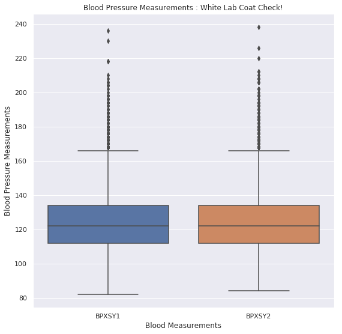


    
    
    Let's take a look at our summary stats just displayed


<div>
<style scoped>
    .dataframe tbody tr th:only-of-type {
        vertical-align: middle;
    }

    .dataframe tbody tr th {
        vertical-align: top;
    }

    .dataframe thead th {
        text-align: right;
    }
</style>
<table border="1" class="dataframe">
  <thead>
    <tr style="text-align: right;">
      <th></th>
      <th>BPXSY1</th>
      <th>BPXSY2</th>
      <th>Wth_Sbj_Dff</th>
    </tr>
  </thead>
  <tbody>
    <tr>
      <th>count</th>
      <td>5369.000000</td>
      <td>5369.000000</td>
      <td>5369.000000</td>
    </tr>
    <tr>
      <th>mean</th>
      <td>125.088471</td>
      <td>124.413485</td>
      <td>0.674986</td>
    </tr>
    <tr>
      <th>std</th>
      <td>18.493801</td>
      <td>18.191573</td>
      <td>5.046465</td>
    </tr>
    <tr>
      <th>min</th>
      <td>84.000000</td>
      <td>84.000000</td>
      <td>-26.000000</td>
    </tr>
    <tr>
      <th>25%</th>
      <td>112.000000</td>
      <td>112.000000</td>
      <td>-2.000000</td>
    </tr>
    <tr>
      <th>50%</th>
      <td>122.000000</td>
      <td>122.000000</td>
      <td>0.000000</td>
    </tr>
    <tr>
      <th>75%</th>
      <td>134.000000</td>
      <td>134.000000</td>
      <td>4.000000</td>
    </tr>
    <tr>
      <th>max</th>
      <td>236.000000</td>
      <td>238.000000</td>
      <td>32.000000</td>
    </tr>
  </tbody>
</table>
</div>


__Q4c.__ Comment on the variation within either the first or second systolic blood pressure measurements, and the variation in the within-subject differences between the first and second systolic blood pressure measurements.
We do see a very marginal "higher" mean for our first measurement and a slightly higher mean for the differences (second measurement subtracted from our first). The variation for slightly higher measurements I think can be seen in the IQR range with the subject differences. Would be interested to see how a medical professional might be able to take a position on the measurements observed and if they ... feel about right from their experience.
## Question 5

Construct a frequency table of household sizes for people within each educational attainment category (the relevant variable is [DMDEDUC2](https://wwwn.cdc.gov/Nchs/Nhanes/2015-2016/DEMO_I.htm#DMDEDUC2)).  Convert the frequencies to proportions.


```python
## DMDHHSIZ - Total number of people in the Household .. Self Explanatory
## DMDEDUC2 - Education Level Adult 20+ (1 : Less than 9th Grade, 2: 9-11th, 3: HS/GED, 4: Some College, 5: College Grad & Above, 9: Don't Know)
household_education_sub = da[['DMDHHSIZ', 'DMDEDUC2']]

## Rename Coluns
household_education_sub.rename(columns={'DMDHHSIZ': 'HouseHoldSize', 'DMDEDUC2': 'EducationOrig'}, inplace=True)

## Replace Values for Education
household_education_sub['Educationx'] = household_education_sub['EducationOrig'].replace({
    1 : 'Less than 9th Grade', 2 : '9-11th Grade', 3 : 'HighSchool or GED', 4 : 'Some College',
    5 : 'College Grad & Above', 9 : "Don't Know"
})

## We Need to GroupBy the Household size and the related education levels
grpby_hhold_education = household_education_sub.groupby('HouseHoldSize')['Educationx']
grpby_hhold_education = grpby_hhold_education.value_counts()
grpby_hhold_education

```


    HouseHoldSize  Educationx          
    1              Some College            245
                   College Grad & Above    195
                   HighSchool or GED       181
                   9-11th Grade             75
                   Less than 9th Grade      72
    2              College Grad & Above    475
                   Some College            436
                   HighSchool or GED       321
                   Less than 9th Grade     147
                   9-11th Grade            143
                   Don't Know                2
    3              Some College            313
                   College Grad & Above    265
                   HighSchool or GED       203
                   9-11th Grade            105
                   Less than 9th Grade      96
    4              Some College            274
                   College Grad & Above    226
                   HighSchool or GED       192
                   9-11th Grade             98
                   Less than 9th Grade      87
    5              Some College            198
                   College Grad & Above    130
                   HighSchool or GED       130
                   Less than 9th Grade      97
                   9-11th Grade             94
                   Don't Know                1
    6              Some College             82
                   HighSchool or GED        78
                   9-11th Grade             73
                   Less than 9th Grade      71
                   College Grad & Above     40
    7              Less than 9th Grade      85
                   HighSchool or GED        81
                   Some College             73
                   9-11th Grade             55
                   College Grad & Above     35
    Name: Educationx, dtype: int64


```python
## Maybe we can pivot to make a bit easier to read?? Unstack a series!
#grpby_hhold_education_pvt = grpby_hhold_education.pivot(index='HouseHoldSize', values='Educationx')
grpby_hhold_education_pvtfrm = grpby_hhold_education.unstack()
display(grpby_hhold_education_pvtfrm.columns.tolist(), grpby_hhold_education_pvtfrm.index.tolist()) ## Quick look at what we're working with after unstacking
display(grpby_hhold_education_pvtfrm) # Counts

grpby_hhold_education_pvtfrm.fillna(0, inplace=True) # Get those nulls out of there (Essentially categories not selected for our household group)

## Let's get the proportion similar to some tables above
grpby_hhold_education_unst_props = grpby_hhold_education_pvtfrm.apply(lambda x: round(x/x.sum(), 2), axis=1)
display(grpby_hhold_education_unst_props) # Proportions (Decimal - 1 Format)

grpby_hhold_education_unst_percnt = grpby_hhold_education_unst_props.apply(lambda x: round((x * 100), 1)).astype(str).apply(lambda x: x + '%')
display(grpby_hhold_education_unst_percnt)

```


    ['9-11th Grade',
     'College Grad & Above',
     "Don't Know",
     'HighSchool or GED',
     'Less than 9th Grade',
     'Some College']


    [1, 2, 3, 4, 5, 6, 7]


<div>
<style scoped>
    .dataframe tbody tr th:only-of-type {
        vertical-align: middle;
    }

    .dataframe tbody tr th {
        vertical-align: top;
    }

    .dataframe thead th {
        text-align: right;
    }
</style>
<table border="1" class="dataframe">
  <thead>
    <tr style="text-align: right;">
      <th>Educationx</th>
      <th>9-11th Grade</th>
      <th>College Grad &amp; Above</th>
      <th>Don't Know</th>
      <th>HighSchool or GED</th>
      <th>Less than 9th Grade</th>
      <th>Some College</th>
    </tr>
    <tr>
      <th>HouseHoldSize</th>
      <th></th>
      <th></th>
      <th></th>
      <th></th>
      <th></th>
      <th></th>
    </tr>
  </thead>
  <tbody>
    <tr>
      <th>1</th>
      <td>75.0</td>
      <td>195.0</td>
      <td>NaN</td>
      <td>181.0</td>
      <td>72.0</td>
      <td>245.0</td>
    </tr>
    <tr>
      <th>2</th>
      <td>143.0</td>
      <td>475.0</td>
      <td>2.0</td>
      <td>321.0</td>
      <td>147.0</td>
      <td>436.0</td>
    </tr>
    <tr>
      <th>3</th>
      <td>105.0</td>
      <td>265.0</td>
      <td>NaN</td>
      <td>203.0</td>
      <td>96.0</td>
      <td>313.0</td>
    </tr>
    <tr>
      <th>4</th>
      <td>98.0</td>
      <td>226.0</td>
      <td>NaN</td>
      <td>192.0</td>
      <td>87.0</td>
      <td>274.0</td>
    </tr>
    <tr>
      <th>5</th>
      <td>94.0</td>
      <td>130.0</td>
      <td>1.0</td>
      <td>130.0</td>
      <td>97.0</td>
      <td>198.0</td>
    </tr>
    <tr>
      <th>6</th>
      <td>73.0</td>
      <td>40.0</td>
      <td>NaN</td>
      <td>78.0</td>
      <td>71.0</td>
      <td>82.0</td>
    </tr>
    <tr>
      <th>7</th>
      <td>55.0</td>
      <td>35.0</td>
      <td>NaN</td>
      <td>81.0</td>
      <td>85.0</td>
      <td>73.0</td>
    </tr>
  </tbody>
</table>
</div>


<div>
<style scoped>
    .dataframe tbody tr th:only-of-type {
        vertical-align: middle;
    }

    .dataframe tbody tr th {
        vertical-align: top;
    }

    .dataframe thead th {
        text-align: right;
    }
</style>
<table border="1" class="dataframe">
  <thead>
    <tr style="text-align: right;">
      <th>Educationx</th>
      <th>9-11th Grade</th>
      <th>College Grad &amp; Above</th>
      <th>Don't Know</th>
      <th>HighSchool or GED</th>
      <th>Less than 9th Grade</th>
      <th>Some College</th>
    </tr>
    <tr>
      <th>HouseHoldSize</th>
      <th></th>
      <th></th>
      <th></th>
      <th></th>
      <th></th>
      <th></th>
    </tr>
  </thead>
  <tbody>
    <tr>
      <th>1</th>
      <td>0.10</td>
      <td>0.25</td>
      <td>0.0</td>
      <td>0.24</td>
      <td>0.09</td>
      <td>0.32</td>
    </tr>
    <tr>
      <th>2</th>
      <td>0.09</td>
      <td>0.31</td>
      <td>0.0</td>
      <td>0.21</td>
      <td>0.10</td>
      <td>0.29</td>
    </tr>
    <tr>
      <th>3</th>
      <td>0.11</td>
      <td>0.27</td>
      <td>0.0</td>
      <td>0.21</td>
      <td>0.10</td>
      <td>0.32</td>
    </tr>
    <tr>
      <th>4</th>
      <td>0.11</td>
      <td>0.26</td>
      <td>0.0</td>
      <td>0.22</td>
      <td>0.10</td>
      <td>0.31</td>
    </tr>
    <tr>
      <th>5</th>
      <td>0.14</td>
      <td>0.20</td>
      <td>0.0</td>
      <td>0.20</td>
      <td>0.15</td>
      <td>0.30</td>
    </tr>
    <tr>
      <th>6</th>
      <td>0.21</td>
      <td>0.12</td>
      <td>0.0</td>
      <td>0.23</td>
      <td>0.21</td>
      <td>0.24</td>
    </tr>
    <tr>
      <th>7</th>
      <td>0.17</td>
      <td>0.11</td>
      <td>0.0</td>
      <td>0.25</td>
      <td>0.26</td>
      <td>0.22</td>
    </tr>
  </tbody>
</table>
</div>


<div>
<style scoped>
    .dataframe tbody tr th:only-of-type {
        vertical-align: middle;
    }

    .dataframe tbody tr th {
        vertical-align: top;
    }

    .dataframe thead th {
        text-align: right;
    }
</style>
<table border="1" class="dataframe">
  <thead>
    <tr style="text-align: right;">
      <th>Educationx</th>
      <th>9-11th Grade</th>
      <th>College Grad &amp; Above</th>
      <th>Don't Know</th>
      <th>HighSchool or GED</th>
      <th>Less than 9th Grade</th>
      <th>Some College</th>
    </tr>
    <tr>
      <th>HouseHoldSize</th>
      <th></th>
      <th></th>
      <th></th>
      <th></th>
      <th></th>
      <th></th>
    </tr>
  </thead>
  <tbody>
    <tr>
      <th>1</th>
      <td>10.0%</td>
      <td>25.0%</td>
      <td>0.0%</td>
      <td>24.0%</td>
      <td>9.0%</td>
      <td>32.0%</td>
    </tr>
    <tr>
      <th>2</th>
      <td>9.0%</td>
      <td>31.0%</td>
      <td>0.0%</td>
      <td>21.0%</td>
      <td>10.0%</td>
      <td>29.0%</td>
    </tr>
    <tr>
      <th>3</th>
      <td>11.0%</td>
      <td>27.0%</td>
      <td>0.0%</td>
      <td>21.0%</td>
      <td>10.0%</td>
      <td>32.0%</td>
    </tr>
    <tr>
      <th>4</th>
      <td>11.0%</td>
      <td>26.0%</td>
      <td>0.0%</td>
      <td>22.0%</td>
      <td>10.0%</td>
      <td>31.0%</td>
    </tr>
    <tr>
      <th>5</th>
      <td>14.0%</td>
      <td>20.0%</td>
      <td>0.0%</td>
      <td>20.0%</td>
      <td>15.0%</td>
      <td>30.0%</td>
    </tr>
    <tr>
      <th>6</th>
      <td>21.0%</td>
      <td>12.0%</td>
      <td>0.0%</td>
      <td>23.0%</td>
      <td>21.0%</td>
      <td>24.0%</td>
    </tr>
    <tr>
      <th>7</th>
      <td>17.0%</td>
      <td>11.0%</td>
      <td>0.0%</td>
      <td>25.0%</td>
      <td>26.0%</td>
      <td>22.0%</td>
    </tr>
  </tbody>
</table>
</div>


__Q5b.__ Restrict the sample to people between 30 and 40 years of age.  Then calculate the median household size for women and men within each level of educational attainment.


```python
## Age Distribution
sns.distplot(da['RIDAGEYR'], kde=False)
plt.title('Distribution of Ages in Dataset')
plt.ylabel('Count Per Bucket')
plt.xlabel('Ages')
plt.show()
```


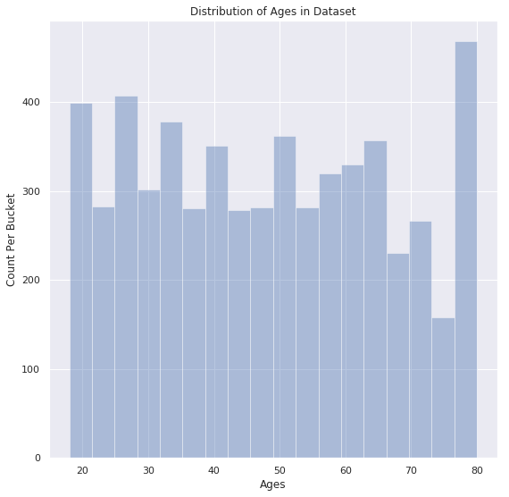


```python
## Name: RIDAGEYRSAS (Age in Years)     RIAGENDR - Gender (1: 'Male', 2: 'Female')

## Need a new dataframe with age, education, household size & gender
thirty_forty_gndr_education = da[['DMDHHSIZ', 'DMDEDUC2', 'RIDAGEYR', 'RIAGENDR']]

## Rename columns to a bit easier to digest resulting dataframe
thirty_forty_gndr_education.rename(columns={'DMDHHSIZ':'HouseSizeCnt', 
                                           'DMDEDUC2': 'Education', 'RIDAGEYR': 'Age',
                                           'RIAGENDR': 'Gender'}, inplace=True)

## Replace column values for more digestable data representation
thirty_forty_gndr_education['Gender'].replace({1:'Male', 2:'Female'}, inplace=True)
thirty_forty_gndr_education['Education'].replace({
    1 : 'Less than 9th Grade', 2 : '9-11th Grade', 3 : 'HighSchool or GED', 4 : 'Some College', 5 : 'College Grad & Above'
}, inplace=True)

print("Total Count of Rows, prior to age subset".format(len(thirty_forty_gndr_education)))
## Set Age Condition for 30-39
thirty_forty_gndr_education = thirty_forty_gndr_education.loc[(thirty_forty_gndr_education['Age'] >= 30) & (thirty_forty_gndr_education['Age'] < 40)]
print("This percentage of individuals fall in that age bucket : {:.2f}%".format(100*(len(thirty_forty_gndr_education) / 5735))) # Dataframe length prior to conditional setting
print("Finally, this is our shake out of the age counts frequency for our bucketed distribution : ")
print(thirty_forty_gndr_education['Age'].value_counts().to_string(name=True))
print('\n')

# print(thirty_forty_gndr_education['Age'].value_counts()) # Just 30s!
thirty_forty_gndr_education_grpby = thirty_forty_gndr_education.groupby(['Gender', 'Education'])['HouseSizeCnt']
thirty_forty_gndr_education_grpby = thirty_forty_gndr_education_grpby.value_counts().fillna(0)
print("Below is a Subset of our GroupBy DataFrame - GroupLevels : ['Gender', 'Education'], \nValue(s) : ['HouseSize'] (default count returned).")
display(thirty_forty_gndr_education_grpby[:15])
# thirty_forty_gndr_education_grpby = thirty_forty_gndr_education_grpby.unstack()
# display(thirty_forty_gndr_education_grpby[:10])
# thirty_forty_gndr_education_grpby.describe()

## So We now have our partitions (Education categories) and groupby/partition counts for the Men and Women Between (30-40) 
## Let's see on the next cell if we can flesh out a way to get the median

```

    Total Count of Rows, prior to age subset
    This percentage of individuals fall in that age bucket : 16.27%
    Finally, this is our shake out of the age counts frequency for our bucketed distribution : 
    36    108
    31    105
    35     99
    34     98
    33     96
    30     94
    38     87
    37     86
    32     85
    39     75
    Name: Age
    
    
    Below is a Subset of our GroupBy DataFrame - GroupLevels : ['Gender', 'Education'], 
    Value(s) : ['HouseSize'] (default count returned).


    Gender  Education             HouseSizeCnt
    Female  9-11th Grade          5               11
                                  6                9
                                  2                8
                                  4                8
                                  7                3
                                  1                2
                                  3                2
            College Grad & Above  4               47
                                  3               33
                                  2               31
                                  5               19
                                  1               17
                                  6                7
                                  7                3
            HighSchool or GED     4               16
    Name: HouseSizeCnt, dtype: int64


```python
#print(thirty_forty_gndr_education_grpby.index.tolist())
females = {}
males = {}
for index, row in thirty_forty_gndr_education_grpby.iteritems():
    if index[0] == 'Female': # index[0] is The outer groupby index (Male or Female)
        if index[1] in females: # index[1] is the Inner Index (Education Category Value for Either Gender)
            ## Add more values to Education key for females
            females[index[1]].append({index[2]:row})
        else:
            ## Create Key for females (it's a new key!) and add values
            females[index[1]] = []
            females[index[1]].append({index[2]:row})
    if index[0] == 'Male': # index[0] is The outer groupby index (Male or Female)
        if index[1] in males: # index[1] is the Inner Index (Education Category Value for Either Gender)
            ## Add more values to Education key for females
            males[index[1]].append({index[2]:row})
        else:
            ## Create Key for females (it's a new key!) and add values
            males[index[1]] = []
            males[index[1]].append({index[2]:row})
print(females)
print('\n')
print(males)

## Alright ... we got'em out of there now we need to iterate through each key in our respective dictionaries 
```

    {'9-11th Grade': [{5: 11}, {6: 9}, {2: 8}, {4: 8}, {7: 3}, {1: 2}, {3: 2}], 'College Grad & Above': [{4: 47}, {3: 33}, {2: 31}, {5: 19}, {1: 17}, {6: 7}, {7: 3}], 'HighSchool or GED': [{4: 16}, {3: 15}, {6: 15}, {7: 15}, {5: 13}, {1: 2}, {2: 2}], 'Less than 9th Grade': [{6: 10}, {4: 8}, {5: 8}, {7: 8}, {3: 5}, {2: 2}, {1: 1}], 'Some College': [{5: 45}, {4: 36}, {3: 31}, {2: 18}, {7: 17}, {6: 12}, {1: 2}]}
    
    
    {'9-11th Grade': [{5: 17}, {4: 15}, {6: 11}, {3: 10}, {2: 7}, {7: 6}, {1: 1}], 'College Grad & Above': [{4: 29}, {3: 28}, {2: 26}, {1: 15}, {5: 13}, {6: 3}, {7: 2}], 'HighSchool or GED': [{4: 23}, {5: 18}, {3: 16}, {2: 15}, {7: 13}, {6: 12}, {1: 9}], 'Less than 9th Grade': [{7: 13}, {5: 11}, {4: 7}, {3: 6}, {6: 5}, {2: 2}], 'Some College': [{5: 30}, {4: 26}, {3: 16}, {1: 14}, {2: 14}, {6: 11}, {7: 8}]}


```python
## Quick Reminder the Keys below is the 'HouseHoldSize - Amount' and the Value is the Frequency/Count of that Amount
## We're after the median household size for each education category (We'll get mean and max too - wahoo)

## Extend Trick (Add same value to a list n times) : using extend() + list comprehension to add multiple values
## res = [], res.extend([3 for i in range(3)]) == [3, 3, 3]

females_sum_stats_counts = {}
males_sum_stats_counts = {}
for x in females:
    # print(x, females[x]) : 9-11th Grade [{5: 11}, {6: 9}, {2: 8}, {4: 8}, {7: 3}, {1: 2}, {3: 2}]
    # loop through each key's list in the dictionary (each ed_level just the key's object property)
    for ed_level in females[x]:
        # see if key already exists and just extend if so (see extend trick above) (x is just the key in our gender object being iterated through)
        if x in females_sum_stats_counts:
            # Set variables to key and value to pass to extend {5: 11} (Key Int uniqueness as it's the groupby count number and it's value is total times it was seen in our dataset)
            # dict list item returns for keys_values not subscriptable (mutate to a list)
            ed_level_key, ed_level_count = list(ed_level.keys())[0], list(ed_level.values())[0]
            females_sum_stats_counts[x].extend([ed_level_key for i in range(ed_level_count)])
        else:
            # Add initial list for new key in sum_stats object
            females_sum_stats_counts[x] = []
            # Set variables to key and value to pass to extend {5: 11} (Key Int uniqueness as it's the groupby count number and it's value is total times it was seen in our dataset)
            # dict list item returns for keys_values not subscriptable (mutate to a list)
            ed_level_key, ed_level_count = list(ed_level.keys())[0], list(ed_level.values())[0]
            females_sum_stats_counts[x].extend([ed_level_key for i in range(ed_level_count)])

for x in males:
    # print(x, females[x]) : 9-11th Grade [{5: 11}, {6: 9}, {2: 8}, {4: 8}, {7: 3}, {1: 2}, {3: 2}]
    # loop through each key's list in the dictionary (each ed_level just the key's object property)
    for ed_level in males[x]:
        # see if key already exists and just extend if so (see extend trick above) (x is just the key in our gender object being iterated through)
        if x in males_sum_stats_counts:
            # Set variables to key and value to pass to extend {5: 11} (Key Int uniqueness as it's the groupby count number and it's value is total times it was seen in our dataset)
            # dict list item returns for keys_values not subscriptable (mutate to a list)
            ed_level_key, ed_level_count = list(ed_level.keys())[0], list(ed_level.values())[0]
            males_sum_stats_counts[x].extend([ed_level_key for i in range(ed_level_count)])
        else:
            # Add initial list for new key in sum_stats object
            males_sum_stats_counts[x] = []
            # Set variables to key and value to pass to extend {5: 11} (Key Int uniqueness as it's the groupby count number and it's value is total times it was seen in our dataset)
            # dict list item returns for keys_values not subscriptable (mutate to a list)
            ed_level_key, ed_level_count = list(ed_level.keys())[0], list(ed_level.values())[0]
            males_sum_stats_counts[x].extend([ed_level_key for i in range(ed_level_count)])
            
print('Our Females Total Counts for Respective House Sizes : Have counts now to look for Summary Stats')
print(females_sum_stats_counts)
print('\n')
print('Our Males Total Counts for Respective House Sizes : Have counts now to look for Summary Stats')
print(males_sum_stats_counts) 
            
```

    Our Females Total Counts for Respective House Sizes : Have counts now to look for Summary Stats
    {'9-11th Grade': [5, 5, 5, 5, 5, 5, 5, 5, 5, 5, 5, 6, 6, 6, 6, 6, 6, 6, 6, 6, 2, 2, 2, 2, 2, 2, 2, 2, 4, 4, 4, 4, 4, 4, 4, 4, 7, 7, 7, 1, 1, 3, 3], 'College Grad & Above': [4, 4, 4, 4, 4, 4, 4, 4, 4, 4, 4, 4, 4, 4, 4, 4, 4, 4, 4, 4, 4, 4, 4, 4, 4, 4, 4, 4, 4, 4, 4, 4, 4, 4, 4, 4, 4, 4, 4, 4, 4, 4, 4, 4, 4, 4, 4, 3, 3, 3, 3, 3, 3, 3, 3, 3, 3, 3, 3, 3, 3, 3, 3, 3, 3, 3, 3, 3, 3, 3, 3, 3, 3, 3, 3, 3, 3, 3, 3, 3, 2, 2, 2, 2, 2, 2, 2, 2, 2, 2, 2, 2, 2, 2, 2, 2, 2, 2, 2, 2, 2, 2, 2, 2, 2, 2, 2, 2, 2, 2, 2, 5, 5, 5, 5, 5, 5, 5, 5, 5, 5, 5, 5, 5, 5, 5, 5, 5, 5, 5, 1, 1, 1, 1, 1, 1, 1, 1, 1, 1, 1, 1, 1, 1, 1, 1, 1, 6, 6, 6, 6, 6, 6, 6, 7, 7, 7], 'HighSchool or GED': [4, 4, 4, 4, 4, 4, 4, 4, 4, 4, 4, 4, 4, 4, 4, 4, 3, 3, 3, 3, 3, 3, 3, 3, 3, 3, 3, 3, 3, 3, 3, 6, 6, 6, 6, 6, 6, 6, 6, 6, 6, 6, 6, 6, 6, 6, 7, 7, 7, 7, 7, 7, 7, 7, 7, 7, 7, 7, 7, 7, 7, 5, 5, 5, 5, 5, 5, 5, 5, 5, 5, 5, 5, 5, 1, 1, 2, 2], 'Less than 9th Grade': [6, 6, 6, 6, 6, 6, 6, 6, 6, 6, 4, 4, 4, 4, 4, 4, 4, 4, 5, 5, 5, 5, 5, 5, 5, 5, 7, 7, 7, 7, 7, 7, 7, 7, 3, 3, 3, 3, 3, 2, 2, 1], 'Some College': [5, 5, 5, 5, 5, 5, 5, 5, 5, 5, 5, 5, 5, 5, 5, 5, 5, 5, 5, 5, 5, 5, 5, 5, 5, 5, 5, 5, 5, 5, 5, 5, 5, 5, 5, 5, 5, 5, 5, 5, 5, 5, 5, 5, 5, 4, 4, 4, 4, 4, 4, 4, 4, 4, 4, 4, 4, 4, 4, 4, 4, 4, 4, 4, 4, 4, 4, 4, 4, 4, 4, 4, 4, 4, 4, 4, 4, 4, 4, 4, 4, 3, 3, 3, 3, 3, 3, 3, 3, 3, 3, 3, 3, 3, 3, 3, 3, 3, 3, 3, 3, 3, 3, 3, 3, 3, 3, 3, 3, 3, 3, 3, 2, 2, 2, 2, 2, 2, 2, 2, 2, 2, 2, 2, 2, 2, 2, 2, 2, 2, 7, 7, 7, 7, 7, 7, 7, 7, 7, 7, 7, 7, 7, 7, 7, 7, 7, 6, 6, 6, 6, 6, 6, 6, 6, 6, 6, 6, 6, 1, 1]}
    
    
    Our Males Total Counts for Respective House Sizes : Have counts now to look for Summary Stats
    {'9-11th Grade': [5, 5, 5, 5, 5, 5, 5, 5, 5, 5, 5, 5, 5, 5, 5, 5, 5, 4, 4, 4, 4, 4, 4, 4, 4, 4, 4, 4, 4, 4, 4, 4, 6, 6, 6, 6, 6, 6, 6, 6, 6, 6, 6, 3, 3, 3, 3, 3, 3, 3, 3, 3, 3, 2, 2, 2, 2, 2, 2, 2, 7, 7, 7, 7, 7, 7, 1], 'College Grad & Above': [4, 4, 4, 4, 4, 4, 4, 4, 4, 4, 4, 4, 4, 4, 4, 4, 4, 4, 4, 4, 4, 4, 4, 4, 4, 4, 4, 4, 4, 3, 3, 3, 3, 3, 3, 3, 3, 3, 3, 3, 3, 3, 3, 3, 3, 3, 3, 3, 3, 3, 3, 3, 3, 3, 3, 3, 3, 2, 2, 2, 2, 2, 2, 2, 2, 2, 2, 2, 2, 2, 2, 2, 2, 2, 2, 2, 2, 2, 2, 2, 2, 2, 2, 1, 1, 1, 1, 1, 1, 1, 1, 1, 1, 1, 1, 1, 1, 1, 5, 5, 5, 5, 5, 5, 5, 5, 5, 5, 5, 5, 5, 6, 6, 6, 7, 7], 'HighSchool or GED': [4, 4, 4, 4, 4, 4, 4, 4, 4, 4, 4, 4, 4, 4, 4, 4, 4, 4, 4, 4, 4, 4, 4, 5, 5, 5, 5, 5, 5, 5, 5, 5, 5, 5, 5, 5, 5, 5, 5, 5, 5, 3, 3, 3, 3, 3, 3, 3, 3, 3, 3, 3, 3, 3, 3, 3, 3, 2, 2, 2, 2, 2, 2, 2, 2, 2, 2, 2, 2, 2, 2, 2, 7, 7, 7, 7, 7, 7, 7, 7, 7, 7, 7, 7, 7, 6, 6, 6, 6, 6, 6, 6, 6, 6, 6, 6, 6, 1, 1, 1, 1, 1, 1, 1, 1, 1], 'Less than 9th Grade': [7, 7, 7, 7, 7, 7, 7, 7, 7, 7, 7, 7, 7, 5, 5, 5, 5, 5, 5, 5, 5, 5, 5, 5, 4, 4, 4, 4, 4, 4, 4, 3, 3, 3, 3, 3, 3, 6, 6, 6, 6, 6, 2, 2], 'Some College': [5, 5, 5, 5, 5, 5, 5, 5, 5, 5, 5, 5, 5, 5, 5, 5, 5, 5, 5, 5, 5, 5, 5, 5, 5, 5, 5, 5, 5, 5, 4, 4, 4, 4, 4, 4, 4, 4, 4, 4, 4, 4, 4, 4, 4, 4, 4, 4, 4, 4, 4, 4, 4, 4, 4, 4, 3, 3, 3, 3, 3, 3, 3, 3, 3, 3, 3, 3, 3, 3, 3, 3, 1, 1, 1, 1, 1, 1, 1, 1, 1, 1, 1, 1, 1, 1, 2, 2, 2, 2, 2, 2, 2, 2, 2, 2, 2, 2, 2, 2, 6, 6, 6, 6, 6, 6, 6, 6, 6, 6, 6, 7, 7, 7, 7, 7, 7, 7, 7]}


```python
## Last Cell (for this Question .. haha)
## Ok Now We want to use our Household Count Lists per Education Levels (Males & Females (30-39))
## Now We Can't conveniently turn into a DataFrame ... because : arrays must all be same length
## We Need to iterate through our object and see if numpy can help us out

## Let's Test Out Real Fast (Grab a test key )
test_one = females_sum_stats_counts['9-11th Grade']
## We can get our mean, median, min, max and our standard devaition!
# print(np.mean(test_one), np.median(test_one), np.min(test_one), np.max(test_one), np.std(test_one))
## Quantiles (25/50/75 avaialbe?)
test_one_quantiles = np.quantile(test_one, [0, 0.25, 0.5, 0.75, 1])
# print(test_one_quantiles)
# print('\n\n')

## Awesome we can now just use numpy to get some summary stats for each of our house counts for our gender education breakdowns
females_sum_stats_totals = {}
males_sum_stats_totals = {}

# Loop through Dictionaries similar to above
for x in females_sum_stats_counts:
    # Set Variable for key access to count dataframe list for multi-assignment condensing
    count_key = females_sum_stats_counts[x]
    # Set new dictionary to key in dataframe for Education Level
    females_sum_stats_totals[x] = {}
    # Set to variable to add onto easier for Education Level in new dictionary
    female_key = females_sum_stats_totals[x]
    # Add on numpy values for (min, max, mean) Also Grab Count (Assign on one line)
    female_key['min'], female_key['mean'], female_key['max'], female_key['count'] = np.min(count_key), round(np.mean(count_key), 2), np.max(count_key), len(count_key)
    # Add values for 25th%, 50th% (Median), 75th%, Stdev
    female_quantiles = np.quantile(count_key, [0, 0.25, 0.5, 0.75, 1]) #1, 2, 3 respective 
    female_key['25th%'], female_key['50th% (Median)'], female_key['75th%'], female_key['Stdev'] = female_quantiles[1], female_quantiles[2], female_quantiles[3], round(np.std(count_key), 3)
    
print('Female Summary Statistics (30-39) for Household Sizes held for Different Education Levels\n')
print(females_sum_stats_totals, '\n')
females_sum_stats_frame = pd.DataFrame(females_sum_stats_totals)
display(females_sum_stats_frame)

print('\n')

for x in males_sum_stats_counts:
    # Set Variable for key access to count dataframe list for multi-assignment condensing
    count_key = males_sum_stats_counts[x]
    # Set new dictionary to key in dataframe for Education Level
    males_sum_stats_totals[x] = {}
    # Set to variable to add onto easier for Education Level in new dictionary
    male_key = males_sum_stats_totals[x]
    # Add on numpy values for (min, max, mean) Also Grab Count (Assign on one line)
    male_key['min'], male_key['mean'], male_key['max'], male_key['count'] = np.min(count_key), round(np.mean(count_key), 2), np.max(count_key), len(count_key)
    # Add values for 25th%, 50th% (Median), 75th%, Stdev
    male_quantiles = np.quantile(count_key, [0, 0.25, 0.5, 0.75, 1]) #1, 2, 3 respective 
    male_key['25th%'], male_key['50th% (Median)'], male_key['75th%'], male_key['Stdev'] = male_quantiles[1], male_quantiles[2], male_quantiles[3], round(np.std(count_key), 3)
    
print('Male Summary Statistics (30-39) for Household Sizes held for Different Education Levels\n')
print(males_sum_stats_totals, '\n')
males_sum_stats_frame = pd.DataFrame(males_sum_stats_totals)
display(males_sum_stats_frame)

```

    Female Summary Statistics (30-39) for Household Sizes held for Different Education Levels
    
    {'9-11th Grade': {'min': 1, 'mean': 4.33, 'max': 7, 'count': 43, '25th%': 3.0, '50th% (Median)': 5.0, '75th%': 6.0, 'Stdev': 1.681}, 'College Grad & Above': {'min': 1, 'mean': 3.34, 'max': 7, 'count': 157, '25th%': 2.0, '50th% (Median)': 3.0, '75th%': 4.0, 'Stdev': 1.417}, 'HighSchool or GED': {'min': 1, 'mean': 4.81, 'max': 7, 'count': 78, '25th%': 4.0, '50th% (Median)': 5.0, '75th%': 6.0, 'Stdev': 1.594}, 'Less than 9th Grade': {'min': 1, 'mean': 4.95, 'max': 7, 'count': 42, '25th%': 4.0, '50th% (Median)': 5.0, '75th%': 6.0, 'Stdev': 1.573}, 'Some College': {'min': 1, 'mean': 4.29, 'max': 7, 'count': 161, '25th%': 3.0, '50th% (Median)': 4.0, '75th%': 5.0, 'Stdev': 1.481}} 
    


<div>
<style scoped>
    .dataframe tbody tr th:only-of-type {
        vertical-align: middle;
    }

    .dataframe tbody tr th {
        vertical-align: top;
    }

    .dataframe thead th {
        text-align: right;
    }
</style>
<table border="1" class="dataframe">
  <thead>
    <tr style="text-align: right;">
      <th></th>
      <th>9-11th Grade</th>
      <th>College Grad &amp; Above</th>
      <th>HighSchool or GED</th>
      <th>Less than 9th Grade</th>
      <th>Some College</th>
    </tr>
  </thead>
  <tbody>
    <tr>
      <th>25th%</th>
      <td>3.000</td>
      <td>2.000</td>
      <td>4.000</td>
      <td>4.000</td>
      <td>3.000</td>
    </tr>
    <tr>
      <th>50th% (Median)</th>
      <td>5.000</td>
      <td>3.000</td>
      <td>5.000</td>
      <td>5.000</td>
      <td>4.000</td>
    </tr>
    <tr>
      <th>75th%</th>
      <td>6.000</td>
      <td>4.000</td>
      <td>6.000</td>
      <td>6.000</td>
      <td>5.000</td>
    </tr>
    <tr>
      <th>Stdev</th>
      <td>1.681</td>
      <td>1.417</td>
      <td>1.594</td>
      <td>1.573</td>
      <td>1.481</td>
    </tr>
    <tr>
      <th>count</th>
      <td>43.000</td>
      <td>157.000</td>
      <td>78.000</td>
      <td>42.000</td>
      <td>161.000</td>
    </tr>
    <tr>
      <th>max</th>
      <td>7.000</td>
      <td>7.000</td>
      <td>7.000</td>
      <td>7.000</td>
      <td>7.000</td>
    </tr>
    <tr>
      <th>mean</th>
      <td>4.330</td>
      <td>3.340</td>
      <td>4.810</td>
      <td>4.950</td>
      <td>4.290</td>
    </tr>
    <tr>
      <th>min</th>
      <td>1.000</td>
      <td>1.000</td>
      <td>1.000</td>
      <td>1.000</td>
      <td>1.000</td>
    </tr>
  </tbody>
</table>
</div>


    
    
    Male Summary Statistics (30-39) for Household Sizes held for Different Education Levels
    
    {'9-11th Grade': {'min': 1, 'mean': 4.45, 'max': 7, 'count': 67, '25th%': 3.0, '50th% (Median)': 5.0, '75th%': 5.5, 'Stdev': 1.489}, 'College Grad & Above': {'min': 1, 'mean': 3.14, 'max': 7, 'count': 116, '25th%': 2.0, '50th% (Median)': 3.0, '75th%': 4.0, 'Stdev': 1.389}, 'HighSchool or GED': {'min': 1, 'mean': 4.08, 'max': 7, 'count': 106, '25th%': 3.0, '50th% (Median)': 4.0, '75th%': 5.0, 'Stdev': 1.789}, 'Less than 9th Grade': {'min': 2, 'mean': 5.14, 'max': 7, 'count': 44, '25th%': 4.0, '50th% (Median)': 5.0, '75th%': 7.0, 'Stdev': 1.546}, 'Some College': {'min': 1, 'mean': 3.92, 'max': 7, 'count': 119, '25th%': 3.0, '50th% (Median)': 4.0, '75th%': 5.0, 'Stdev': 1.698}} 
    


<div>
<style scoped>
    .dataframe tbody tr th:only-of-type {
        vertical-align: middle;
    }

    .dataframe tbody tr th {
        vertical-align: top;
    }

    .dataframe thead th {
        text-align: right;
    }
</style>
<table border="1" class="dataframe">
  <thead>
    <tr style="text-align: right;">
      <th></th>
      <th>9-11th Grade</th>
      <th>College Grad &amp; Above</th>
      <th>HighSchool or GED</th>
      <th>Less than 9th Grade</th>
      <th>Some College</th>
    </tr>
  </thead>
  <tbody>
    <tr>
      <th>25th%</th>
      <td>3.000</td>
      <td>2.000</td>
      <td>3.000</td>
      <td>4.000</td>
      <td>3.000</td>
    </tr>
    <tr>
      <th>50th% (Median)</th>
      <td>5.000</td>
      <td>3.000</td>
      <td>4.000</td>
      <td>5.000</td>
      <td>4.000</td>
    </tr>
    <tr>
      <th>75th%</th>
      <td>5.500</td>
      <td>4.000</td>
      <td>5.000</td>
      <td>7.000</td>
      <td>5.000</td>
    </tr>
    <tr>
      <th>Stdev</th>
      <td>1.489</td>
      <td>1.389</td>
      <td>1.789</td>
      <td>1.546</td>
      <td>1.698</td>
    </tr>
    <tr>
      <th>count</th>
      <td>67.000</td>
      <td>116.000</td>
      <td>106.000</td>
      <td>44.000</td>
      <td>119.000</td>
    </tr>
    <tr>
      <th>max</th>
      <td>7.000</td>
      <td>7.000</td>
      <td>7.000</td>
      <td>7.000</td>
      <td>7.000</td>
    </tr>
    <tr>
      <th>mean</th>
      <td>4.450</td>
      <td>3.140</td>
      <td>4.080</td>
      <td>5.140</td>
      <td>3.920</td>
    </tr>
    <tr>
      <th>min</th>
      <td>1.000</td>
      <td>1.000</td>
      <td>1.000</td>
      <td>2.000</td>
      <td>1.000</td>
    </tr>
  </tbody>
</table>
</div>


## Question 6

The participants can be clustered into "maked variance units" (MVU) based on every combination of the variables [SDMVSTRA](https://wwwn.cdc.gov/Nchs/Nhanes/2015-2016/DEMO_I.htm#SDMVSTRA) and [SDMVPSU](https://wwwn.cdc.gov/Nchs/Nhanes/2015-2016/DEMO_I.htm#SDMVPSU).  Calculate the mean age ([RIDAGEYR](https://wwwn.cdc.gov/Nchs/Nhanes/2015-2016/DEMO_I.htm#RIDAGEYR)), height ([BMXHT](https://wwwn.cdc.gov/Nchs/Nhanes/2015-2016/BMX_I.htm#BMXHT)), and BMI ([BMXBMI](https://wwwn.cdc.gov/Nchs/Nhanes/2015-2016/BMX_I.htm#BMXBMI)) for each gender ([RIAGENDR](https://wwwn.cdc.gov/Nchs/Nhanes/2015-2016/DEMO_I.htm#RIAGENDR)), within each MVU, and report the ratio between the largest and smallest mean (e.g. for height) across the MVUs.


```python
# insert your code here
sdmvstra_sdmvpsu_grp = da.groupby(['SDMVSTRA', 'SDMVPSU'])['RIDAGEYR', 'BMXHT', 'BMXBMI'].agg(['mean'])
# sdmvstra_sdmvpsu_grp = sdmvstra_sdmvpsu_grp.value_counts()
display(sdmvstra_sdmvpsu_grp)
# print(da.SDMVSTRA .value_counts())
# print(da.SDMVPSU.value_counts())
```


<div>
<style scoped>
    .dataframe tbody tr th:only-of-type {
        vertical-align: middle;
    }

    .dataframe tbody tr th {
        vertical-align: top;
    }

    .dataframe thead tr th {
        text-align: left;
    }

    .dataframe thead tr:last-of-type th {
        text-align: right;
    }
</style>
<table border="1" class="dataframe">
  <thead>
    <tr>
      <th></th>
      <th></th>
      <th>RIDAGEYR</th>
      <th>BMXHT</th>
      <th>BMXBMI</th>
    </tr>
    <tr>
      <th></th>
      <th></th>
      <th>mean</th>
      <th>mean</th>
      <th>mean</th>
    </tr>
    <tr>
      <th>SDMVSTRA</th>
      <th>SDMVPSU</th>
      <th></th>
      <th></th>
      <th></th>
    </tr>
  </thead>
  <tbody>
    <tr>
      <th rowspan="2" valign="top">119</th>
      <th>1</th>
      <td>47.747059</td>
      <td>165.148824</td>
      <td>28.741765</td>
    </tr>
    <tr>
      <th>2</th>
      <td>53.464567</td>
      <td>163.977953</td>
      <td>27.614286</td>
    </tr>
    <tr>
      <th rowspan="2" valign="top">120</th>
      <th>1</th>
      <td>43.381910</td>
      <td>162.469898</td>
      <td>31.683077</td>
    </tr>
    <tr>
      <th>2</th>
      <td>44.482759</td>
      <td>166.194483</td>
      <td>27.564828</td>
    </tr>
    <tr>
      <th rowspan="2" valign="top">121</th>
      <th>1</th>
      <td>45.608911</td>
      <td>165.825628</td>
      <td>30.107576</td>
    </tr>
    <tr>
      <th>2</th>
      <td>43.207447</td>
      <td>167.496774</td>
      <td>26.372043</td>
    </tr>
    <tr>
      <th rowspan="2" valign="top">122</th>
      <th>1</th>
      <td>43.875000</td>
      <td>168.345714</td>
      <td>28.938286</td>
    </tr>
    <tr>
      <th>2</th>
      <td>45.747368</td>
      <td>164.093651</td>
      <td>26.157143</td>
    </tr>
    <tr>
      <th rowspan="2" valign="top">123</th>
      <th>1</th>
      <td>46.238806</td>
      <td>167.812245</td>
      <td>29.589286</td>
    </tr>
    <tr>
      <th>2</th>
      <td>49.046243</td>
      <td>166.859538</td>
      <td>29.805780</td>
    </tr>
    <tr>
      <th rowspan="2" valign="top">124</th>
      <th>1</th>
      <td>51.232068</td>
      <td>165.080426</td>
      <td>29.099149</td>
    </tr>
    <tr>
      <th>2</th>
      <td>45.062016</td>
      <td>167.946875</td>
      <td>28.228125</td>
    </tr>
    <tr>
      <th rowspan="2" valign="top">125</th>
      <th>1</th>
      <td>53.125000</td>
      <td>167.478947</td>
      <td>30.042105</td>
    </tr>
    <tr>
      <th>2</th>
      <td>50.673267</td>
      <td>167.383500</td>
      <td>28.858291</td>
    </tr>
    <tr>
      <th rowspan="2" valign="top">126</th>
      <th>1</th>
      <td>47.250000</td>
      <td>167.232402</td>
      <td>30.242373</td>
    </tr>
    <tr>
      <th>2</th>
      <td>47.902564</td>
      <td>167.514583</td>
      <td>29.336126</td>
    </tr>
    <tr>
      <th rowspan="2" valign="top">127</th>
      <th>1</th>
      <td>51.230769</td>
      <td>163.715544</td>
      <td>31.690625</td>
    </tr>
    <tr>
      <th>2</th>
      <td>52.618557</td>
      <td>165.265803</td>
      <td>30.678646</td>
    </tr>
    <tr>
      <th rowspan="2" valign="top">128</th>
      <th>1</th>
      <td>54.779221</td>
      <td>162.034649</td>
      <td>32.060088</td>
    </tr>
    <tr>
      <th>2</th>
      <td>45.707006</td>
      <td>166.456688</td>
      <td>27.161146</td>
    </tr>
    <tr>
      <th rowspan="2" valign="top">129</th>
      <th>1</th>
      <td>44.641304</td>
      <td>163.763187</td>
      <td>27.797802</td>
    </tr>
    <tr>
      <th>2</th>
      <td>44.582524</td>
      <td>166.666832</td>
      <td>29.211881</td>
    </tr>
    <tr>
      <th rowspan="2" valign="top">130</th>
      <th>1</th>
      <td>49.119565</td>
      <td>169.231522</td>
      <td>30.524457</td>
    </tr>
    <tr>
      <th>2</th>
      <td>50.690821</td>
      <td>167.338119</td>
      <td>30.397525</td>
    </tr>
    <tr>
      <th rowspan="2" valign="top">131</th>
      <th>1</th>
      <td>53.960199</td>
      <td>169.176382</td>
      <td>29.115152</td>
    </tr>
    <tr>
      <th>2</th>
      <td>45.793991</td>
      <td>167.740870</td>
      <td>31.670000</td>
    </tr>
    <tr>
      <th rowspan="2" valign="top">132</th>
      <th>1</th>
      <td>42.802139</td>
      <td>166.902688</td>
      <td>29.211290</td>
    </tr>
    <tr>
      <th>2</th>
      <td>50.374517</td>
      <td>165.920079</td>
      <td>29.759843</td>
    </tr>
    <tr>
      <th rowspan="2" valign="top">133</th>
      <th>1</th>
      <td>44.620253</td>
      <td>164.473377</td>
      <td>27.741176</td>
    </tr>
    <tr>
      <th>2</th>
      <td>47.279793</td>
      <td>164.936126</td>
      <td>28.480628</td>
    </tr>
  </tbody>
</table>
</div>


__Q6a.__ Comment on the extent to which mean age, height, and BMI vary among the MVUs.

__Q6b.__ Calculate the inter-quartile range (IQR) for age, height, and BMI for each gender and each MVU.  Report the ratio between the largest and smalles IQR across the MVUs.


```python
# insert your code here
```

__Q6c.__ Comment on the extent to which the IQR for age, height, and BMI vary among the MVUs.
