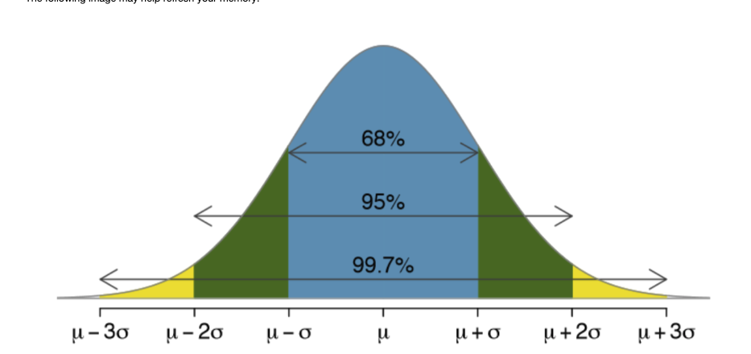
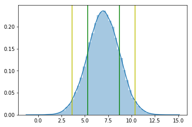
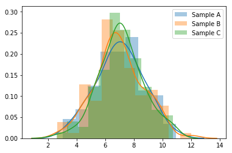
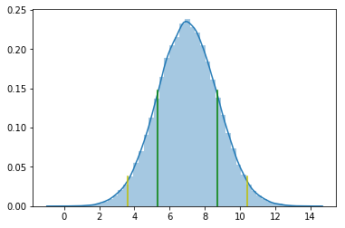
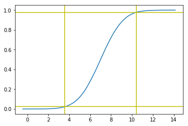

# The Empirical Rule and Distribution

In week 2, we discussed the empirical rule or the 68 - 95 - 99.7 rule, which describes how many observations fall within a certain distance from our mean.  This distance from the mean is denoted as sigma, or standard deviation (the average distance an observation is from the mean).

The following image may help refresh your memory:



For this tutorial, we will be exploring the number of hours the average college student gets.

The example used in lecture stated there was a mean of 7 and standard deviation of 1.7 for hours of sleep; we will use these same values.


```python
## Import libraries and set our random seed for reproducibility

import warnings
warnings.filterwarnings('ignore')
import random
import numpy as np
import pandas as pd
import matplotlib.pyplot as plt
import seaborn as sns

random.seed(1738)
```


```python
## Create 100K observations distributed normally

## Mu/Mean of 7 Hours A Night
mu = 7

## Standard deviation of 1.7 hours
sigma = 1.7

## Create 100K observations with defined mu& sigma w/list comprehension
Observations = [random.normalvariate(mu, sigma) for _ in range(100000)]
```


```python
## Our Green line is one standard deviation, Yellow is 2
## axvline on script layer of matplotlib allows for this visualization

sns.distplot(Observations)

plt.axvline(np.mean(Observations) + np.std(Observations), color = "g")
plt.axvline(np.mean(Observations) - np.std(Observations), color = "g")

plt.axvline(np.mean(Observations) + (np.std(Observations) * 2), color = "y")
plt.axvline(np.mean(Observations) - (np.std(Observations) * 2), color = "y")

```


    <matplotlib.lines.Line2D at 0x7f2e1e62acf8>





```python
## Pull Summary/Descriptive Statistics
pd.Series(Observations).describe()
```


    count    100000.000000
    mean          7.000626
    std           1.693249
    min          -0.754203
    25%           5.865611
    50%           7.003080
    75%           8.144851
    max          14.595650
    dtype: float64


```python
# Create Three Samples from our generated observations generated with the normalvariate method above
SampleA = random.sample(Observations, 100)
SampleB = random.sample(Observations, 100)
SampleC = random.sample(Observations, 100)
```


```python

fig, ax = plt.subplots()

sns.distplot(SampleA, ax = ax, label='Sample A')
sns.distplot(SampleB, ax = ax, label='Sample B')
sns.distplot(SampleC, ax = ax, label='Sample C')

plt.legend()
plt.show()
```





Now that we have covered the 68 - 95 - 99.7 rule, we will take this a step further and discuss the empirical distribution.

The empirical distribution is a cumulative density function that signifies the proportion of observations that are less than or equal to a certain values.

Lets use the initial image above as an example of this concept:


Now, by using our observations for ours of sleep, we can create an empirical distribution in python that signifies the proportion of observations are observed at a specific number for hours of sleep.


```python
mu = 7

sigma = 1.7

Observations = [random.normalvariate(mu, sigma) for _ in range(100000)]

## Output Standard Deviations
sns.distplot(Observations)
plt.axvline(np.mean(Observations) + np.std(Observations), 0, .59, color = 'g')
plt.axvline(np.mean(Observations) - np.std(Observations), 0, .59, color = 'g')

plt.axvline(np.mean(Observations) + (np.std(Observations) * 2), 0, .15, color = 'y')
plt.axvline(np.mean(Observations) - (np.std(Observations) * 2), 0, .15, color = 'y')
```


    <matplotlib.lines.Line2D at 0x7f2e20923978>





```python
# Cumulative Distribution (Density) Function Visualized
from statsmodels.distributions.empirical_distribution import ECDF
import matplotlib.pyplot as plt

ecdf = ECDF(Observations) # Observations (hours of sleep for generated population)

plt.plot(ecdf.x, ecdf.y)

## Generating the 95% of distribution inclusion of our population (2 standard devation)
plt.axhline(y = 0.025, color = 'y', linestyle='-')
plt.axvline(x = np.mean(Observations) - (2 * np.std(Observations)), color = 'y', linestyle='-')

plt.axhline(y = 0.975, color = 'y', linestyle='-')
plt.axvline(x = np.mean(Observations) + (2 * np.std(Observations)), color = 'y', linestyle='-')
```


    <matplotlib.lines.Line2D at 0x7f2e209f05c0>





```python
## You can see our last value as x as the max value in the generated population
print(ecdf.x)
```

    [       -inf -0.44218169 -0.11162099 ... 13.65070914 13.65801522
     14.1495449 ]


```python
print(ecdf.y)
```

    [0.0000e+00 1.0000e-05 2.0000e-05 ... 9.9998e-01 9.9999e-01 1.0000e+00]

