In this assignment we'll ask you to plot multiple variables.   

You will use what you find in this assignment to answer the questions in the quiz that follows. It may be useful to keep this notebook side-by-side with this week's quiz on your screen.


```python
import numpy as np
import pandas as pd
import seaborn as sns
import scipy.stats as stats
%matplotlib inline
import matplotlib.pyplot as plt
pd.set_option('display.max_columns', 100)

path = "Cartwheeldata.csv"
```


```python
# First, you must import the cartwheel data from the path given above
df = pd.read_csv(path) # using pandas, read in the csv data found at the url defined by 'path'
```


```python
# Next, look at the 'head' of our DataFrame 'df'. 
df.head()
```


<div>
<style scoped>
    .dataframe tbody tr th:only-of-type {
        vertical-align: middle;
    }

    .dataframe tbody tr th {
        vertical-align: top;
    }

    .dataframe thead th {
        text-align: right;
    }
</style>
<table border="1" class="dataframe">
  <thead>
    <tr style="text-align: right;">
      <th></th>
      <th>ID</th>
      <th>Age</th>
      <th>Gender</th>
      <th>GenderGroup</th>
      <th>Glasses</th>
      <th>GlassesGroup</th>
      <th>Height</th>
      <th>Wingspan</th>
      <th>CWDistance</th>
      <th>Complete</th>
      <th>CompleteGroup</th>
      <th>Score</th>
    </tr>
  </thead>
  <tbody>
    <tr>
      <th>0</th>
      <td>1</td>
      <td>56</td>
      <td>F</td>
      <td>1</td>
      <td>Y</td>
      <td>1</td>
      <td>62.0</td>
      <td>61.0</td>
      <td>79</td>
      <td>Y</td>
      <td>1</td>
      <td>7</td>
    </tr>
    <tr>
      <th>1</th>
      <td>2</td>
      <td>26</td>
      <td>F</td>
      <td>1</td>
      <td>Y</td>
      <td>1</td>
      <td>62.0</td>
      <td>60.0</td>
      <td>70</td>
      <td>Y</td>
      <td>1</td>
      <td>8</td>
    </tr>
    <tr>
      <th>2</th>
      <td>3</td>
      <td>33</td>
      <td>F</td>
      <td>1</td>
      <td>Y</td>
      <td>1</td>
      <td>66.0</td>
      <td>64.0</td>
      <td>85</td>
      <td>Y</td>
      <td>1</td>
      <td>7</td>
    </tr>
    <tr>
      <th>3</th>
      <td>4</td>
      <td>39</td>
      <td>F</td>
      <td>1</td>
      <td>N</td>
      <td>0</td>
      <td>64.0</td>
      <td>63.0</td>
      <td>87</td>
      <td>Y</td>
      <td>1</td>
      <td>10</td>
    </tr>
    <tr>
      <th>4</th>
      <td>5</td>
      <td>27</td>
      <td>M</td>
      <td>2</td>
      <td>N</td>
      <td>0</td>
      <td>73.0</td>
      <td>75.0</td>
      <td>72</td>
      <td>N</td>
      <td>0</td>
      <td>4</td>
    </tr>
  </tbody>
</table>
</div>


If you can't remember a function, open a previous notebook or video as a reference, or use your favorite search engine to look for a solution.

## Scatter plots

First, let's looks at two variables that we expect to have a strong relationship, 'Height' and 'Wingspan'.


```python
# Make a Seaborn scatter plot with x = height and y = wingspan using sns.scatterplot(x, y)
plt.figure(figsize=(12,8))
sns.scatterplot(x='Height', y='Wingspan', data=df)
plt.title("Height and Weight Scatterpoints")
plt.show()
```


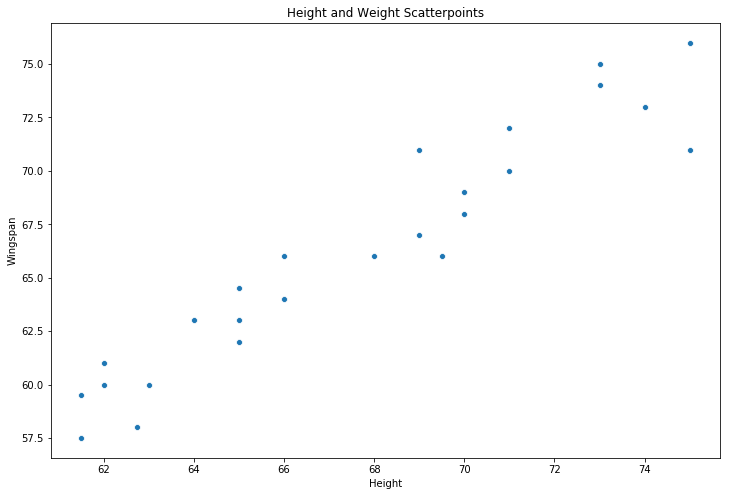


```python
display(df[['Height', 'Wingspan']].corr())
```


<div>
<style scoped>
    .dataframe tbody tr th:only-of-type {
        vertical-align: middle;
    }

    .dataframe tbody tr th {
        vertical-align: top;
    }

    .dataframe thead th {
        text-align: right;
    }
</style>
<table border="1" class="dataframe">
  <thead>
    <tr style="text-align: right;">
      <th></th>
      <th>Height</th>
      <th>Wingspan</th>
    </tr>
  </thead>
  <tbody>
    <tr>
      <th>Height</th>
      <td>1.000000</td>
      <td>0.954018</td>
    </tr>
    <tr>
      <th>Wingspan</th>
      <td>0.954018</td>
      <td>1.000000</td>
    </tr>
  </tbody>
</table>
</div>


```python
plt.figure(figsize=(12,8))
sns.regplot(x="Height", y="Wingspan", data=df, fit_reg=True, scatter_kws={"alpha": 0.4})
plt.title("Height and Weight Regression Line")
plt.show()
```


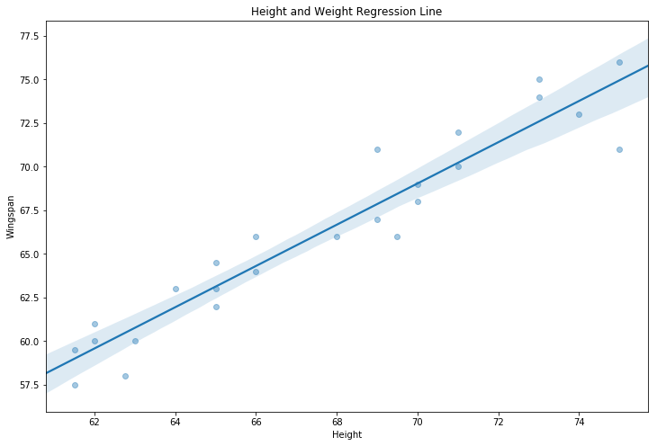


```python
sns.set(style='darkgrid')
sns.jointplot(x="Height", y="Wingspan", data=df, kind='kde', height=9, aspect=6).annotate(stats.pearsonr)
plt.title("Height and Weight Regression Line")
plt.show()
```

    /opt/conda/lib/python3.6/site-packages/matplotlib/contour.py:1004: UserWarning: The following kwargs were not used by contour: 'aspect'
      s)
    /opt/conda/lib/python3.6/site-packages/seaborn/axisgrid.py:1847: UserWarning: JointGrid annotation is deprecated and will be removed in a future release.
      warnings.warn(UserWarning(msg))


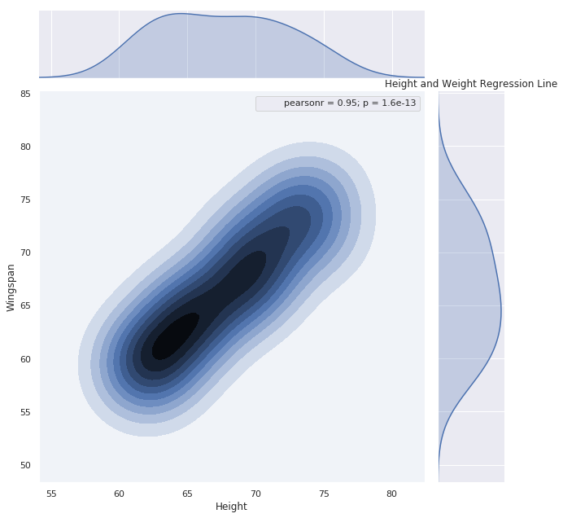


```python
## Let's see both genders on a different column
_ = sns.FacetGrid(df, col='Gender', height=7).map(sns.regplot, x="Height", y="Wingspan", data=df, fit_reg=True, scatter_kws={"alpha": 0.4}).add_legend()
plt.show()


```


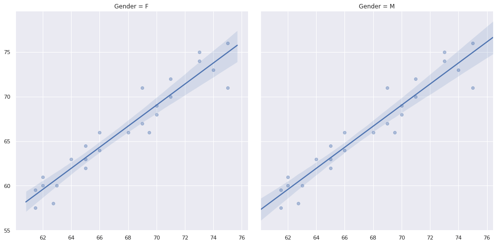


```python
## We can look at the correlation too
display(df.groupby('Gender')['Height', 'Wingspan'].describe())
display(df.groupby('Gender')['Height', 'Wingspan'].corr())
```


<div>
<style scoped>
    .dataframe tbody tr th:only-of-type {
        vertical-align: middle;
    }

    .dataframe tbody tr th {
        vertical-align: top;
    }

    .dataframe thead tr th {
        text-align: left;
    }

    .dataframe thead tr:last-of-type th {
        text-align: right;
    }
</style>
<table border="1" class="dataframe">
  <thead>
    <tr>
      <th></th>
      <th colspan="8" halign="left">Height</th>
      <th colspan="8" halign="left">Wingspan</th>
    </tr>
    <tr>
      <th></th>
      <th>count</th>
      <th>mean</th>
      <th>std</th>
      <th>min</th>
      <th>25%</th>
      <th>50%</th>
      <th>75%</th>
      <th>max</th>
      <th>count</th>
      <th>mean</th>
      <th>std</th>
      <th>min</th>
      <th>25%</th>
      <th>50%</th>
      <th>75%</th>
      <th>max</th>
    </tr>
    <tr>
      <th>Gender</th>
      <th></th>
      <th></th>
      <th></th>
      <th></th>
      <th></th>
      <th></th>
      <th></th>
      <th></th>
      <th></th>
      <th></th>
      <th></th>
      <th></th>
      <th></th>
      <th></th>
      <th></th>
      <th></th>
    </tr>
  </thead>
  <tbody>
    <tr>
      <th>F</th>
      <td>12.0</td>
      <td>63.812500</td>
      <td>2.036946</td>
      <td>61.5</td>
      <td>62.0</td>
      <td>63.5</td>
      <td>65.0</td>
      <td>68.0</td>
      <td>12.0</td>
      <td>61.541667</td>
      <td>2.649686</td>
      <td>57.5</td>
      <td>59.875</td>
      <td>61.5</td>
      <td>63.25</td>
      <td>66.0</td>
    </tr>
    <tr>
      <th>M</th>
      <td>13.0</td>
      <td>71.192308</td>
      <td>2.673469</td>
      <td>66.0</td>
      <td>69.5</td>
      <td>71.0</td>
      <td>73.0</td>
      <td>75.0</td>
      <td>13.0</td>
      <td>70.615385</td>
      <td>3.330127</td>
      <td>66.0</td>
      <td>68.000</td>
      <td>71.0</td>
      <td>73.00</td>
      <td>76.0</td>
    </tr>
  </tbody>
</table>
</div>


<div>
<style scoped>
    .dataframe tbody tr th:only-of-type {
        vertical-align: middle;
    }

    .dataframe tbody tr th {
        vertical-align: top;
    }

    .dataframe thead th {
        text-align: right;
    }
</style>
<table border="1" class="dataframe">
  <thead>
    <tr style="text-align: right;">
      <th></th>
      <th></th>
      <th>Height</th>
      <th>Wingspan</th>
    </tr>
    <tr>
      <th>Gender</th>
      <th></th>
      <th></th>
      <th></th>
    </tr>
  </thead>
  <tbody>
    <tr>
      <th rowspan="2" valign="top">F</th>
      <th>Height</th>
      <td>1.000000</td>
      <td>0.892182</td>
    </tr>
    <tr>
      <th>Wingspan</th>
      <td>0.892182</td>
      <td>1.000000</td>
    </tr>
    <tr>
      <th rowspan="2" valign="top">M</th>
      <th>Height</th>
      <td>1.000000</td>
      <td>0.809293</td>
    </tr>
    <tr>
      <th>Wingspan</th>
      <td>0.809293</td>
      <td>1.000000</td>
    </tr>
  </tbody>
</table>
</div>


How would you describe the relationship between 'Height' and 'Wingspan'?   
Questions you can ask:
* Is it linear?
* Are there outliers?
* Are their ranges similar or different?  

How else could you describe the relationship?

Now let's look at two variables that we don't yet assume have a strong relationship, 'Wingspan' and 'CWDistance'


```python
# Make a Seaborn scatter plot with x = wingspan and y = cartwheel distance
plt.figure(figsize=(10,6))
sns.scatterplot(x='Wingspan', y='CWDistance', data=df)
plt.title("Wingspan and CWDistance Scatterpoints")
plt.show()
```


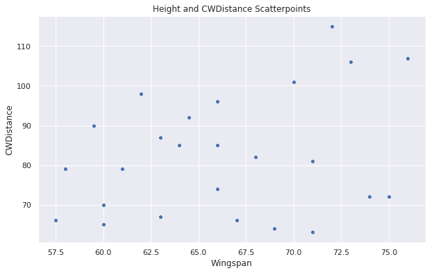


```python
plt.figure(figsize=(10,6))
sns.regplot(x="Wingspan", y="CWDistance", data=df, fit_reg=True, scatter_kws={"alpha": 0.4})
plt.title("Wingspan and CWDistance Regression Line")
plt.show()
```


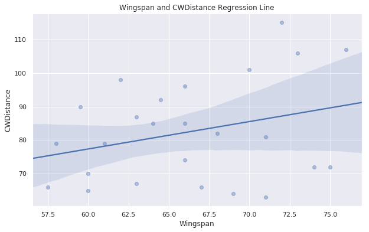


```python
sns.set(style='darkgrid')
sns.jointplot(x="Wingspan", y="CWDistance", data=df, kind='kde', height=10, aspect=6).annotate(stats.pearsonr)
plt.title("Height and CWDistance Regression Line")
plt.show()
```

    /opt/conda/lib/python3.6/site-packages/matplotlib/contour.py:1004: UserWarning: The following kwargs were not used by contour: 'aspect'
      s)
    /opt/conda/lib/python3.6/site-packages/seaborn/axisgrid.py:1847: UserWarning: JointGrid annotation is deprecated and will be removed in a future release.
      warnings.warn(UserWarning(msg))


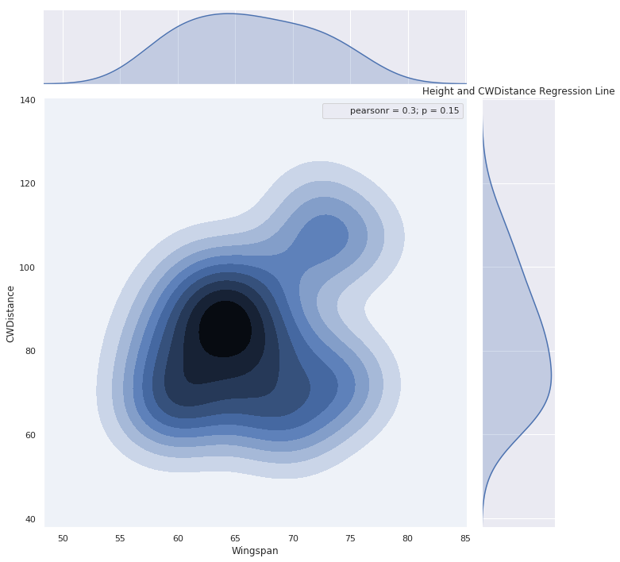


```python
# Question 3
# Is the interquartile range of ‘CWDistance’ similar to ‘Wingspan’?
plt.figure(figsize=(12,10))
sns.boxplot(data=df[['CWDistance', 'Wingspan']])
plt.title('Box plot distribution for CWDistance & Wingspan')
plt.show()
```


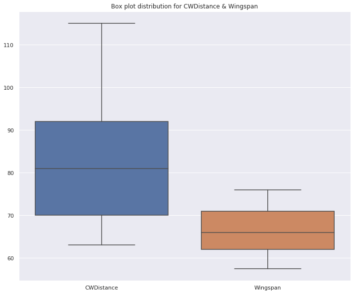


```python
display(df[['CWDistance', 'Wingspan']].describe())
```


<div>
<style scoped>
    .dataframe tbody tr th:only-of-type {
        vertical-align: middle;
    }

    .dataframe tbody tr th {
        vertical-align: top;
    }

    .dataframe thead th {
        text-align: right;
    }
</style>
<table border="1" class="dataframe">
  <thead>
    <tr style="text-align: right;">
      <th></th>
      <th>CWDistance</th>
      <th>Wingspan</th>
    </tr>
  </thead>
  <tbody>
    <tr>
      <th>count</th>
      <td>25.000000</td>
      <td>25.000000</td>
    </tr>
    <tr>
      <th>mean</th>
      <td>82.480000</td>
      <td>66.260000</td>
    </tr>
    <tr>
      <th>std</th>
      <td>15.058552</td>
      <td>5.492647</td>
    </tr>
    <tr>
      <th>min</th>
      <td>63.000000</td>
      <td>57.500000</td>
    </tr>
    <tr>
      <th>25%</th>
      <td>70.000000</td>
      <td>62.000000</td>
    </tr>
    <tr>
      <th>50%</th>
      <td>81.000000</td>
      <td>66.000000</td>
    </tr>
    <tr>
      <th>75%</th>
      <td>92.000000</td>
      <td>71.000000</td>
    </tr>
    <tr>
      <th>max</th>
      <td>115.000000</td>
      <td>76.000000</td>
    </tr>
  </tbody>
</table>
</div>


How would you describe the relationship between 'Wingspan' and 'CWDistance'?   
* Is it linear?
* Are there outliers?
* Are their ranges similar or different?  

How else could you describe the relationship?

Let makes the same plot as above, but now include 'Gender' as the color scheme by including the argument
```
hue=df['Gender']
```
in the Seaborn function


```python
plt.figure(figsize=(12,10))
sns.scatterplot(x='Wingspan', y='CWDistance', data=df, hue='Gender')
plt.title("Wingspan & CWDistance Scatterpoints per Gender")
plt.show()
```


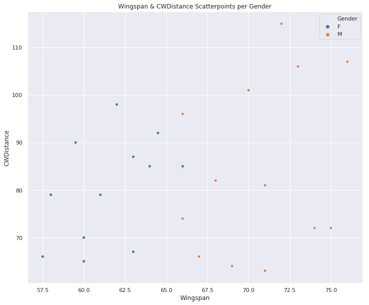


Does does this new information on the plot change your interpretation of the relationship between 'Wingspan' and 'CWDistance'?

## Barcharts
Now lets plot barplots of 'Glasses'


```python
plt.figure(figsize=(12,10))
sns.barplot(x='Glasses', y='CWDistance', data=df)
```


    <matplotlib.axes._subplots.AxesSubplot at 0x7fd4116c9b00>


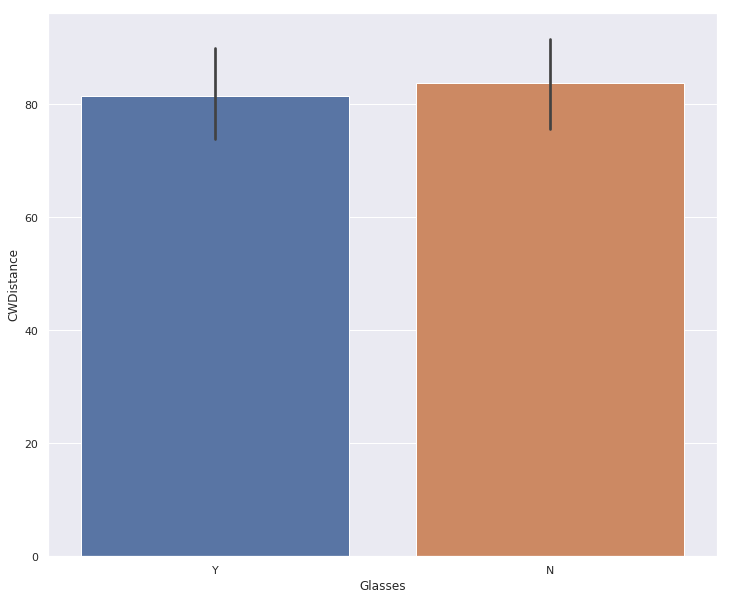


```python
# Make a Seaborn barplot with x = glasses and y = cartwheel distance
plt.figure(figsize=(12,10))
sns.barplot(x='Glasses', y='CWDistance', data=df, hue='Gender')
```


    <matplotlib.axes._subplots.AxesSubplot at 0x7fd411fb3860>


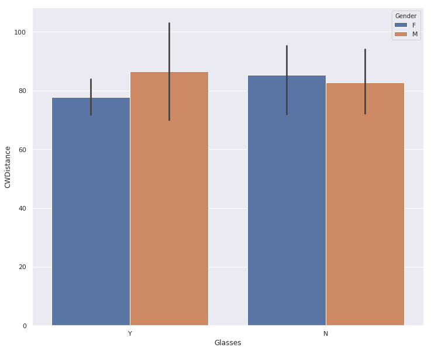


What can you say about the relationship of 'Glasses' and 'CWDistance'?


```python
# Make the same Seaborn boxplot as above, but include gender for the hue argument
plt.figure(figsize=(12,10))
sns.boxplot(x='Glasses', y='CWDistance', data=df, hue='Gender')
```


    <matplotlib.axes._subplots.AxesSubplot at 0x7fd411e66b70>


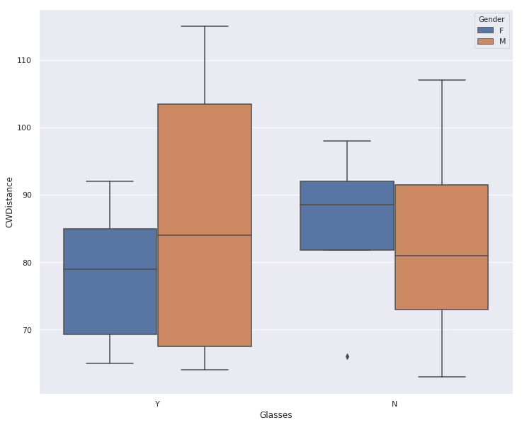


How does this new plot change your interpretation about the relationship of 'Glasses' and 'CWDistance'?
