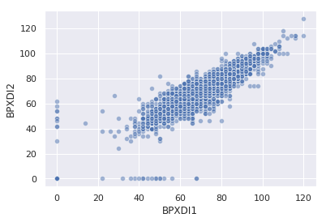
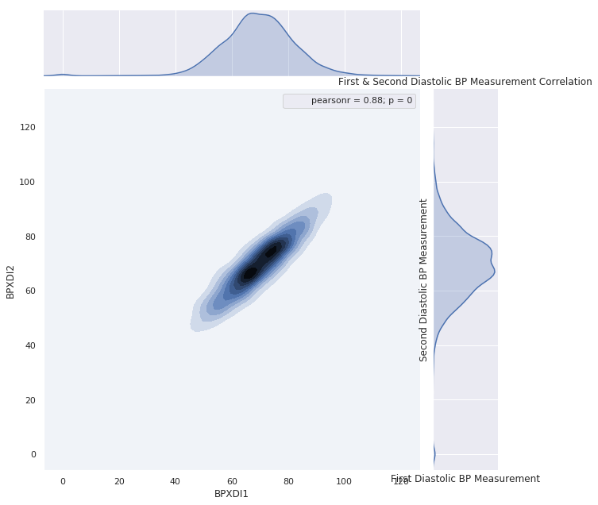
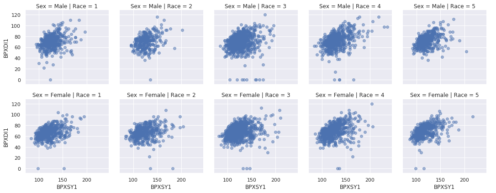
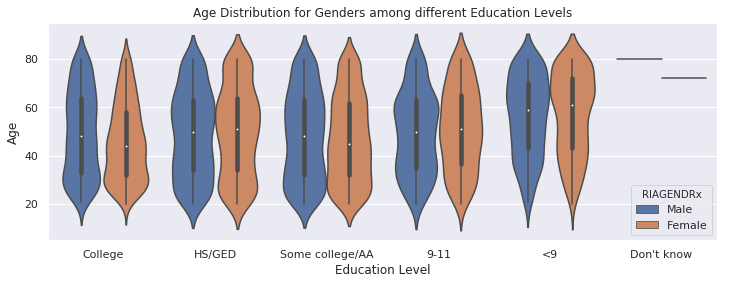
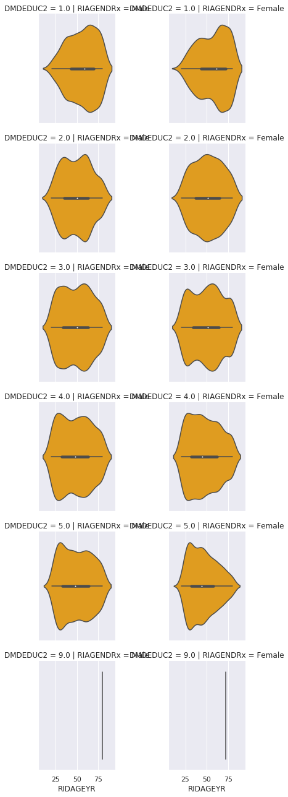
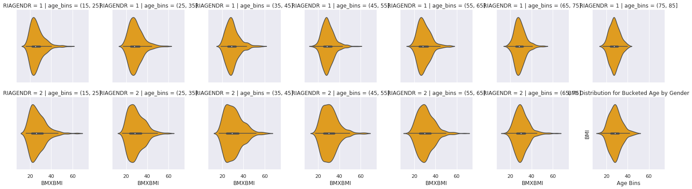
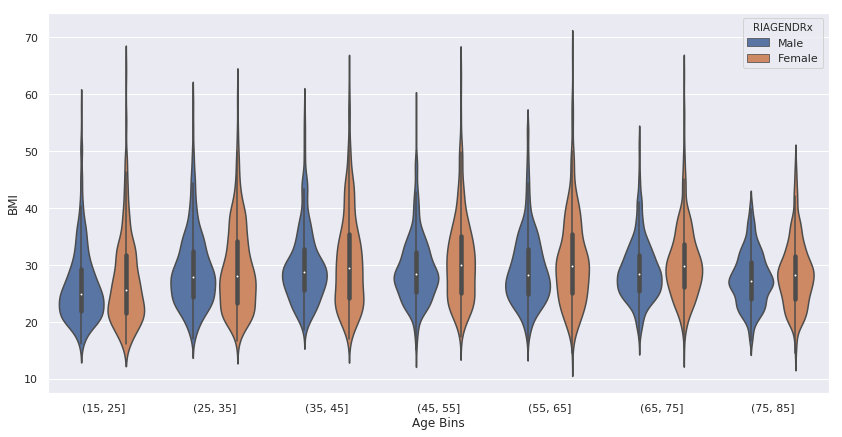

# Practice notebook for multivariate analysis using NHANES data

This notebook will give you the opportunity to perform some multivariate analyses on your own using the NHANES study data.  These analyses are similar to what was done in the week 3 NHANES case study notebook.

You can enter your code into the cells that say "enter your code here", and you can type responses to the questions into the cells that say "Type Markdown and Latex".

Note that most of the code that you will need to write below is very similar to code that appears in the case study notebook.  You will need to edit code from that notebook in small ways to adapt it to the prompts below.

To get started, we will use the same module imports and read the data in the same way as we did in the case study:


```python
%matplotlib inline
import matplotlib.pyplot as plt
import seaborn as sns
import pandas as pd
import statsmodels.api as sm
import numpy as np
from scipy import stats

da = pd.read_csv("nhanes_2015_2016.csv")
da.columns
```


    Index(['SEQN', 'ALQ101', 'ALQ110', 'ALQ130', 'SMQ020', 'RIAGENDR', 'RIDAGEYR',
           'RIDRETH1', 'DMDCITZN', 'DMDEDUC2', 'DMDMARTL', 'DMDHHSIZ', 'WTINT2YR',
           'SDMVPSU', 'SDMVSTRA', 'INDFMPIR', 'BPXSY1', 'BPXDI1', 'BPXSY2',
           'BPXDI2', 'BMXWT', 'BMXHT', 'BMXBMI', 'BMXLEG', 'BMXARML', 'BMXARMC',
           'BMXWAIST', 'HIQ210'],
          dtype='object')


## Question 1

Make a scatterplot showing the relationship between the first and second measurements of diastolic blood pressure ([BPXDI1](https://wwwn.cdc.gov/Nchs/Nhanes/2015-2016/BPX_I.htm#BPXDI1) and [BPXDI2](https://wwwn.cdc.gov/Nchs/Nhanes/2015-2016/BPX_I.htm#BPXDI2)).  Also obtain the 4x4 matrix of correlation coefficients among the first two systolic and the first two diastolic blood pressure measures.


```python
# enter your code here
corr_matr_frst_second_diastolic = da[['BPXDI1', 'BPXDI2', 'BPXSY1', 'BPXSY2']] ## 4X4 Correlations between first & second diastolic and systolic
display(corr_matr_frst_second_diastolic.corr())
print([x for x in da.columns if x.__contains__('BPXDI')]) # Conditional check for all columns containing the apparent characters for diastolic

```


<div>
<style scoped>
    .dataframe tbody tr th:only-of-type {
        vertical-align: middle;
    }

    .dataframe tbody tr th {
        vertical-align: top;
    }

    .dataframe thead th {
        text-align: right;
    }
</style>
<table border="1" class="dataframe">
  <thead>
    <tr style="text-align: right;">
      <th></th>
      <th>BPXDI1</th>
      <th>BPXDI2</th>
      <th>BPXSY1</th>
      <th>BPXSY2</th>
    </tr>
  </thead>
  <tbody>
    <tr>
      <th>BPXDI1</th>
      <td>1.000000</td>
      <td>0.884722</td>
      <td>0.316531</td>
      <td>0.329843</td>
    </tr>
    <tr>
      <th>BPXDI2</th>
      <td>0.884722</td>
      <td>1.000000</td>
      <td>0.277681</td>
      <td>0.303847</td>
    </tr>
    <tr>
      <th>BPXSY1</th>
      <td>0.316531</td>
      <td>0.277681</td>
      <td>1.000000</td>
      <td>0.962287</td>
    </tr>
    <tr>
      <th>BPXSY2</th>
      <td>0.329843</td>
      <td>0.303847</td>
      <td>0.962287</td>
      <td>1.000000</td>
    </tr>
  </tbody>
</table>
</div>


    ['BPXDI1', 'BPXDI2']


```python
## Sns scatterplot
sns.set(style='darkgrid')
sns.scatterplot(x='BPXDI1', y='BPXDI2', data=corr_matr_frst_second_diastolic, alpha=0.5)
plt.title('Correlation First & Second Diastolic Blood Pressure Measurements')
```


    <matplotlib.axes._subplots.AxesSubplot at 0x7fde09e35d30>





```python
# sns.jointplot dual distributions
sns.set(style='darkgrid') # rc={"figure.figsize":(12, 9) for The first method can be used to change the size of “axes-level” plots such as sns.scatterplot() or sns.boxplot() plots:
sns.jointplot(x='BPXDI1', y='BPXDI2', 
              data=corr_matr_frst_second_diastolic, kind='kde',
             height=9, aspect=6).annotate(stats.pearsonr)
plt.xlabel('First Diastolic BP Measurement')
plt.ylabel('Second Diastolic BP Measurement')
plt.title('First & Second Diastolic BP Measurement Correlation')
plt.show()
```

    /opt/conda/lib/python3.6/site-packages/matplotlib/contour.py:1004: UserWarning: The following kwargs were not used by contour: 'aspect'
      s)
    /opt/conda/lib/python3.6/site-packages/seaborn/axisgrid.py:1847: UserWarning: JointGrid annotation is deprecated and will be removed in a future release.
      warnings.warn(UserWarning(msg))





## Question 2

Construct a grid of scatterplots between the first systolic and the first diastolic blood pressure measurement.  Stratify the plots by gender (rows) and by race/ethnicity groups (columns).


```python
# insert your code here (BPXSY1 First Systolic, BPXDI1 First Diastolic) RIAGENDR - Gender, RIDRETH1 - Race/Ethnicity
# print(da.columns.tolist(), '\n') # was looking for systolic and diastolic columns
# print(da['RIAGENDR'].value_counts()) # Value_counts for Gender
da["RIAGENDRx"] = da.RIAGENDR.replace({1: "Male", 2: "Female"}) # Modify Gender to Recognizable Values
# print(da['RIDRETH1'].value_counts()) # https://wwwn.cdc.gov/Nchs/Nhanes/2015-2016/DEMO_I.htm#RIDRETH1 Renaming columns based off these
da['RIDRETH1x'] = da['RIDRETH1'].replace({1:'Mexican American', 2:'Other Hispanic', 3:'Non-Hispanic White', 
                                          4:'Non-Hispanic Black', 5:'Other Race'})
stratify_frame = da[['RIAGENDRx','RIDRETH1x', 'BPXSY1', 'BPXDI1', 'RIDRETH1']] 
stratify_frame.rename(columns={'RIDRETH1':'Race', 'RIAGENDRx': 'Sex', 'RIDRETH1x':'Race_Strings'}, inplace=True)
display(stratify_frame.head(5))
_ = sns.FacetGrid(stratify_frame, col="Race",  row="Sex").map(plt.scatter, "BPXSY1", "BPXDI1", alpha=0.5).add_legend()
plt.show()

```


<div>
<style scoped>
    .dataframe tbody tr th:only-of-type {
        vertical-align: middle;
    }

    .dataframe tbody tr th {
        vertical-align: top;
    }

    .dataframe thead th {
        text-align: right;
    }
</style>
<table border="1" class="dataframe">
  <thead>
    <tr style="text-align: right;">
      <th></th>
      <th>Sex</th>
      <th>Race_Strings</th>
      <th>BPXSY1</th>
      <th>BPXDI1</th>
      <th>Race</th>
    </tr>
  </thead>
  <tbody>
    <tr>
      <th>0</th>
      <td>Male</td>
      <td>Non-Hispanic White</td>
      <td>128.0</td>
      <td>70.0</td>
      <td>3</td>
    </tr>
    <tr>
      <th>1</th>
      <td>Male</td>
      <td>Non-Hispanic White</td>
      <td>146.0</td>
      <td>88.0</td>
      <td>3</td>
    </tr>
    <tr>
      <th>2</th>
      <td>Male</td>
      <td>Non-Hispanic White</td>
      <td>138.0</td>
      <td>46.0</td>
      <td>3</td>
    </tr>
    <tr>
      <th>3</th>
      <td>Female</td>
      <td>Non-Hispanic White</td>
      <td>132.0</td>
      <td>72.0</td>
      <td>3</td>
    </tr>
    <tr>
      <th>4</th>
      <td>Female</td>
      <td>Non-Hispanic Black</td>
      <td>100.0</td>
      <td>70.0</td>
      <td>4</td>
    </tr>
  </tbody>
</table>
</div>





## Question 3

Use "violin plots" to compare the distributions of ages within groups defined by gender and educational attainment.


```python
# insert your code here 
## Replace Education Levels from Numeric to Categorical
da["DMDEDUC2x"] = da.DMDEDUC2.replace({1: "<9", 2: "9-11", 3: "HS/GED", 4: "Some college/AA", 5: "College", 
                                       7: "Refused", 9: "Don't know"})


vp_gndr_education = da[['DMDEDUC2x', 'RIAGENDRx', 'RIDAGEYR']]
vp_gndr_education['Age'] = vp_gndr_education['RIDAGEYR'] # Set new column to subset dataframe to age 
display(vp_gndr_education.head())

## Alright Now we need to group, count and unstack for a dataframe with groupby counts
vp_gndr_education_grpby = vp_gndr_education.groupby(['RIAGENDRx', 'DMDEDUC2x'])['Age'].value_counts().unstack() # transform from long to wide for columns
vp_gndr_education_grpby.fillna(0, inplace=True) # Fill in null values for age counts
print('Here is The DataFrame to transform into a violin plot for distribution of ages across education categories for males & females')
display(vp_gndr_education_grpby)

#Will use original DA dataframe as groupby dataframe doesn't have the easiest access to values
plt.figure(figsize=(12, 4))
sns.violinplot(data=da, x='DMDEDUC2x', y='RIDAGEYR', hue='RIAGENDRx')
plt.xlabel('Education Level')
plt.ylabel('Age')
plt.title('Age Distribution for Genders among different Education Levels')
plt.show()


```


<div>
<style scoped>
    .dataframe tbody tr th:only-of-type {
        vertical-align: middle;
    }

    .dataframe tbody tr th {
        vertical-align: top;
    }

    .dataframe thead th {
        text-align: right;
    }
</style>
<table border="1" class="dataframe">
  <thead>
    <tr style="text-align: right;">
      <th></th>
      <th>DMDEDUC2x</th>
      <th>RIAGENDRx</th>
      <th>RIDAGEYR</th>
      <th>Age</th>
    </tr>
  </thead>
  <tbody>
    <tr>
      <th>0</th>
      <td>College</td>
      <td>Male</td>
      <td>62</td>
      <td>62</td>
    </tr>
    <tr>
      <th>1</th>
      <td>HS/GED</td>
      <td>Male</td>
      <td>53</td>
      <td>53</td>
    </tr>
    <tr>
      <th>2</th>
      <td>HS/GED</td>
      <td>Male</td>
      <td>78</td>
      <td>78</td>
    </tr>
    <tr>
      <th>3</th>
      <td>College</td>
      <td>Female</td>
      <td>56</td>
      <td>56</td>
    </tr>
    <tr>
      <th>4</th>
      <td>Some college/AA</td>
      <td>Female</td>
      <td>42</td>
      <td>42</td>
    </tr>
  </tbody>
</table>
</div>


    Here is The DataFrame to transform into a violin plot for distribution of ages across education categories for males & females


<div>
<style scoped>
    .dataframe tbody tr th:only-of-type {
        vertical-align: middle;
    }

    .dataframe tbody tr th {
        vertical-align: top;
    }

    .dataframe thead th {
        text-align: right;
    }
</style>
<table border="1" class="dataframe">
  <thead>
    <tr style="text-align: right;">
      <th></th>
      <th>Age</th>
      <th>20</th>
      <th>21</th>
      <th>22</th>
      <th>23</th>
      <th>24</th>
      <th>25</th>
      <th>26</th>
      <th>27</th>
      <th>28</th>
      <th>29</th>
      <th>...</th>
      <th>71</th>
      <th>72</th>
      <th>73</th>
      <th>74</th>
      <th>75</th>
      <th>76</th>
      <th>77</th>
      <th>78</th>
      <th>79</th>
      <th>80</th>
    </tr>
    <tr>
      <th>RIAGENDRx</th>
      <th>DMDEDUC2x</th>
      <th></th>
      <th></th>
      <th></th>
      <th></th>
      <th></th>
      <th></th>
      <th></th>
      <th></th>
      <th></th>
      <th></th>
      <th></th>
      <th></th>
      <th></th>
      <th></th>
      <th></th>
      <th></th>
      <th></th>
      <th></th>
      <th></th>
      <th></th>
      <th></th>
    </tr>
  </thead>
  <tbody>
    <tr>
      <th rowspan="6" valign="top">Female</th>
      <th>9-11</th>
      <td>1.0</td>
      <td>2.0</td>
      <td>4.0</td>
      <td>8.0</td>
      <td>3.0</td>
      <td>1.0</td>
      <td>3.0</td>
      <td>2.0</td>
      <td>11.0</td>
      <td>2.0</td>
      <td>...</td>
      <td>0.0</td>
      <td>4.0</td>
      <td>5.0</td>
      <td>5.0</td>
      <td>4.0</td>
      <td>0.0</td>
      <td>1.0</td>
      <td>1.0</td>
      <td>1.0</td>
      <td>22.0</td>
    </tr>
    <tr>
      <th>&lt;9</th>
      <td>1.0</td>
      <td>2.0</td>
      <td>0.0</td>
      <td>2.0</td>
      <td>4.0</td>
      <td>2.0</td>
      <td>1.0</td>
      <td>2.0</td>
      <td>6.0</td>
      <td>4.0</td>
      <td>...</td>
      <td>4.0</td>
      <td>6.0</td>
      <td>8.0</td>
      <td>5.0</td>
      <td>8.0</td>
      <td>4.0</td>
      <td>5.0</td>
      <td>6.0</td>
      <td>7.0</td>
      <td>39.0</td>
    </tr>
    <tr>
      <th>College</th>
      <td>1.0</td>
      <td>0.0</td>
      <td>7.0</td>
      <td>14.0</td>
      <td>12.0</td>
      <td>21.0</td>
      <td>22.0</td>
      <td>18.0</td>
      <td>14.0</td>
      <td>22.0</td>
      <td>...</td>
      <td>7.0</td>
      <td>3.0</td>
      <td>10.0</td>
      <td>5.0</td>
      <td>5.0</td>
      <td>3.0</td>
      <td>2.0</td>
      <td>3.0</td>
      <td>2.0</td>
      <td>21.0</td>
    </tr>
    <tr>
      <th>Don't know</th>
      <td>0.0</td>
      <td>0.0</td>
      <td>0.0</td>
      <td>0.0</td>
      <td>0.0</td>
      <td>0.0</td>
      <td>0.0</td>
      <td>0.0</td>
      <td>0.0</td>
      <td>0.0</td>
      <td>...</td>
      <td>0.0</td>
      <td>1.0</td>
      <td>0.0</td>
      <td>0.0</td>
      <td>0.0</td>
      <td>0.0</td>
      <td>0.0</td>
      <td>0.0</td>
      <td>0.0</td>
      <td>0.0</td>
    </tr>
    <tr>
      <th>HS/GED</th>
      <td>12.0</td>
      <td>8.0</td>
      <td>15.0</td>
      <td>11.0</td>
      <td>10.0</td>
      <td>16.0</td>
      <td>12.0</td>
      <td>10.0</td>
      <td>11.0</td>
      <td>8.0</td>
      <td>...</td>
      <td>7.0</td>
      <td>5.0</td>
      <td>2.0</td>
      <td>6.0</td>
      <td>8.0</td>
      <td>5.0</td>
      <td>5.0</td>
      <td>4.0</td>
      <td>8.0</td>
      <td>48.0</td>
    </tr>
    <tr>
      <th>Some college/AA</th>
      <td>24.0</td>
      <td>20.0</td>
      <td>19.0</td>
      <td>22.0</td>
      <td>15.0</td>
      <td>16.0</td>
      <td>18.0</td>
      <td>22.0</td>
      <td>17.0</td>
      <td>17.0</td>
      <td>...</td>
      <td>7.0</td>
      <td>11.0</td>
      <td>9.0</td>
      <td>4.0</td>
      <td>11.0</td>
      <td>5.0</td>
      <td>8.0</td>
      <td>7.0</td>
      <td>3.0</td>
      <td>50.0</td>
    </tr>
    <tr>
      <th rowspan="6" valign="top">Male</th>
      <th>9-11</th>
      <td>7.0</td>
      <td>3.0</td>
      <td>1.0</td>
      <td>5.0</td>
      <td>6.0</td>
      <td>2.0</td>
      <td>5.0</td>
      <td>9.0</td>
      <td>4.0</td>
      <td>8.0</td>
      <td>...</td>
      <td>5.0</td>
      <td>4.0</td>
      <td>2.0</td>
      <td>2.0</td>
      <td>3.0</td>
      <td>2.0</td>
      <td>2.0</td>
      <td>5.0</td>
      <td>1.0</td>
      <td>19.0</td>
    </tr>
    <tr>
      <th>&lt;9</th>
      <td>0.0</td>
      <td>2.0</td>
      <td>4.0</td>
      <td>1.0</td>
      <td>3.0</td>
      <td>2.0</td>
      <td>3.0</td>
      <td>3.0</td>
      <td>1.0</td>
      <td>1.0</td>
      <td>...</td>
      <td>7.0</td>
      <td>6.0</td>
      <td>5.0</td>
      <td>4.0</td>
      <td>2.0</td>
      <td>8.0</td>
      <td>5.0</td>
      <td>4.0</td>
      <td>6.0</td>
      <td>25.0</td>
    </tr>
    <tr>
      <th>College</th>
      <td>0.0</td>
      <td>1.0</td>
      <td>7.0</td>
      <td>14.0</td>
      <td>11.0</td>
      <td>19.0</td>
      <td>19.0</td>
      <td>15.0</td>
      <td>7.0</td>
      <td>15.0</td>
      <td>...</td>
      <td>9.0</td>
      <td>9.0</td>
      <td>4.0</td>
      <td>11.0</td>
      <td>5.0</td>
      <td>7.0</td>
      <td>3.0</td>
      <td>7.0</td>
      <td>3.0</td>
      <td>37.0</td>
    </tr>
    <tr>
      <th>Don't know</th>
      <td>0.0</td>
      <td>0.0</td>
      <td>0.0</td>
      <td>0.0</td>
      <td>0.0</td>
      <td>0.0</td>
      <td>0.0</td>
      <td>0.0</td>
      <td>0.0</td>
      <td>0.0</td>
      <td>...</td>
      <td>0.0</td>
      <td>0.0</td>
      <td>0.0</td>
      <td>0.0</td>
      <td>0.0</td>
      <td>0.0</td>
      <td>0.0</td>
      <td>0.0</td>
      <td>0.0</td>
      <td>2.0</td>
    </tr>
    <tr>
      <th>HS/GED</th>
      <td>14.0</td>
      <td>8.0</td>
      <td>15.0</td>
      <td>8.0</td>
      <td>14.0</td>
      <td>11.0</td>
      <td>13.0</td>
      <td>9.0</td>
      <td>7.0</td>
      <td>10.0</td>
      <td>...</td>
      <td>11.0</td>
      <td>5.0</td>
      <td>5.0</td>
      <td>5.0</td>
      <td>8.0</td>
      <td>4.0</td>
      <td>6.0</td>
      <td>5.0</td>
      <td>1.0</td>
      <td>36.0</td>
    </tr>
    <tr>
      <th>Some college/AA</th>
      <td>19.0</td>
      <td>13.0</td>
      <td>23.0</td>
      <td>15.0</td>
      <td>10.0</td>
      <td>14.0</td>
      <td>12.0</td>
      <td>11.0</td>
      <td>16.0</td>
      <td>16.0</td>
      <td>...</td>
      <td>9.0</td>
      <td>8.0</td>
      <td>8.0</td>
      <td>5.0</td>
      <td>8.0</td>
      <td>6.0</td>
      <td>6.0</td>
      <td>5.0</td>
      <td>3.0</td>
      <td>44.0</td>
    </tr>
  </tbody>
</table>
<p>12 rows × 61 columns</p>
</div>





```python
plt.figure(figsize=(12, 8))
g = sns.FacetGrid(da, row='DMDEDUC2', col='RIAGENDRx')
g.map(sns.violinplot, 'RIDAGEYR', color='orange')
plt.show()
```

    /opt/conda/lib/python3.6/site-packages/seaborn/axisgrid.py:715: UserWarning: Using the violinplot function without specifying `order` is likely to produce an incorrect plot.
      warnings.warn(warning)


    <Figure size 864x576 with 0 Axes>





## Question 4

Use violin plots to compare the distributions of BMI within a series of 10-year age bands.  Also stratify these plots by gender.


```python
# insert your code here
print(da['RIDAGEYR'].describe()) # Quick look at age before cutting into buckets of 10
vp_bmi = da[['RIDAGEYR', 'BMXBMI', 'RIAGENDR', 'RIAGENDRx']]
vp_bmi['age_bins'] = pd.cut(x=vp_bmi['RIDAGEYR'], bins=[15, 25, 35, 45, 55, 65, 75, 85])
print(vp_bmi['age_bins'].value_counts())

## Set Figure and violinplot 
plt.figure(figsize=(10, 6))
g = sns.FacetGrid(vp_bmi, row='RIAGENDR', col='age_bins')
g.map(sns.violinplot, 'BMXBMI', color='orange')
plt.xlabel('Age Bins')
plt.ylabel('BMI')
plt.title('BMI Distribution for Bucketed Age by Gender')
plt.show()
```

    count    5735.000000
    mean       48.052310
    std        18.431011
    min        18.000000
    25%        32.000000
    50%        48.000000
    75%        63.000000
    max        80.000000
    Name: RIDAGEYR, dtype: float64
    (25, 35]    983
    (45, 55]    926
    (55, 65]    917
    (35, 45]    911
    (15, 25]    786
    (65, 75]    700
    (75, 85]    512
    Name: age_bins, dtype: int64


    /opt/conda/lib/python3.6/site-packages/seaborn/axisgrid.py:715: UserWarning: Using the violinplot function without specifying `order` is likely to produce an incorrect plot.
      warnings.warn(warning)


    <Figure size 720x432 with 0 Axes>





```python
plt.figure(figsize=(14, 7))
a = sns.violinplot(vp_bmi['age_bins'], vp_bmi['BMXBMI'], hue=vp_bmi['RIAGENDRx'], bw=.25) # bw reduce amount of smoothing, split to take up less space
plt.xlabel('Age Bins')
plt.ylabel('BMI')
plt.title('')
plt.show()
```





__Q5a.__ Comment on the trends in BMI across the demographic groups.


```python
## Here is our summary stats for the age bins in the violin plot above
display(vp_bmi.groupby(['age_bins', 'RIAGENDRx'])['BMXBMI'].describe()) # Here's a look at our binned BMI distributions
```


<div>
<style scoped>
    .dataframe tbody tr th:only-of-type {
        vertical-align: middle;
    }

    .dataframe tbody tr th {
        vertical-align: top;
    }

    .dataframe thead th {
        text-align: right;
    }
</style>
<table border="1" class="dataframe">
  <thead>
    <tr style="text-align: right;">
      <th></th>
      <th></th>
      <th>count</th>
      <th>mean</th>
      <th>std</th>
      <th>min</th>
      <th>25%</th>
      <th>50%</th>
      <th>75%</th>
      <th>max</th>
    </tr>
    <tr>
      <th>age_bins</th>
      <th>RIAGENDRx</th>
      <th></th>
      <th></th>
      <th></th>
      <th></th>
      <th></th>
      <th></th>
      <th></th>
      <th></th>
    </tr>
  </thead>
  <tbody>
    <tr>
      <th rowspan="2" valign="top">(15, 25]</th>
      <th>Female</th>
      <td>393.0</td>
      <td>27.311450</td>
      <td>7.868145</td>
      <td>16.2</td>
      <td>21.600</td>
      <td>25.70</td>
      <td>31.800</td>
      <td>64.6</td>
    </tr>
    <tr>
      <th>Male</th>
      <td>382.0</td>
      <td>26.475393</td>
      <td>6.555691</td>
      <td>16.2</td>
      <td>21.900</td>
      <td>24.90</td>
      <td>29.375</td>
      <td>57.6</td>
    </tr>
    <tr>
      <th rowspan="2" valign="top">(25, 35]</th>
      <th>Female</th>
      <td>512.0</td>
      <td>29.488867</td>
      <td>7.697125</td>
      <td>16.6</td>
      <td>23.400</td>
      <td>28.10</td>
      <td>34.200</td>
      <td>60.7</td>
    </tr>
    <tr>
      <th>Male</th>
      <td>462.0</td>
      <td>29.168398</td>
      <td>6.773196</td>
      <td>17.1</td>
      <td>24.325</td>
      <td>28.00</td>
      <td>32.475</td>
      <td>58.8</td>
    </tr>
    <tr>
      <th rowspan="2" valign="top">(35, 45]</th>
      <th>Female</th>
      <td>496.0</td>
      <td>30.854839</td>
      <td>8.430103</td>
      <td>17.1</td>
      <td>24.200</td>
      <td>29.45</td>
      <td>35.400</td>
      <td>62.7</td>
    </tr>
    <tr>
      <th>Male</th>
      <td>406.0</td>
      <td>29.831034</td>
      <td>6.548925</td>
      <td>18.6</td>
      <td>25.600</td>
      <td>28.80</td>
      <td>32.750</td>
      <td>57.8</td>
    </tr>
    <tr>
      <th rowspan="2" valign="top">(45, 55]</th>
      <th>Female</th>
      <td>489.0</td>
      <td>31.083027</td>
      <td>7.820576</td>
      <td>17.3</td>
      <td>25.100</td>
      <td>30.00</td>
      <td>35.100</td>
      <td>64.5</td>
    </tr>
    <tr>
      <th>Male</th>
      <td>432.0</td>
      <td>29.277083</td>
      <td>5.931203</td>
      <td>15.1</td>
      <td>25.200</td>
      <td>28.40</td>
      <td>32.350</td>
      <td>57.4</td>
    </tr>
    <tr>
      <th rowspan="2" valign="top">(55, 65]</th>
      <th>Female</th>
      <td>446.0</td>
      <td>30.821749</td>
      <td>7.923187</td>
      <td>14.5</td>
      <td>25.125</td>
      <td>29.85</td>
      <td>35.400</td>
      <td>67.3</td>
    </tr>
    <tr>
      <th>Male</th>
      <td>456.0</td>
      <td>29.299781</td>
      <td>6.274426</td>
      <td>16.4</td>
      <td>24.900</td>
      <td>28.25</td>
      <td>32.800</td>
      <td>54.2</td>
    </tr>
    <tr>
      <th rowspan="2" valign="top">(65, 75]</th>
      <th>Female</th>
      <td>355.0</td>
      <td>30.560282</td>
      <td>6.668386</td>
      <td>15.5</td>
      <td>26.100</td>
      <td>29.80</td>
      <td>33.700</td>
      <td>63.6</td>
    </tr>
    <tr>
      <th>Male</th>
      <td>336.0</td>
      <td>29.075595</td>
      <td>5.378481</td>
      <td>17.0</td>
      <td>25.500</td>
      <td>28.50</td>
      <td>31.725</td>
      <td>51.8</td>
    </tr>
    <tr>
      <th rowspan="2" valign="top">(75, 85]</th>
      <th>Female</th>
      <td>253.0</td>
      <td>28.507905</td>
      <td>5.907785</td>
      <td>14.5</td>
      <td>24.100</td>
      <td>28.20</td>
      <td>31.600</td>
      <td>48.2</td>
    </tr>
    <tr>
      <th>Male</th>
      <td>244.0</td>
      <td>27.623770</td>
      <td>4.726565</td>
      <td>16.6</td>
      <td>24.075</td>
      <td>27.30</td>
      <td>30.550</td>
      <td>40.7</td>
    </tr>
  </tbody>
</table>
</div>


### Notes
* We Can see the plots for elder age bins noticeable shrink and markedly a fairly tightening of the distribution with the smaller standard deviation
* The mean and median values across our genders and age buckets are strikingly similar but the max bmi and range of values is far more diverse for our younger age buckets which stretches our distribution

## Question 5

Construct a frequency table for the joint distribution of ethnicity groups ([RIDRETH1](https://wwwn.cdc.gov/Nchs/Nhanes/2015-2016/DEMO_I.htm#RIDRETH1)) and health-insurance status ([HIQ210](https://wwwn.cdc.gov/Nchs/Nhanes/2015-2016/HIQ_I.htm#HIQ210)).  Normalize the results so that the values within each ethnic group are proportions that sum to 1.


```python
# insert your code here & HIQ210 - Time when no insurance in past year
da['HIQ210x'] = da['HIQ210'].replace({1:'NoInsurance < 12', 2: 'Insurance < 12', 9:'Unsure'})
eth_hins_freqs = da.groupby('RIDRETH1x')['HIQ210x'].value_counts().unstack() # Grouped by value counts unstacked to wide format
eth_hins_freqs.fillna(0, inplace=True)
print("Below are the frequency counts for each ethnicity for the Insurance Status Values")
display(eth_hins_freqs) # Frequency Counts

print('\nBelow are the percentage counts for each ethnicity for the Insurance Status Values')
# Normalize values to percentages across ethnicities
eth_hins_freqs_percentages = eth_hins_freqs.apply(lambda x: x/x.sum(), axis=1)
display(eth_hins_freqs_percentages)

```

    Below are the frequency counts for each ethnicity for the Insurance Status Values


<div>
<style scoped>
    .dataframe tbody tr th:only-of-type {
        vertical-align: middle;
    }

    .dataframe tbody tr th {
        vertical-align: top;
    }

    .dataframe thead th {
        text-align: right;
    }
</style>
<table border="1" class="dataframe">
  <thead>
    <tr style="text-align: right;">
      <th>HIQ210x</th>
      <th>Insurance &lt; 12</th>
      <th>NoInsurance &lt; 12</th>
      <th>Unsure</th>
    </tr>
    <tr>
      <th>RIDRETH1x</th>
      <th></th>
      <th></th>
      <th></th>
    </tr>
  </thead>
  <tbody>
    <tr>
      <th>Mexican American</th>
      <td>578.0</td>
      <td>93.0</td>
      <td>3.0</td>
    </tr>
    <tr>
      <th>Non-Hispanic Black</th>
      <td>926.0</td>
      <td>113.0</td>
      <td>1.0</td>
    </tr>
    <tr>
      <th>Non-Hispanic White</th>
      <td>1535.0</td>
      <td>111.0</td>
      <td>2.0</td>
    </tr>
    <tr>
      <th>Other Hispanic</th>
      <td>501.0</td>
      <td>74.0</td>
      <td>0.0</td>
    </tr>
    <tr>
      <th>Other Race</th>
      <td>728.0</td>
      <td>65.0</td>
      <td>2.0</td>
    </tr>
  </tbody>
</table>
</div>


    
    Below are the percentage counts for each ethnicity for the Insurance Status Values


<div>
<style scoped>
    .dataframe tbody tr th:only-of-type {
        vertical-align: middle;
    }

    .dataframe tbody tr th {
        vertical-align: top;
    }

    .dataframe thead th {
        text-align: right;
    }
</style>
<table border="1" class="dataframe">
  <thead>
    <tr style="text-align: right;">
      <th>HIQ210x</th>
      <th>Insurance &lt; 12</th>
      <th>NoInsurance &lt; 12</th>
      <th>Unsure</th>
    </tr>
    <tr>
      <th>RIDRETH1x</th>
      <th></th>
      <th></th>
      <th></th>
    </tr>
  </thead>
  <tbody>
    <tr>
      <th>Mexican American</th>
      <td>0.857567</td>
      <td>0.137982</td>
      <td>0.004451</td>
    </tr>
    <tr>
      <th>Non-Hispanic Black</th>
      <td>0.890385</td>
      <td>0.108654</td>
      <td>0.000962</td>
    </tr>
    <tr>
      <th>Non-Hispanic White</th>
      <td>0.931432</td>
      <td>0.067354</td>
      <td>0.001214</td>
    </tr>
    <tr>
      <th>Other Hispanic</th>
      <td>0.871304</td>
      <td>0.128696</td>
      <td>0.000000</td>
    </tr>
    <tr>
      <th>Other Race</th>
      <td>0.915723</td>
      <td>0.081761</td>
      <td>0.002516</td>
    </tr>
  </tbody>
</table>
</div>


__Q6a.__ Which ethnic group has the highest rate of being uninsured in the past year?

### Ethnic Insurance Coverage Over Past 12 Months
* Above we can see that over the last 12 months nearly 14% of Mexican American ethnicities in our dataset did not hold health insurance coverage over the past 12 months.
* This is closely followed by our "Other Hispanic" ethnicity count which is about 13% in the same category
* This value is cut in half for Non-Hispanic White and about 25% for Non-Hispanic Black ethnicities in our dataset
