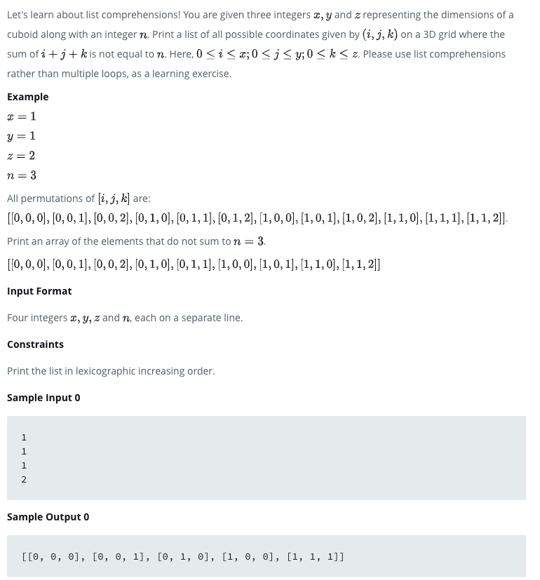

## HackerRank 🧑‍💻 for Python 🐍
* So sometimes the challenges are gonna be good to write in a markdown file as the detail isn't going to be the easiest comment for a straight python file in some scenarios
* Now ... to some challenges 
* Am also noting some challenges here for greater understanding of how the code working not just in a python script (see below!)
---

### **`File Details: Quick Summaries of Challenges`** 🗄️
* [**`Opening Challenges`**](/HackerRank/entry_easy/opening_challenges.py)
    * Leap Year Modulus Boolean Setting
    * Str building for input numeric value with range for loop
    * `List Comprehension` for permutation building - Further Details below for Challenge section capture
        * Good reminder on nested loop functionality in list comprehensions
    * `Runner Up Score` - use of all() for Boolean condition, sorted unique ranks with method chaining and **sorted** reverse argument to capture higher ranks
    * Formatting numeric string value for a rounded 2 digit float value
    * `Math pows`
    * list methods for **`mutating list commands` and update over While loop**
* [**`Second Set`**](/HackerRank/entry_easy/second_set.py)
    * `Tuple generation` from input and use of built_in hash method 
    * `Collections OrderedDict` - Receive input and iterate over total of N times - split input str by item/price and append or add to Ordered Dict
    * `Swap Values` - isalpha check with lower/upper check to swap values if character is alpha then join strings
    * **String operations** - `substr search`, `string mutation through slicing`, `split and join`
    * `String Operations` in `OrderedDict` for string check for any True characters in string based on provided string methods
        - Good reminder here of how to chain a method from an object (in this case a str) and pass a character to that object method call to evaluate
        - Also had tripped up on a test case here and using the Submissions part for the challenge allowed me to see the test case which failed and debug - I foolish put the same str method twice for two keys which was tripping me up
    * Last Challenge for this growing file is the `text wrap`: We are slicing through a string to print a new line of characters for a particular width to the end of the string. Good use of mutating iterator values against stop indexes for the slice as well as use of `math.ceil` and `math.floor` for conditionally checking how long the loop should run prior to printing out the remaining characters of the string
        - Also converting list items to a multiline string for the requested output 
* [**`Third Set`**](/HackerRank/entry_easy/third_set.py)

---

### **Challenges Breakdown Selections** ⛰️

* **`List Comprehensions`**


* So trick here is using multiple for loops in the comprehension which are **`nested loops`**
```python
# Let's say for instance we have the values for our input
# x = 1, y = 1, z = 1, n = 2
>>> x, y, z, n = 1, 1, 1, 2
>>> x
1
>>> y
1
>>> z
1
>>> n
2
>>> [[a, b] for a in range(x + 1) for b in range(y+1)]
[[0, 0], [0, 1], [1, 0], [1, 1]]
```
* **`Output Breakdown`**
    - **a** or idx[0] in our list output shows a zero and is the result of the first for loop execution
    - Now once that first 0 is generated for the temp variable **a**, the second for loop with temp variable **b** starts
        * Now as a nested loop in the comprehension (which this is but a little more difficult to see on first glance), the entire for loop for b will run
        * **`Most Imporant Point`** : the chaining of for loops in a list comprehension will work as a nested iteration which in our challenge is very useful as the objective is to create possible permutations of all the different values
* **`Back to Permutations`**
```python
>>> x, y, z, n = 1, 1, 1, 2
>>> permutations = [[a, b, c] for a in range(x+1) for b in range(y+1) for c in range(z+1)]
>>> permutations
[[0, 0, 0], [0, 0, 1], [0, 1, 0], [0, 1, 1], [1, 0, 0], [1, 0, 1], [1, 1, 0], [1, 1, 1]]
```
* **`Output Breakdown : Nested Iterations`**
    * The third list index or `permutations[2]` is when the last for loop iteration with variable **`c`** completes
    - as variable **`z`** is **1** the range or loops is range(2) == [0, 1], thus the `permutations[2] & permutations[3]` is the set of iterations run for the second value of **`b`** or 1
        - thus permutations[2][-1] is **`c's`** first iteration of 0 and permutations[3][-1] is **`c's`** second iterations of 1
    *  Now once **`c`** completes for the last value of b, we exit the nested loop back to variable **`a`** which completes it's second and last value of 1 with the possible ranges of `b` and `c` with 

* **`Now Last Part`**
    * Now we need to print an array of the elements/list coordinates that do not sum to the the value of **`n`**
```python
>>> permutations = [[a, b, c] for a in range(x + 1) for b in range(y + 1) for c in range(z + 1)]
>>> ## We have all the permutations now and we need to print the permutations
>>> ## which don't sum to the value of n or our last argument
>>> permutations_not_sum_n = [x for x in permutations if sum(x) != n]
>>> print(permutations_not_sum_n)
[[0, 0, 0], [0, 0, 1], [0, 1, 0], [1, 0, 0], [1, 1, 1]]
```